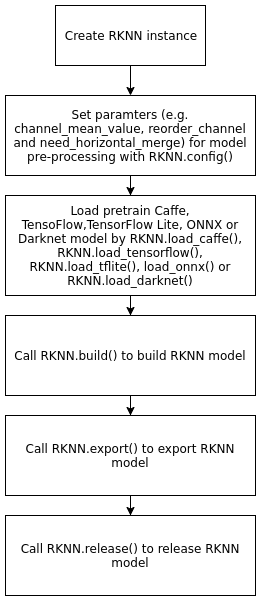
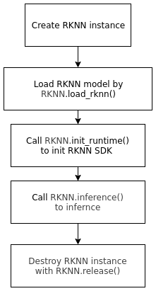

# RKNN Toolkit

Rockchip provides RKNN-Toolkit Development Suite for model transformation, reasoning and performance evaluation.

Users can easily complete the following functions through the provided Python interface:

1）Model transformation: Support Caffe, Tensorflow, TensorFlow Lite, ONNX, Darknet model, support RKNN model import and export, follow-up can be loaded on the hardware platform.

2）Model reasoning: It can simulate the running model on PC and obtain the reasoning results. It can also run the model on RK3399Pro or RK1808 Linux and get the reasoning results.

3）Performance evaluation: It can simulate the running of the model on PC and obtain the time-consuming information of each layer. It can also run the model on the specified hardware platform RK3399Pro or RK1808 Linux through online debugging, and obtain the total running time of the model on hardware and the time-consuming information of each layer.

**RKNN Tookit only supports Linux system and can be used on 3399pro development board or PC.**

## Program installation
RKNN Toolkit can be downloaded from this link: [LINK](http://git.t-firefly.com:8081/rk-linux/external/rknn-toolkit/tree/rk1808/firefly)

### Install on PC
<!-- #### Fedora 28
Basic Dependency Installation:
```bash
sudo dnf install -y cmake gcc gcc-c++ protobuf-devel protobuf-compiler lapack-devel \
python3-devel python3-opencv python3-numpy-f2py python3-h5py python3-lmdb  python3-grpcio
```

Install RKNN Toolkit:
```bash
pip3 install --user -r rknn-toolkit/package/requirements-cpu.txt
pip3 install --user rknn-toolkit/package/rknn_toolkit-1.0.0-cp36-cp36m-linux_x86_64.whl
```
If there is GPU acceleration in PC, replace requirements-cpu.txt with requirements-gpu.txt 
-->

#### Ubuntu 16.04
Basic Installation:
```bash
sudo apt-get install -y python3 python3-pip libglib2.0-dev \
        libsm-dev libxrender-dev libxext-dev
```

Install RKNN Toolkit:
```bash
pip3 install --user -r rknn-toolkit/packages/requirements-cpu.txt
pip3 install --user rknn-toolkit/packages/rknn_toolkit-1.3.0-cp35-cp35m-linux_x86_64.whl
```
If there is GPU acceleration in PC, replace requirements-cpu.txt with requirements-gpu.txt.

#### Ubuntu 18.04
Step like Ubuntu 16.04, simply replace rknn_toolkit-1.0.0-cp35-cp35m-linux_x86_64.whl with rknn_toolkit-1.0.0-cp36-cp36m-linux_x86_64.whl

## Program upgrade (1.0.0 -> 1.3.0)

### In PC

#### Ubuntu 18.04
```bash
pip3 install --user -r rknn-toolkit/packages/requirements-cpu.txt
pip3 install --user -U rknn-toolkit/packages/rknn_toolkit-1.3.0-cp36-cp36m-linux_x86_64.whl
```

If there is GPU acceleration in PC, replace requirements-cpu.txt with requirements-gpu.txt.

### Ubuntu 16.04
```bash
pip3 install --user -r rknn-toolkit/packages/requirements-cpu.txt
pip3 install --user -U rknn-toolkit/packages/rknn_toolkit-1.3.0-cp35-cp35m-linux_x86_64.whl
```

## API call process

### Model trasformation


Examples of model transformation are given below, referring in detail to examples in RKNN Tookit.
```python
from rknn.api import RKNN  
 
INPUT_SIZE = 64
 
if __name__ == '__main__':
    # Create RKNN execution objects
    rknn = RKNN()
    # Configure model input for NPU preprocessing of data input
    # channel_mean_value='0 0 0 255'，In model reasoning, RGB data will be transformed as follows
    # (R - 0)/255, (G - 0)/255, (B - 0)/255。When reasoning, RKNN model will automatically do mean and normalization processing
    # reorder_channel=’0 1 2’ Used to specify whether to adjust the image channel order, set to 0 1 2, that is, do not adjust according to the order of the input image channel.
    # reorder_channel=’2 1 0’ Represents switching channels 0 and 2, and if the input is RGB, it will be adjusted to BGR. If it is BGR, it will be adjusted to RGB.
    #The order of image channels is not adjusted
    rknn.config(channel_mean_value='0 0 0 255', reorder_channel='0 1 2')
 
    # Loading TensorFlow Model
    # tf_pb='digital_gesture.pb' Specify the TensorFlow model to be converted
    # Inputs specify input nodes in the model
    # Outputs specify the output node in the model
    # Input_size_list specifies the size of model input
    print('--> Loading model')
    rknn.load_tensorflow(tf_pb='digital_gesture.pb',
                         inputs=['input_x'],
                         outputs=['probability'],
                         input_size_list=[[INPUT_SIZE, INPUT_SIZE, 3]])
    print('done')
 
    # Creating Analytical Pb Model
    # do_quantization=False Specify not to quantify
    # Quantization reduces the size of the model and improves the speed of computation, but it loses accuracy.
    print('--> Building model')
    rknn.build(do_quantization=False)
    print('done')
 
    # Export and save RkNN model file
    rknn.export_rknn('./digital_gesture.rknn')
 
    # Release RKNN Context
    rknn.release()
```

### Model reasoning



An example of model inference is as follows. For details, please refer to the example in RKNN Tookit. Take `rknn-toolkit/example/mobilenet_v1` as an example.

RKNN-Toolkit is connected to the hardware of the development board through the USB of the PC. The RKNN model constructed or imported is run on the RK1808, and the inference results and performance information are obtained from the RK1808.

Please do the following steps

1. Make sure the USB OTG of the development board is connected to the PC, and the ADB can correctly recognize the device, that is, execute the `adb devices -l` command on the PC to see the target device.

2. When calling the `init_runtime` interface to initialize the runtime environment, you need to specify the target parameter and the device_id parameter. The target parameter indicates the hardware type.The selected value is `rk1808`. When the PC is connected to multiple devices, the device_id parameter, that is, the device number, needs to be specified, which can be viewed through the `adb devics` command, as an example:

	```
	$ adb devices
	List of devices attached
	0123456789ABCDEF device
	```
	I.e.
	```
	ret = rknn.init_runtime (target = 'rk1808', device_id = '0123456789ABCDEF')
	```

3. run

	```
	python3 ./test.py
	```
After running successfully, the data obtained after RK1808 inference can be obtained.

Examples of using model reasoning are as follows. Refer to example in RKNN Tookit for details.
```python
mport numpy as np
import cv2
from rknn.api import RKNN

def show_outputs(outputs):
    output = outputs[0][0]
    output_sorted = sorted(output, reverse=True)
    top5_str = 'mobilenet_v1\n-----TOP 5-----\n'
    for i in range(5):
        value = output_sorted[i]
        index = np.where(output == value)
        for j in range(len(index)):
            if (i + j) >= 5:
                break
            if value > 0:
                topi = '{}: {}\n'.format(index[j], value)
            else:
                topi = '-1: 0.0\n'
            top5_str += topi
    print(top5_str)

def show_perfs(perfs):
    perfs = 'perfs: {}\n'.format(outputs)
    print(perfs)

if __name__ == '__main__':

    # Create RKNN object
    rknn = RKNN()
    
    # pre-process config
    print('--> config model')
    rknn.config(channel_mean_value='103.94 116.78 123.68 58.82', reorder_channel='0 1 2')
    print('done')

    # Load tensorflow model
    print('--> Loading model')
    ret = rknn.load_tflite(model='./mobilenet_v1.tflite')
    if ret != 0:
        print('Load mobilenet_v1 failed!')
        exit(ret)
    print('done')

    # Build model
    print('--> Building model')
    ret = rknn.build(do_quantization=True, dataset='./dataset.txt')
    if ret != 0:
        print('Build mobilenet_v1 failed!')
        exit(ret)
    print('done')

    # Export rknn model
    print('--> Export RKNN model')
    ret = rknn.export_rknn('./mobilenet_v1.rknn')
    if ret != 0:
        print('Export mobilenet_v1.rknn failed!')
        exit(ret)
    print('done')

    # Set inputs
    img = cv2.imread('./dog_224x224.jpg')
    img = cv2.cvtColor(img, cv2.COLOR_BGR2RGB)

    # init runtime environment
    print('--> Init runtime environment')
    ret = rknn.init_runtime(target='rk1808', device_id='0123456789ABCDEF')
    if ret != 0:
        print('Init runtime environment failed')
        exit(ret)
    print('done')

    # Inference
    print('--> Running model')
    outputs = rknn.inference(inputs=[img])
    show_outputs(outputs)
    print('done')

    # perf
    print('--> Begin evaluate model performance')
    perf_results = rknn.eval_perf(inputs=[img])
    print('done')

    rknn.release()
```

## API

For a detailed API, please refer to the user guide document in RKNN-Toolkit in the `<rk1808-linux-sdk>/docs/Develop reference documents/NPU` directory: "RKNN-Toolkit User Guide xx.pdf".