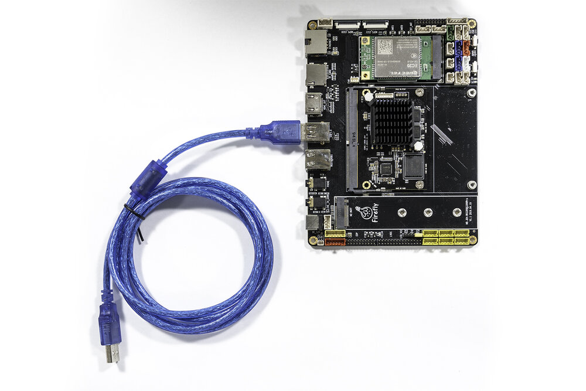
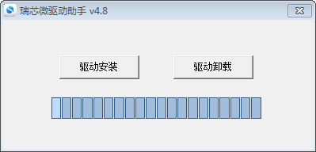
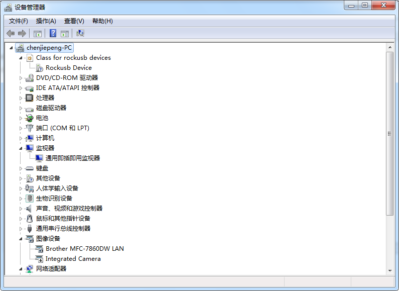
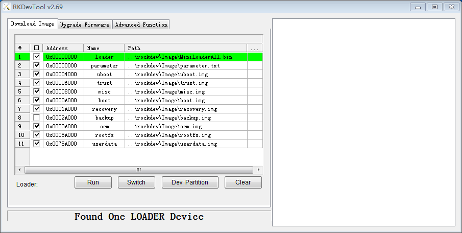
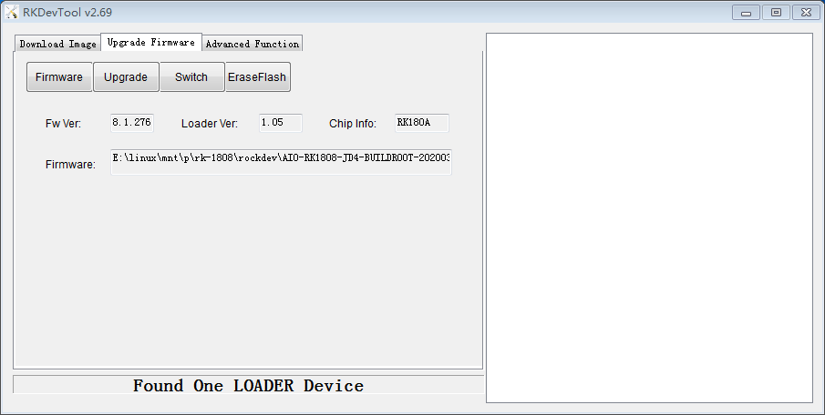

# Upgrade the firmware

## Introduction

This article describes how to upgrade the firmware file on the host to the flash memory of the development board through the Dual male usb data cable.
When upgrading, you need to choose the appropriate upgrade mode according to the host operating system and firmware type.

## Preparatory work
* AIO-1808-JD4
* Firmware
* host computer
* Dual male usb data cable

There are two types of firmware files:
* A single unified firmware `update.img` that packs the boot loader, parameters, and all partition images together for firmware publishing.
* Multiple partition images, such as `kernel.img`, `rootfs.img`, `recovery.img`, etc. are generated in the development stage.
* You can find the compiled unified [[AIO-1808-JD4 firmware]](https://community.t-firefly.com/en/doc/download/83) here, download it and unpack it.You can also refer to the instructions for compiling firmware to compile by yourself.

Host operating system support:
> * Windows XP （32/64 bits）
> * Windows 7 (32/64 bits)
> * Windows 8 (32/64 bits)
> * Linux (32/64 bits)

Host connection development board:

One end of the male-to-male USB cable is connected to the USB 3.0 interface of the development board, and the other end is connected to the host, as shown in the figure.



## Windows

* Tool: [Androidtool_xxx ( version number)](https://community.t-firefly.com/en/doc/download/83)

### Install RK USB drive

Download [ Release_DriverAssistant.zip](https://community.t-firefly.com/en/doc/download/83) , extract, and then run the DriverInstall.exe inside . 
In order for all devices to use the updated driver, first select `驱动卸载` and then select `驱动安装`.



### Connected devices
You can put the device into upgrade mode as follows:
* disconnect the power adapter first :
   * Dual male usb data cable connects one end to the host and the other end to the development board
   *  press the `RECOVERY` button on the device and hold.
   * connect to the power supply
   * about two seconds later, release the `RECOVERY` button.

The host should prompt for new hardware and configure the driver. Open Device manager and you will see the new Device" Rockusb Device" appear as shown below. If not, you need to go back to the previous step and reinstall the driver.



### Upgrade the firmware

Download [AndroidTool](https://community.t-firefly.com/en/doc/download/83)，extract,Run AndroidTool.exe in the AndroidTool_Release_xxx directory. (note: if it is Windows 7/8, you need to press the right mouse button and choose to run as an administrator), as shown below:



#### Upgrade unified firmware - update.img

The steps to update the unified firmware `update.img` are as follows:
1. Switch to the "upgrade firmware" page.
2. Press the "firmware" button to open the firmware file to be upgraded. The upgrade tool displays detailed firmware information.
3. Press the "upgrade" button to start the upgrade.
4. <font color=#ff0000 >If the upgrade fails, you can try to erase the Flash by pressing the "erase Flash" button first, and then upgrade. </font>

**Note: if the firmware laoder you wrote is inconsistent with the original one, please execute "wipe Flash" before upgrading the firmware.** 



#### Upgrade Partition image
Each firmware partition may be different, please note the following two points:

The steps to upgrade the partition image are as follows:
	
1. Switch to the "download image" page.
2. Check the partition to be burned, and select multiple.
3. Make sure the path of the image file is correct. If necessary, click the blank table cell on the right side of the path to select it again.
4. Click "execute" button to start the upgrade, and the device will restart automatically after the upgrade.


## Linux
There is no need to install device driver under Linux. Please refer to the Windows section to connect the device.

* Tool : [upgrade_tool_xxx (version number)](https://community.t-firefly.com/en/doc/download/83)

### Upgrade_tool

Download [Linux_Upgrade_Tool](https://community.t-firefly.com/en/doc/download/83), And install it into the system as follows for easy invocation:
```
unzip Linux_Upgrade_Tool_xxxx.zip
cd Linux_UpgradeTool_xxxx
sudo mv upgrade_tool /usr/local/bin
sudo chown root:root /usr/local/bin/upgrade_tool
```
### Upgrade unified firmware - *update.img*：   
```
sudo upgrade_tool uf update.img
```

<font color=#ff0000 >If the upgrade fails, try erasing before upgrading. </font>
```
# erase flash : Using the ef parameter requires the loader file or the corresponding update.img to be specified
# update.img :The ubuntu firmware you need to upgrade .
sudo upgrade_tool ef update.img
# upgrade again
sudo upgrade_tool uf update.img 
```

### Upgrade Partition image   

Linux: Using the following methods:
```
sudo upgrade_tool ul $LOADER
sudo upgrade_tool di -p $PARAMETER
sudo upgrade_tool di -uboot $UBOOT
sudo upgrade_tool di -trust $TRUST
sudo upgrade_tool di -b $BOOT
sudo upgrade_tool di -r $RECOVERY
sudo upgrade_tool di -m $MISC
sudo upgrade_tool di -oem $OEM
sudo upgrade_tool di -userdata $USERDATA
sudo upgrade_tool di -rootfs $ROOTFS
```

If the upgrade fails due to flash problems, you can try low-level formatting and erase nand flash:
```
sudo upgrade_tool lf update.img	# low-level formatting
sudo upgrade_tool ef update.img	# erase
```
## FAQs

### Q1: How to enter MaskRom mode

**A1 :** If the board does not enter Loader mode, you can try to force your way into MaskRom mode. See operation method ["How to enter MaskRom mode"](maskrom_mode.html).