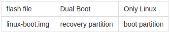

# Build Kernel

## Install Development Packages
Install development packages：

```
sudo apt-get install build-essential lzop libncurses5-dev libssl-dev
# If using 64 bits Ubuntu, you need also:
sudo apt-get install libc6:i386
```   

Install mkbootimg utility:

```
git clone https://github.com/neo-technologies/rockchip-mkbootimg.gitcd rockchip-mkbootimg
make && sudo make install
```

If you have already downloaded the Firefly-RK3128 Android SDK, the kernel source and cross compiling toolchain are in SDK/kernel and SDK/prebuilts respectively. Please skip to next step.  
If not, please download the kernel source code and Android's arm-eabi-4.6 cross compiling toolchain.  
Download the kernel source code：

```
git clone https://bitbucket.org/T-Firefly/fireprime-kernel.git
```

Note: This is Linux kernel source code in separated source repository, which is extracted from fireprime branch of Firenow-Lollipop Android SDK, for convenience of users who only want the kernel source code instead of the huge sdk.   
For Android's arm-eabi-4.6 cross compiling toolchain, you may look around to see if any  local Android SDK has prebuilts/gcc/linux-x86/arm/arm-eabi-4.6. If there is, you can reuse it; otherwise download from [here]() and extract it.

## Compile Kernel

### Compile Image

If you are not compiling kernel in the SDK, you need to specify ARCH and CROSS_COMPILE first:

```
export ARCH=arm
export CROSS_COMPILE=/path/to/prebuilts/gcc/linux-x86/arm/arm-eabi-4.6/bin/arm-eabi-
```

In the kernel source directory, execute:

```
make fireprime-linux_defconfig
make -j8 rk3128-fireprime.img
```

### Compile Kernel Modules

Run:
```
make modules
mkdir modules_insatll
make INSTALL_MOD_PATH=./modules_install modules_insatll
```

Copy the kernel module files to the root file system:
```
rsync -av ./modules_install/ /path/to/your/rfs/
```

You can also copy to the development board, using ssh remote connection:
```
rsync -av ./modules_install/ root@<Board IP>:/
```
Clean up the module install directory (it  contains links which impact compilation of Android SDK):
```
rm -rf ./modules_install
```

## Create linux-boot.img

### Create Initramfs

The kernel will load the initramfs as the first root file system. It is in charge of finding the actual root device, load it then finally switch to it.
```
git clone -b fireprime https://github.com/TeeFirefly/initrd.gitmake -C initrd
```

### Package Kernel and Initramfs

Pack kernel and initramfs into linux-boot.img:
```
truncate -s "%4" initrd.img
mkbootimg --kernel arch/arm/boot/zImage --ramdisk initrd.img -o linux-boot.img
```

## Modify Parameter File

The root file system can reside on different partitions in different storage devices (eMMC, TF card or USB disk, etc). It must be specified in the kernel's command line. There is a CMDLINE in the paramter file. Add one of below according to your need: (# and contents after are comments, no need to enter):
```
root=/dev/block/mtd/by-name/linuxroot        # flash partition named "linuxroot"
root=/dev/mmcblk0p1          # First partition of TF card
root=/dev/sda1               # First partition of USB disk
root=LABEL=linuxroot         # Partition whose label is "linuxroot"
```

This is the parameter file used in official dual boot firmware, for reference only:
```
FIRMWARE_VER:5.1
MACHINE_MODEL:rk312x
MACHINE_ID:007
MANUFACTURER:RK30SDK
MAGIC: 0x5041524B
ATAG: 0x60000800
MACHINE: 312x
CHECK_MASK: 0x80
KERNEL_IMG: 0x60408000
#RECOVER_KEY: 1,1,0,20,0
CMDLINE:console=ttyFIQ0,115200 earlyprintk androidboot.hardware=rk30board androidboot.console=ttyFIQ0 board.ap_has_alsa=0 init=/init initrd=0x62000000,0x00800000 mtdparts=rk29xxnand:0x00002000@0x00002000(uboot),0x00002000@0x00004000(misc),0x00008000@0x00006000(resource),0x00008000@0x0000e000(kernel),0x00010000@0x00016000(boot),0x00010000@0x00026000(recovery),0x0001a000@0x00036000(backup),0x00040000@0x00050000(cache),0x00002000@0x00090000(kpanic),0x00180000@0x00092000(system),0x00002000@0x00212000(metadata),0x00200000@0x00214000(userdata),0x00020000@0x00414000(radical_update),-@0x00434000(user)
```

## Flash to Device

Please reference [Flash image](https://drive.google.com/open?id=0B7HO8lbGgAqAfjd0VGNrVG1kcE01WTVybHRpUHRyaWtxVnZVR05vU1YwOUN0UWpUV0g3bWs), flash parameter file and its corresponding partition images.  
If you are upgrading from official firmware, flash linux-boot.img to the following partion, according to the firmware type:  



If the root filesystem image is not flashed yet, you can download the prebuilt image, or customize your own one, and flash it to the partition specified in parameter file.