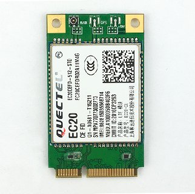
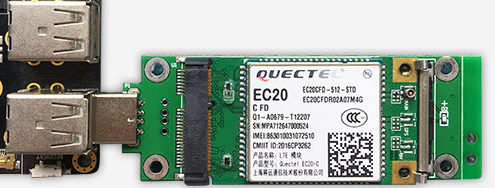

# Wireless module

## [EC20 4G module](https://www.firefly.store/products/4g-module-kit-eg25-g)

### Product Parameter

- Model
  + EC20-C R2.0 Mini PCIe-C
- Power supply
  + 3.3V～3.6V (Typical 3.3V)
- Band
  + TDD-LTE: B38/B39/B40/B41
  + FDD-LTE：B1/B3/B8
  + WCDMA: B1/B8
  + TD-SCDMA: B34/B39
  + GSM: 900/1800
- Data
  + TDD-LTE： Max 130Mbps (DL) Max 35Mbps (UL)
  + FDD-LTE： Max 150Mbps (DL) Max 50Mbps (UL)
  + DC-HSPA+： Max 42Mbps (DL) Max 5.76Mbps (UL)
  + UMTS： Max 384Kbps (DL) Max 384Kbps (UL)
  + CDMA： Max 3.1Mbps (DL) Max 1.8Mbps (UL)
  + TD-SCDMA： Max 4.2Mbps (DL) Max 2.2Mbps (UL)
  + EDGE： Max 236.8Kbps (DL) Max 236.8Kbps (UL)
  + GPRS： Max 85.6Kbps (DL) Max 85.6Kbps (UL)
- Connector
  + USB: USB 2.0 high-speed interface, 480Mbps
  + Digital voice: 1 digital voice interface (optional)
  + USIM: 1.8 V / 3 V
  + Network instructions: * 2, NET_STATUS, and NET_MODE
  + UART: x 1 UART
  + Reset: low level
  + PWRKEY: low level
  + Antenna interface: x 3 (main antenna, split antenna and GNSS antenna interface)
  + ADC: x 2
- Dimensions
  + 51.0×30.0×4.9mm
- Weight
  + About 10.5 g
- Approvals
  + CCC/ NAL*/ TA

### Picture

### Connection Method

### Reference firmware

[Firefly-RK3128 public firmware](https://community.t-firefly.com/en/doc/download/6)
 