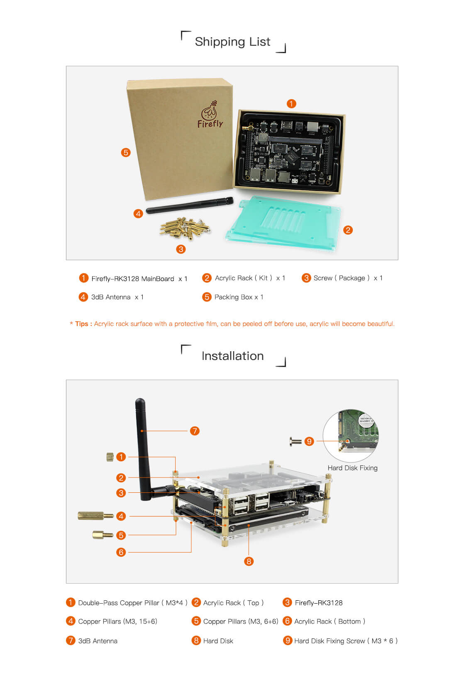

# User manual

## Accessories

The standard set of Firefly-RK3128 includes the following accessories:

* Core-3128J core board x 1
* Firefly-RK3128 base board x 1
* WiFi antenna

Other available accessories include:

* [5V/2.5A DC power adapter (supports 220V/110V inputs)](https://www.firefly.store/products/5v-3a-power-adapter)
* [Firefly USB to UART Module](https://www.firefly.store/products/usb-to-uart-module-cp2104)
* [Cooling fan kit (5V/0.12A)](https://www.firefly.store/products)
* [Heatsink](https://www.firefly.store/products)

During using, you may need the following accessories:

* Display device
  * Display or TV supporting HDMI interface, and HDMI cable
* Network
  * 100M/1000M ethernet cable, and corresponding router
  * WiFi router
* Input devices
  * USB wire/wireless mouse/keyboard
  * Infrared remote control
* Firmware upgrade and debug:
  * Micro USB cable
  * USB to serial adapter

## Packing list

- Note: The packing list is for reference only.

## Start-up

After confirming the motherboard accessories are connected correctly, connect the power adapter to the live socket and the power cable to the development board. The power board will auto power on when it is powered up for the first time.When the system is started, you may shut it down via poweroff button to maintain power supply to the development board. Now you have two ways to start the Firefly-RK3128 up:

-    Press and hold the power button for three seconds
-    Press the power button on the IR remote control

When starting up, the blue indicator will illuminate.