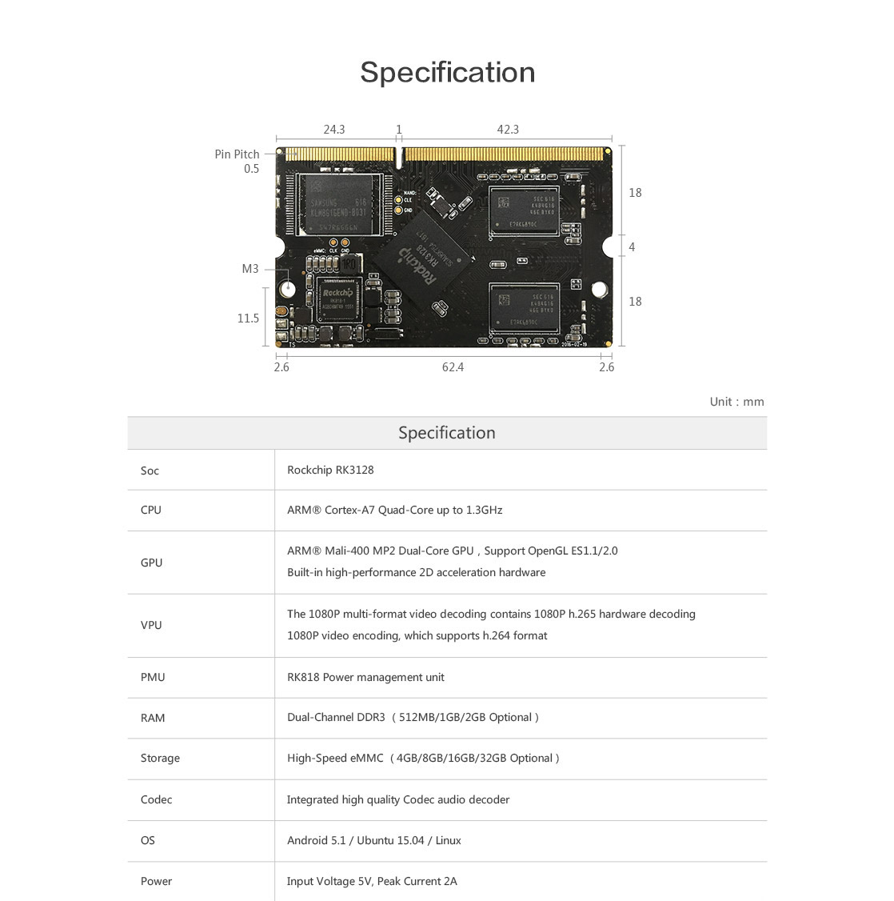

# Product introduction

## product description
The Core-3128J core board is a quad-core Cortex-A7 high-performance core board that uses the Rockchip RK3128 quad-core Cortex-A7 1.3GHz processor to provide a variety of storage configuration options. Users can quickly implement projects simply by extending the functional backplane. Research production. The core board layout is compact and beautiful, with a size of only 67.6mm x 41mm, which saves more valuable space.

Core-3128J core board supports Android, Linux and other operating systems, with complete software support, and many off-the-shelf applications. User development is simpler and more convenient. It can be widely used in vending machines, smart POS machines, all-in-one machines,Industrial computers and other industries.The core board is subjected to strict electromagnetic, temperature, high-voltage pulse, aging and other tests, and the performance is stable and reliable, and can be supplied in large quantities.

## Product parameters

## Product resources

* [[Wiki]](http://en.t-firefly.com/doc/product/index/id/6.html)
Includes information on Android & Ubuntu driver development (see Fireprime Wiki)
 
* [[Git link]](https://bitbucket.org/T-Firefly/firenow-lollipop) 
Android SDK source code

* [[Technical forum]](http://bbs.t-firefly.com/forum.php?mod=forumdisplay&fid=100)
More than 100,000 corporate customers and users communication platform

## Product technical support
Core-3128J core board can meet different needs of customers in a variety of scenarios. It has been widely used in game equipment, advertising machines, vending machines, robots, etc. The quality and performance have been very good in the industry, professional The technical team solves a wide range of problems in hardware design and software functions for our customers. Please contact us for professional technical support and more detailed information.

### Contact information
* Email: sales@t-firefly.com
* Mobile: (+86) 186 8811 7175
* Landline: 0760-89881218
* National Service Hotline: 4001-511-533
* Address: Room 2101, Hongyu Building, No. 57 Zhongshan 4th Road, East District, Zhongshan City, Guangdong Province