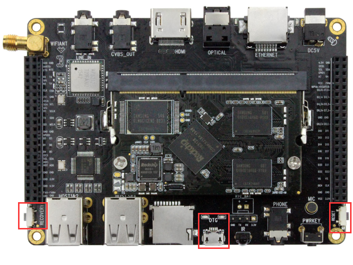
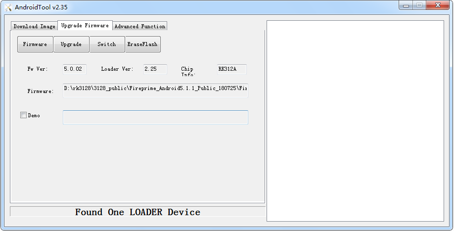
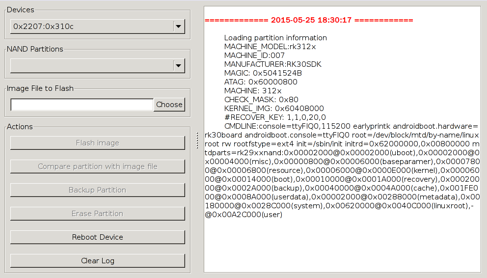

# Firmware upgrade

## Introduction

This article describes how to burn the firmware files on the host to the flash memory of the development board via the Micro USB OTG cable.  
When upgrading, you need to choose a suitable upgrade method in line with the host operating system and firmware type.

## Ready to work

What you need:

* [Firefly-RK3128 development board](https://www.firefly.store/products/core-3128j-quad-core-a7-high-performance-core-board-fireprime)
* [Firmware](https://community.t-firefly.com/en/doc/download/6)
* Host
* Good Micro USB OTG Cable

Typically firmware files comprise two kinds:

* Monolithic image, often known as update.img, which contains the bootloader, parameter and all the partition image files. It is used for firmware distribution.
* Multiple partition image, like kernel.img, boot.img, recovery.img, etc, which are created during development.

You can download compiled update.img, or you can reference Build Android to compile your own image file.  
Host operating system supports:

* Windows XP （32/64bit)
* Windows 7 (32/64bit)
* Windows 8 (32/64bit)
* Linux (32/64bit)

## Flash on windows

We used to need two utilities to flash rockchip image file:  

* RKBatchTool, used to flash update.img
* RKDevelopTool, used to flash partition image file separately.

Then RK released the AndroidTool tool, starting to support unified firmware (update.img) burning based on RKDevelopTool. So, you can only use this tool now.You need to install the RK USB driver before burning. Skip this step if the driver is already installed.

### RK USB driver installation

Download [Release_DriverAssistant.zip](https://community.t-firefly.com/en/doc/download/6), uncompress it, then run DriverInstall.exe inside.  
In order to use new driver for all the rockchip devices, please select "驱动卸载"(Driver uninstall), then "驱动安装"(Driver install).  


### Devices connection

There are two ways to put the device into upgrade mode.  
The first one, device is cut off all the power sources, such as power adapter and Micro USB OTG connection:  

* Keep micro USB OTG cable connected with host PC.
* Press and hold RECOVERY key.
* Connect micro USB OTG cable to the device.
* After around two seconds, release RECOVERY key.

The other way:

* Use micro USB OTG cable to connect host and device together.
* Press and hold RECOVERY key.
* Shortly press RESET key.
* After around two seconds, release RECOVERY key.

RECOVERY button and RESET button and OTG interface as shown:



The host will prompt to have new device detected and configured. Open the Device Management, you'll find a new device name "Rockusb Device", as shown below. Return to previous step to reinstall driver if it is not shown.


### Firmware burning

Download [AndroidTool_Release_v2.35.rar](https://community.t-firefly.com/en/doc/download/6). Uncompress it and change to directory AndroidTool_Release_v2.33.  
AndroidTool defaults to display in Chinese. We need to change it to English. Open config.ini with an text editor (like notepad). The starting lines are:

```
#选择工具语言:Selected=1(中文);Selected=2(英文)
[Language]
Kinds=2
Selected=1
LangPath=Language\
```

Change "Selected=1" to "Selected=2", and save. From now on,  AndroidTool will display in English.  
Now, run AndroidTool.exe: (Note: If using Windows 7/8, you'll need to right click it, select to run it as Administrator)


#### Burn the unified firmware update.img

Steps to burn the unified firmwar update.img:

* Switch to "Upgrade Firmware" tab page.
* Click "Firmware" button and open the image file. Detail information of the image file, like version and chip, is shown.
* Click "Upgrade" button to start flash.
* If upgrade fails, please try "LowerFormat" in the "Download Image" tab page first, then try again.

***WARNING: If you flash firmware laoder different version of the original machine, please click "Erase Flash" before upgrading the firmware.***



#### Burn partition image

Steps to burn partition image：

* Switch to "Download Image" tab page.
* Check the partitions you want.
* Make sure the image file's path is correct. Click the rightmost empty table cell to select new path if needed.
* Click "Run" button to start flashing. Device will reboot automatically when finish.


## Flash on linux

Rockchip provides a command line utility named "upgrade_tool" under Linux, which support flashing of both update.img and partition images.  
We have two choices with regard to open source tools:

* rkflashtool [https://github.com/Galland/rkflashtool_rk3066](https://github.com/Galland/rkflashtool_rk3066)
* rkflashkit [https://github.com/linuxerwang/rkflashkit]( https://github.com/linuxerwang/rkflashkit)

Both of them only support flashing partition images, not update.img. rkflashtool is a command line tool, and flashkit has a nice and easy to use GUI with command line support lately added. We only introduce rkflashkit below.  
There is no need to install device driver. Just connect the device and host as described in the Windows section.  

### upgrade_tool

Download [Linux_Upgrade_Tool](https://community.t-firefly.com/en/doc/download/6),  and install it into the system as indicated below, so that it is available for calling:

```
unzip Linux_Upgrade_Tool_v1.24.zip
cd Linux_UpgradeTool_v1.24 
sudo mv upgrade_tool /usr/local/bin
sudo chown root:root /usr/local/bin/upgrade_tool
```

Burn unified firmware update.img:

```
sudo upgrade_tool uf update.img
```

Burn partition image:

```
sudo upgrade_tool di -b /path/to/boot.img
sudo upgrade_tool di -k /path/to/kernel.img
sudo upgrade_tool di -s /path/to/system.img
sudo upgrade_tool di -r /path/to/recovery.img
sudo upgrade_tool di -m /path/to/misc.img
sudo upgrade_tool di resource /path/to/resource.img
sudo upgrade_tool di -p paramater   # flash parameter
sudo upgrade_tool ul bootloader.bin # flash bootloader
```

If flash issue causes error while upgrading, you may try low-level formatting and erasing nand flash:

```
upgrade_tool lf   # low format flash
upgrade_tool ef   # erase flash
```

### rkflashkit

* Install:

```
sudo apt-get install build-essential fakeroot 
git clone https://github.com/linuxerwang/rkflashkit
cd rkflashkit
./waf debian
sudo apt-get install python-gtk2
sudo dpkg -i rkflashkit_0.1.4_all.deb
```

* Graphic interface:



* Command line:

```
$ rkflashkit --help
Usage: <cmd> [args] [<cmd> [args]...]

part                              List partition
flash @<PARTITION> <IMAGE FILE>   Flash partition with image file
cmp @<PARTITION> <IMAGE FILE>     Compare partition with image file
backup @<PARTITION> <IMAGE FILE>  Backup partition to image file
erase  @<PARTITION>               Erase partition
reboot                            Reboot device

For example, flash device with boot.img and kernel.img, then reboot:

sudo rkflashkit flash @boot boot.img @kernel.img kernel.img reboot
```

You may find examples in help information. It shows that one single command can burn multiple image files and restart the device, which is a great news for developers who need to compile and burn the kernel frequently.

## Common Problem

### How to enter MaskRom mode

If the board cannot enter Loader mode, the SD card fails to start, and you can try to enter MaskRom mode. Please refer to [《How to enter MaskRom mode》](maskrom_mode.md)。
