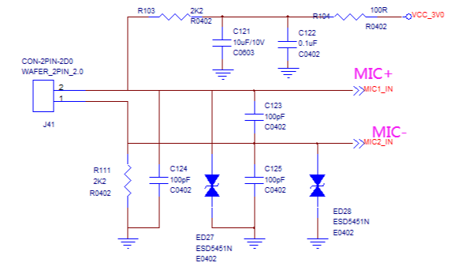

# FAQ

## The system is abnormally stuck or restarted 

The current of power supply may not be enough, the Working voltage of board is 5V and the working current is over 500mA, depending on the specific mounted peripherals.

## View all status of internal Codec gain

* Method 1:

  ```shell
  amixer contents
  ```

* Method 2:

  ```shell
  tinymix contents
  ```

## The sound of the headphones is too small 

Check the codec output gains in current left and right channels: 

```shell
amixer cget name='DAC HPOUT Left Volume'
amixer cget name='DAC HPOUT Right Volume'
```

Adjust the base gain as needed: 

```shell
amixer cset name='DAC HPOUT Left Volume' 18
amixer cset name='DAC HPOUT Right Volume' 18
```

Adjust the volume (percentage): 

```shell
amixer cset name='Master Playback Volume' 40
```

### Speaker

Check the current left and right channel output gain of Codec:

```shell
amixer cget name='DAC LINEOUT Left Volume'
amixer cget name='DAC LINEOUT Right Volume'
```

Adjust the front stage gain as required:

```shell
amixer cset name='DAC HPMIX Left Volume' 1
amixer cset name='DAC HPMIX Right Volume' 1
```

Adjust the rear stage gain as required:

```shell
amixer cset name='DAC LINEOUT Left Volume' 3
amixer cset name='DAC LINEOUT Right Volume' 3
```

Adjust volume (%):

```shell
amixer cset name='Master Playback Volume' 40
```

## Recording

#### View sound card

```shell
cat /proc/asound/cards
0 [rockchiprk3308b]: rockchip_rk3308 - rockchip,rk3308b-acodec
                     rockchip,rk3308b-acodec
1 [Audio          ]: USB-Audio - AC108 USB Audio
                     XPowers AND ST AC108 USB Audio at usb-ff440000.usb-1.1, full speed
7 [Loopback       ]: Loopback - Loopback
                     Loopback 1
```

### MIC gain adjustment of internal Codec

* Group n
  * Group 0: mic1和mic2
  * Group 1: mic3和mic4
  * Group 2: mic5和mic6
  * Group 3: mic7和mic8
* "ADC MIC" prefix: indicates adjusting the front MIC PGA linear amplification gain
* "ADC ALC" prefix: indicates the adjusted the rear ALC linear amplification gain

```shell
amixer cset name='ADC MIC Group 0 Left Volume'  3   # mic1,range 0->3
amixer cset name='ADC MIC Group 0 Right Volume' 3   # mic2,range 0->3
amixer cset name='ADC ALC Group 0 Left Volume'  13  # mic1,range 0->31
amixer cset name='ADC ALC Group 0 Right Volume' 13  # mic2,range 0->31
```

Collect 8 channels **sound card 0** audio data:

```shell
arecord -D hw:0,0 -c 8 -r 16000 -f S16_LE test.wav
```

When the sample rate is greater than 16000hz, the recording command should be followed by the parameter `--period-size=1024 --buffer-size=4096`, for example:

```
arecord -D hw:0,0 -c 8 -r 44100 -f S16_LE --period-size=1024 --buffer-size=4096 test.wav
```

### Internal Codec MIC no sound recording

* Use active MIC
* Use passive MIC
  * Check whether there is a connected bias voltage? (bias voltage can use MICBIAS1 or MICBIAS2)
  * Reference circuit
    <br></br>
    

## SoX - Sound eXchange

Extract the data of a single channel in a double channel audio file and output it as a single channel audio

```shell
sox stereo.wav left.wav  remix 1 	#extract the left audio
sox stereo.wav right.wav remix 2 	#extract the right audio
```

## Speech recognition development

As for the speech kit supported by ROC-RK3308B-CC-PLUS(or ROC-RK3308B-CC) open source motherboard, if the customer needs more in-depth business customization cooperation, they need to communicate with our company or the corresponding speech company.

## Display screen

* Support RGB interface
  * RGB888
  * RGB666
  * RGB565
* Support MCU i80 interface
* The maximum resolution is 720P

## AndroidTool

### The partition image is burned separately, and the partition address is wrong

Android tool is loading parameter.txt The partition address will be automatically assigned according to the parameter, so each time the partition image is burned separately, it will be loaded by the way parameter.txt , there is no need to manually modify the partition address.

## I2C

#### I2cdetect cannot detect the device attached by i2c3

* Does kernel DTS enable i2c3
* Check whether the pins used by i2c3 are reused for other functions
* Check if i2c3 is connected with pull-up voltage, could refer to the schematic diagram i2c1
* Check whether the device mounted on i2c3 has normal power supply

The same with other I2C.

## VAD

### Use MIC of internal Codec

* `rockchip,adc-grps-route = <1 0 3 2>;`: channel  0 to 7, its corresponding internal Codec mic is MIC3, MIC4, MIC1,  MIC2, MIC7, MIC8, MIC5 and MIC6.
* `rockchip,det-channel = <0>;`: the channel detected by vad is channel 0.

Check whether the channel of `rockchip,det-channel` in dts is consistent with the MIC of the internal Codec corresponding to `rockchip,adc-grps-route`?

## Watchdog

### Steps

* Enable in dts used by kernel
  wdt    

    ```shell
  &wdt {
      status = "okay";
  };
    ```

* Executable demo

  * open: Open the device node `/dev/watchdog` to start the watchdog
  * ioctl: Set the timeout that WDIOC_SETTIMEOUT
  * write: feed dog

Specific programs (refer to the articles on the Internet) need to be written and compiled by yourself.

### Test

* After the board is started, run the demo file to start the watchdog and feed the dog.
* Kill the demo process, the dog will not be fed. After the timeout, the machine will restart.

## SSH

### Usage method

* Enable SSH related options

  * openssh

  ```shell
  BR2_PACKAGE_OPENSSH=y
  ```

  * Configure the login account root and password

  ```shell
  BR2_TARGET_ENABLE_ROOT_LOGIN=y
  BR2_TARGET_GENERIC_ROOT_PASSWD="123"
  ```

* Determine whether rootfs is read-write

  * Refer to [Rootfs switch as ext2](buildroot_development.html#rootfs-switch-as-ext2) chapter.

* Modify profile

  * Modify `/etc/ssh/sshd_config` in the board_ Config file

  ```shell
  PermitRootLogin yes
  ```

## USB Camera

### Configuration enable

Kernel enables config is as follow:

```shell
CONFIG_MEDIA_CAMERA_SUPPORT=y
CONFIG_MEDIA_USB_SUPPORT=y
CONFIG_USB_VIDEO_CLASS=y
CONFIG_USB_VIDEO_CLASS_INPUT_EVDEV=y
```

## Device information writing tool

<font color=red>**Note:**</font> If the EMMC erase operation is performed on the development board, the previously written data will also be cleared.

### Windows mode

* Install RKDevInfoWriteTool
  * [Download address](http://en.t-firefly.com/doc/download/page/id/67.html)

* Select "RPMB" in **settings** of RKDevInfoWriteTool

* Configure "SN"，"WIFI MAC"，"LAN MAC"，"BT MAC", etc. in **settings**  of RKDevInfoWriteTool as required

* Development board enters loader mode

* RKDevInfoWriteTool performs  **write** or **read** operations

For specific operations, please refer to the PDF document 《RKDevInfoWriteTool_User_Guide》 under the installation directory of RKDevInfoWriteTool.

### Linux mode

Development board's own information writing method

* buildroot enable
  `BR2_PACKAGE_VENDOR_STORAGE`

* Through vendor_ Storage command for reading and writing

  * SN

  ```shell
  vendor_storage -w VENDOR_SN_ID -t string -i cad895bedb8ee15f
   vendor_storage -r VENDOR_SN_ID
  ```

  * LAN MAC

  ```shell
  vendor_storage -w VENDOR_LAN_MAC_ID -t string -i AABBCCDDEEFF
   vendor_storage -r VENDOR_LAN_MAC_ID
  ```

  Others can be based on `vendor_storage -h` prompts for operation.

### Instruction

#### WIFI MAC

##### RTL8188EU

The value of  VENDOR_ WIFI_ MAC_ ID is given to the MAC address of p2p0, while the MAC address of wlan0 is the first byte of vendor_ WIFI_ MAC_ID value `&= ~0x2`.

##### AP6236

The following changes need to be made:

```shell
diff --git a/kernel/drivers/net/wireless/rockchip_wlan/rkwifi/bcmdhd/Makefile b/kernel/drivers/net/wireless/rockchip_wlan/rkwifi/bcmdhd/Makefile
index 2550ff6..ecd4028 100644
--- a/kernel/drivers/net/wireless/rockchip_wlan/rkwifi/bcmdhd/Makefile
+++ b/kernel/drivers/net/wireless/rockchip_wlan/rkwifi/bcmdhd/Makefile
@@ -23,7 +23,7 @@ DHDCFLAGS = -Wall -Wstrict-prototypes -Dlinux -DBCMDRIVER                 \
        -DKEEP_ALIVE -DPKT_FILTER_SUPPORT -DPNO_SUPPORT -DDHDTCPACK_SUPPRESS  \
        -DDHD_DONOT_FORWARD_BCMEVENT_AS_NETWORK_PKT                           \
        -DMULTIPLE_SUPPLICANT -DTSQ_MULTIPLIER -DMFP                          \
-       -DWL_EXT_IAPSTA -DSUPPORT_P2P_GO_PS                                   \
+       -DWL_EXT_IAPSTA -DSUPPORT_P2P_GO_PS -DGET_CUSTOM_MAC_ENABLE           \
        -DENABLE_INSMOD_NO_FW_LOAD -DDHD_UNSUPPORT_IF_CNTS                    \
        -Idrivers/net/wireless/rockchip_wlan/rkwifi/bcmdhd \
        -Idrivers/net/wireless/rockchip_wlan/rkwifi/bcmdhd/include
```

<!-------

## Firmware burning

If you burn firmware fails.

You can download the [Official Firmware](http://wiki.t-firefly.com/en/ROC-RK3308B-CC/resource.html#firmware) and burn this firmware in your device at [Maskrom mode](http://wiki.t-firefly.com/en/ROC-RK3308B-CC/maskrom_mode.html) to resume your device.

Or, you can try it again on Windows with [AndroidTool](http://en.t-firefly.com/doc/download/page/id/53.html#windows_147).

## Speech recognition Commercial development 

As for the major ASR sdks supported by the ROC-RK3308B-CC open-source motherboard, customers need to communicate with their own R&D company if they need more in-depth cooperation of customized services. 

## Startup after booting

Directly modify the startup script in ROC-RK3308B-CC and add your own commands. 

```shell
vi /oem/RkLunch.sh
```

## When burning partition image separately, a partition address error occurred 

When loading parameter.txt, AndroidTool will automatically distribute partition address according to parameter. When the partition image is burned separately, the parameter.txt will be loaded simultaneously, so there’s no need to manually modify the partition address.  

---------->

## MAC Address Rewrite 

The MAC address of Ethernet chip RTL8152B on ROC-RK3308B-CC-PLUS can  be rewritten  by the tool that under `/oem/Rtl8152b_mac_tool` 

* Modify the `NODEID` in `EF8152B.cfg` to the MAC address to be written. The `NODEID` address should be between the `STARTID` and `ENDID` range, this range can be changed too

  ```shell
  NODEID = 00 E0 4C 36 00 01
  STARTID = 00 E0 4C 36 00 01
  ENDID = 00 E0 4C 36 FF FF
  ```

* Execute `./rtunicpg-aarch64 /s` search device under the tool directory `/oem/Rtl8152b_mac_tool`, the current MAC address `C2:20:D1:D3:00:9A` is randomly generated. When the MAC address has not been written, each restart of the system is different

  ```shell
  ./rtunicpg-aarch64 /s
  
  *************************************************************************
  *   RTUNicPG  - EFUSE/EEPROM/FLASH Programming Utility for
  *         RTL8152/RTL8153 Family USB FE/GBE Network Adapter
  *   Version : v2.0.6.9
  * Copyright (C) Realtek Semiconductor Corp. 2017. All Rights Reserved.
  *************************************************************************
  - RTL8152B
  
  0      eth1    VID:0BDA   PID:8152   bcdDevice:2000   C2:20:D1:D3:00:9A   path:1.4
  ```

* Since there is only one device, run `./rtunicpg-aarch64 /efuse` directly for the first time 

After it is successful, execute `ifconfig eth1` to check the MAC address. It can be seen that it has been rewritten to `00:E0:4C:36:00:01`. Restart the system to check the MAC address again, and the MAC address remains unchanged 

In case of subsequent rewriting, the method of  `./rtunicpg-aarch64  /efuse /nodeid 00E04C360002 ` can be used. **Since efuse space is limited, the number of times to write MAC address should better not exceed 10**

## Uart Baud Rate Changes to 115200 

After enable uart device in device tree, `stty [-F DEVICE | --file=DEVICE] [-a|--all]` could be used to check the baud rate, and the default baud rate is 9600, it can be changed to 115200 in either of the following ways 

* modify in user space, such as ttyS3

  ```shell
  stty -F /dev/ttyS3 speed 115200
  ```

* modify in kernel driver

  ```shell
  diff --git a/kernel/drivers/tty/serial/serial_core.c b/kernel/drivers/tty/serial/serial_core.c
  index 87625fa..39e7d0c 100644
  --- a/kernel/drivers/tty/serial/serial_core.c
  +++ b/kernel/drivers/tty/serial/serial_core.c
  @@ -2394,8 +2394,8 @@ int uart_register_driver(struct uart_driver *drv)
          normal->type            = TTY_DRIVER_TYPE_SERIAL;
          normal->subtype         = SERIAL_TYPE_NORMAL;
          normal->init_termios    = tty_std_termios;
  -       normal->init_termios.c_cflag = B9600 | CS8 | CREAD | HUPCL | CLOCAL;
  -       normal->init_termios.c_ispeed = normal->init_termios.c_ospeed = 9600;
  +       normal->init_termios.c_cflag = B115200 | CS8 | CREAD | HUPCL | CLOCAL;
  +       normal->init_termios.c_ispeed = normal->init_termios.c_ospeed = 115200;
          normal->flags           = TTY_DRIVER_REAL_RAW | TTY_DRIVER_DYNAMIC_DEV;
          normal->driver_state    = drv;
          tty_set_operations(normal, &uart_ops);
  
  ```

The first method needs to be reset after system restart, and the second method will change the default baud rate of all serial ports to 115200 