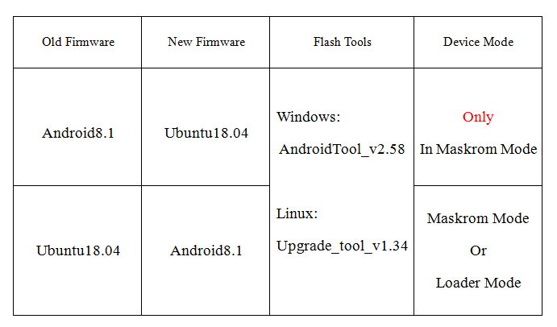

# Flashing Notes

Please read the following carefully！！！

## Firmware Format
There are only one firmware file formats:

- RK Firmware

[RK Firmware], is packed in Rockchip's proprietary format, which is flashed to the eMMC via Rockchip's [upgrade_tool] (Linux) or [AndroidTool] (Windows). It is Rockchip's traditional packing format, commonly used in Rockchip Android firmware. [RK Firmware] of Android can also be flashed into SD card using [SD Firmware Tool].

if you want to know more about the firmware formats or Partition Image, you can refer to [Formats](http://wiki.t-firefly.com/ROC-RK3328-CC/started.html#firmware-format)

## Download & Flash

Here's the available OS list of firmware:

- Android 8.1
- Ubuntu 18.04

Then choose the flashing tool according to your host PC's OS:

- To flash to the eMMC:
    + GUI:
        * [AndroidTool] (Windows)
    + CLI:
        * [upgrade_tool] (Linux)

* Tools download:
  - [upgrade_tool](http://en.t-firefly.com/doc/download/62.html#other_189)
  - [Android_tool](http://en.t-firefly.com/doc/download/62.html#other_190)  
* Firmware
  - Official firmware: The Linux firmware provided by the official cloud disk,This includes firmware such as Ubuntu,Buildroot,Debian.the GPT firmware compiled with the new Linux SDK for GPT.
  - DIY firmware:The firmware compiled according to [Compile Linux Firmware] is GPT Firmware  

## Flash Firmware of Android Note
Please read the following table carefully and then upgrade:

Note:Loader mode is preferred when both Loader mode and Maskrom mode can burn firmware.

* Operating hardware: [MaskRom]（In general, the first method is recommended）

[Getting Started]: started.md
[FAQ]: faqs.md
[Serial Debug]: debug.md
[Building Linux Root Filesystem]: linux_build_ubuntu_rootfs.md
[ADB introduction]: adb_use.md
[Contact]: resource.md#community
[RK Firmware]: 02-upgrade_table.md#rk-firmware-format
[Compile Linux Firmware]:linux_compile_gpt.md
[Compile Android Firmware]:compile_android8.1_firmware.md
[MaskRom]:04-maskrom_mode.md
[Flashing Notes]:02-upgrade_table.md
[Boot Mode]:01-bootmode.md
[ROC-RK3328-PC]: http://en.t-firefly.com/product/rocrk3328pc.html "ROC-RK3328-PC Official Website"
[Download Page]: http://en.t-firefly.com/doc/download/34.html
[Forum]: http://bbs.t-firefly.com/
[Facebook]: https://www.facebook.com/TeeFirefly
[Google+]: https://plus.google.com/u/0/communities/115232561394327947761
[Youtube]: https://www.youtube.com/channel/UCk7odZvUrTG0on8HXnBT7gA
[Twitter]: https://twitter.com/TeeFirefly
[Shop]: http://shop.t-firefly.com/
[USB Serial Adapter]: https://www.firefly.store/products/usb-to-uart-module-cp2104 
[5V2A US Adapter]: https://www.firefly.store/products/5v2a-us-adapter-3c-fcc-ce
[eMMC Flash]: https://www.firefly.store/products
[Storage Map]: http://opensource.rock-chips.com/wiki_Partitions#Default_storage_map