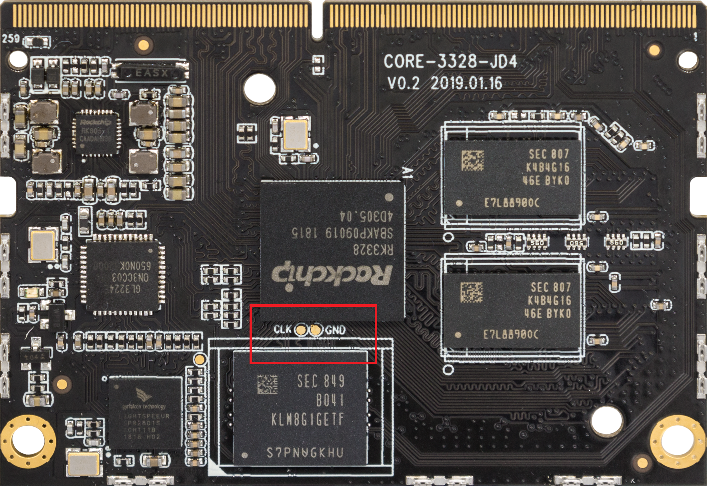
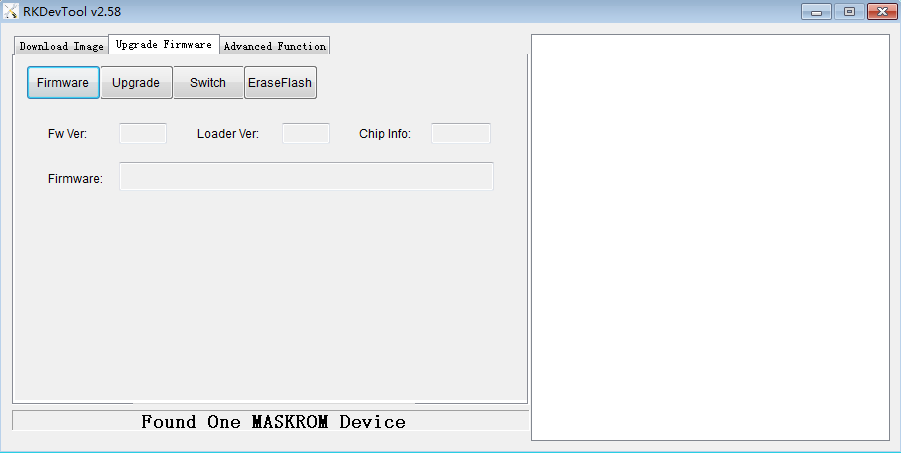

# MaskRom mode

***For information on boot mode, please refer to Chapter [Boot Mode]***   

`MaskRom` is the last line of defense before your device becomes bricked. Forcible access to `MaskRom` involves hardware operations with certain risks, so please try the `MaskRom` mode only if your device cannot enter the `Loader` mode.   

Please read carefully and be cautious!

## Principle
Artificially short connect Flash's data pin and ground wire, the system will think Flash data error, and thus clear Flash data.

Please follow the steps indicated below:    

1. Find the solder joint (CLK, GND) reserved for AIO-RK3328-JD4, on the front of the development board, as shown below:

2. Disconnect all power supply to the device.
3. Unplug the SD card.
4. Connect the device and the host with a USB Tyoe-C cable
5. Use metal tweezers to connect the two test points on the core board (as indicated on the following image) and hold still.
6. Plug in the device. 
7. Remove the tweezers in a minute. 

Then the device will enter MaskRom mode.   

