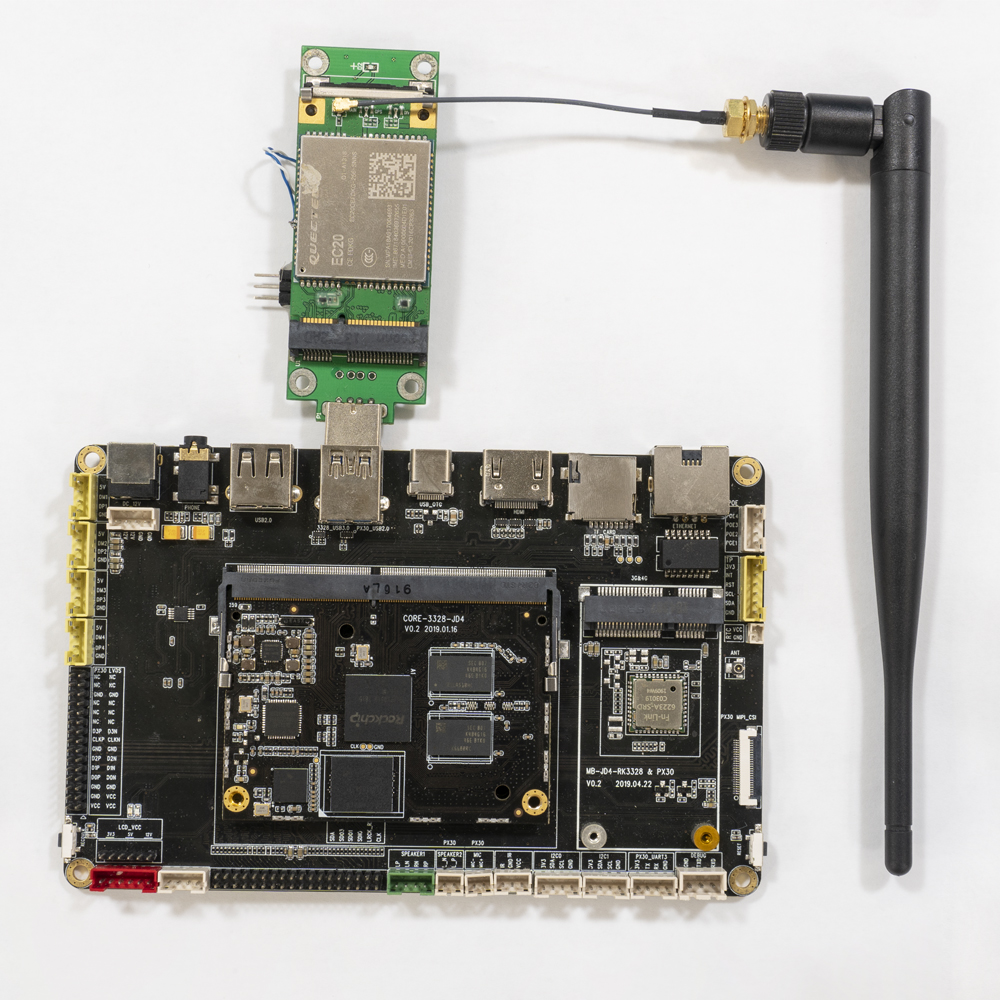
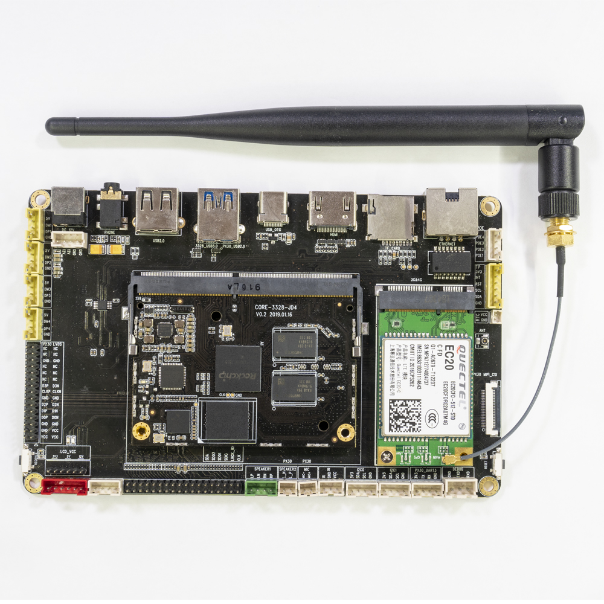
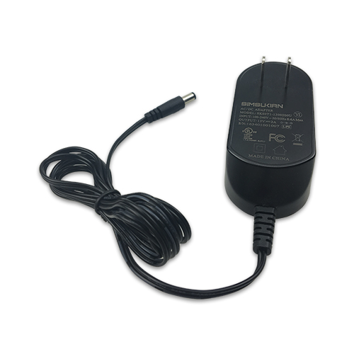
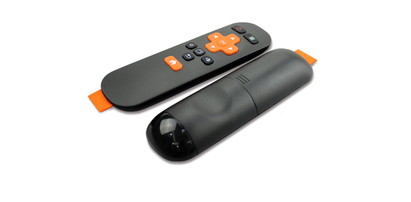
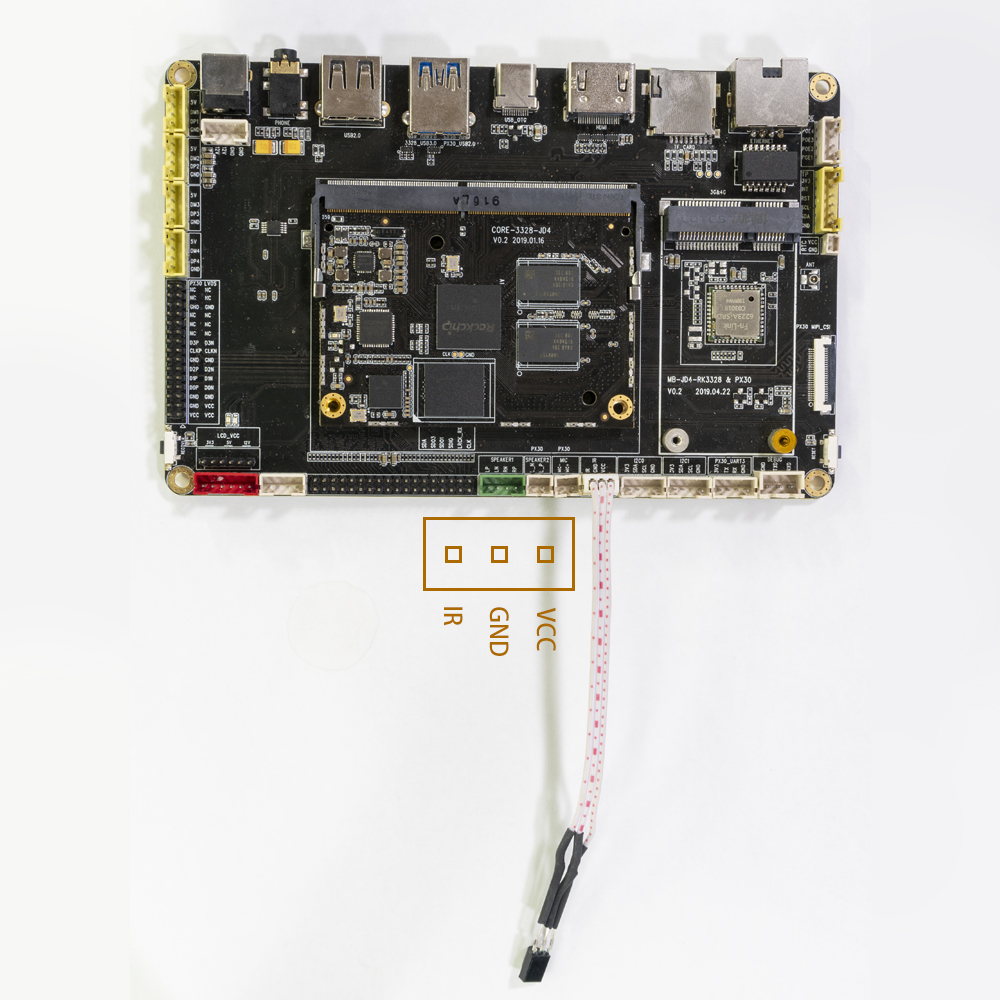
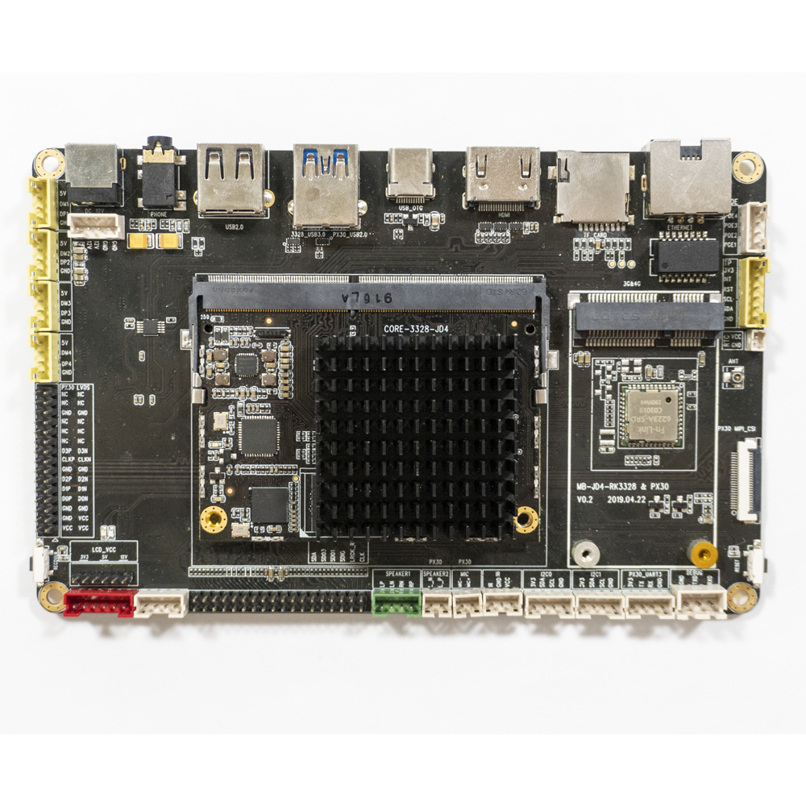

# Accessories

## Conversion module
### [USB to TTL serial port module](https://www.firefly.store/products/usb-to-uart-module-cp2104)
#### Product parameters
* **brand:** Firefly
* **size:** 29mm*19mm

#### Technical data
Driver download: [http://www.prolific.com.tw/US/ShowProduct.aspx?pcid=41](http://www.prolific.com.tw/US/ShowProduct.aspx?pcid=41)

#### Real figure

#### Connection methods

## Wireless module
### [EC20 4G Module suite](https://www.firefly.store/products/4g-module-kit-eg25-g)
#### Product parameters
* **model**
  * EC20-C R2.0 Mini PCIe-C
* **supply voltage**
  * 3.3V~ 3.6V, Typical values: 3.3V
* **Working frequency band**
  * TDD-LTE: B38/B39/B40/B41
  * FDD-LTE: B1/B3/B8
  * WCDMA: B1/B8
  * TD-SCDMA: B34/B39
  * GSM: 900/1800
* **data transmission**
  * TDD-LTE： Max 130Mbps (DL) Max 35Mbps (UL)
  * FDD-LTE： Max 150Mbps (DL) Max 50Mbps (UL)
  * DC-HSPA+： Max 42Mbps (DL) Max 5.76Mbps (UL)
  * UMTS： Max 384Kbps (DL) Max 384Kbps (UL)
  * TD-SCDMA： Max 4.2Mbps (DL) Max 2.2Mbps (UL)
  * CDMA： Max 3.1Mbps (DL) Max 1.8Mbps (UL)
  * EDGE： Max 236.8Kbps (DL) Max 236.8Kbps (UL)
  * GPRS： Max 85.6Kbps (DL) Max 85.6Kbps (UL)
* **Interface connector**
  * USB: USB 2.0 high-speed interface, 480Mbps
  * digital voice: 1 digital voice interface (optional)
  * USIM：1.8V/3V
  * network indicator: ×2, NET_STATUS 和 NET_MODE
  * UART：×1 UART
  * reset: low level
  * PWRKEY: low level
  * antenna interface: 3 (main antenna, diversity antenna and GNSS antenna interface)
  * ADC：×2
* **Structure size**
  * 51.0mm × 30.0mm × 4.9mm
* **weight**
  * about 10.5g
* **certification**
  * CCC/ NAL*/ TA

#### Real figure

#### Connection methods
* USB connection

* Mini-PCIe connection

#### Refer to the firmware
Public firmware supports EC20 4G module by default.

## [Power adapter](https://www.firefly.store/products/12v-2a-power-adapter)
### Product parameters
* **product:** USB power adapter
* **specification:** US/EU standard
* **input standard:** AC110-240V 50/60Hz
* **output standard:** 12V-2A

**Note :** the AIO-3328-JD4 all-in-one machine needs power supply of 12V/2A for normal operation. If the current is lower than 2A, it may be restarted abnormally due to low current. In order to ensure the normal operation of the development board, please use power supply with voltage of 12V and current of 2a-3a.Recommend the use of Firefly website power accessories.

### Real figure

## [IR remote control](https://www.firefly.store/products/12-key-ir-remote-control)
### Product parameters
* **product:** 12-key infrared remote control
* **version:**  customized version of Firefly
* **power supply:** two no.7 batteries
* **adaptation:** AIO-3328-JD4
* **description:** support remote startup function of AIO-3328-JD4 development board

### Real figure

### The key code

*  The IR wiring position of AIO-3328-JD4 is shown in the red box below

## The cooling suite
### Aluminum heat sink
#### Accessories parameters
* adapter : AIO-3328-JD4
* size    : 43mm (L)* 39.5mm(W)*11mm(H)

#### Installation
