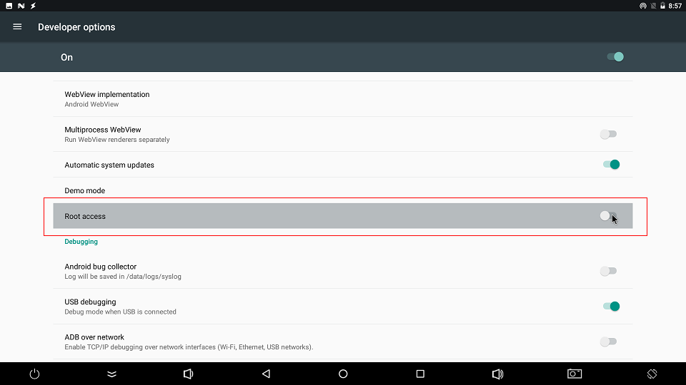

# FAQS


## The board repeatedly restarts during boot

The power supply may not provide enough current. Use a stable 12V/2A or higher-current power adapter.

## Where can I find the RK3328 technical reference manual?

See the [Rockchip RK3328 TRM](https://t-firefly.oss-cn-hangzhou.aliyuncs.com/product/RK3328/Docs/TRM/Rockchip_RK3328TRM_V1.1-Part1-20170321.pdf).

## How do I program the MAC address?

Enter upgrade mode as described in [Upgrade firmware](03-upgrade_firmware.md), then use [WNpctool](https://pan.baidu.com/s/1kU727kF#list/path=%2F) to program the MAC address.

## There is no sound after connecting headphones in Ubuntu

Open `Menu -> Multimedia -> PulseAudio Volume Control -> Configuration`, select the active sound-card profile, and disable unused sound cards.

## How do I save Android system logs?

Open `Settings -> System -> About tablet` and tap `Build number` five times to enable Developer options. Return to the previous menu, open `Developer options`, and enable `Enable logging to save`. Android creates a `.LOGSAVE` directory in the storage root containing `logcat` and kernel `kmsg` logs.
### Open Root permissions

There are many powerful functions of the Android system that require root permissions. Developers often encounter permissions problems when using them. How to enable the root permissions of the system on the Firefly platform? Firefly has added the function of starting root privileges in the system. The specific steps are as follows:

1. Find `About device` in `Settgins apk` and click into it;
2. After clicking on `Build number` 5 times, it will prompt (you are now a developer);
3. Then return to the previous level and click the option `Developer options`, and click `ROOT access` in the options to open the root authority function.


## What should I do if the boot is abnormal and restarts cyclically?

It may be that the power supply current is not enough. Please use a power supply with a voltage of 12V and a current of 2.5A~3A.

## What is the default username and password for Ubuntu?

* Username: `firefly`
* Password: `firefly`
* Switch super user `sudo -s`


## Write number tool to write SN, MAC address

<font color=red>**Note:**</font> If the eMMC erase operation is performed on the development board, the previously written data will also be cleared.

### Windows way
* Install RKDevInfoWriteTool
    * [Download link](https://community.t-firefly.com/en/doc/download/62#other_297)
* Select "RPMB" in **Settings** of RKDevInfoWriteTool
* Configure "SN", "WIFI MAC", "LAN MAC", "BT MAC", etc. in the **Settings** of RKDevInfoWriteTool as needed
* The development board enters loader mode
* RKDevInfoWriteTool performs **write** or **read** operations

For specific operations, please refer to the PDF document "RKDevInfoWriteTool User Guide" under the RKDevInfoWriteTool installation directory.

### Linux way

How to write the number of the development board itself

* Buildroot enable `BR2_PACKAGE_VENDOR_STORAGE`
* Read and write operations through the vendor_storage command
    * [Download link](https://community.t-firefly.com/en/doc/download/62#other_297)
     * SN
     ```shell
     vendor_storage -w VENDOR_SN_ID -t string -i cad895bedb8ee15f
     vendor_storage -r VENDOR_SN_ID -t hex -i /dev/null
     ```

     * LAN MAC
     ```shell
     vendor_storage -w VENDOR_LAN_MAC_ID -t string -i AABBCCDDEEFF
     vendor_storage -r VENDOR_LAN_MAC_ID -t hex -i /dev/null
     ```

        Others can be operated according to the prompt of `vendor_storage -h`.

For how to read the application, please refer to the `vendor_storage_read` function in `buildroot/package/rockchip/vendor_storage/vendor_storage.c`.

## On Ubuntu system, if there is no sound after plugging in headphones, what should I do?

`Menu` -> `Multimedia` -> `PulseAudio Volume Control` -> `Configuration` -> Select the sound card that is working and turn off the other sound card.

## How to make the system crawl LOG under Android?

`Settings (settings)` -> `About phone (about phone)` -> Click 5 times `Build number (version number)` -> `Developer options (Developer options)` -> `Enable logging to save Save)`. After the function is turned on, the folder `.LOGSAVE` will be generated under the root directory of the system `storage`, which includes the system logcat and kernel kmsg.