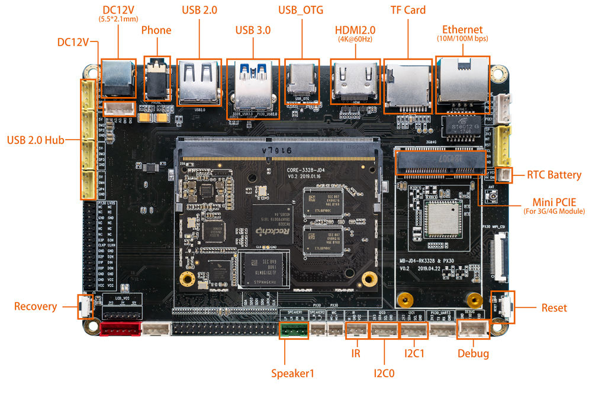
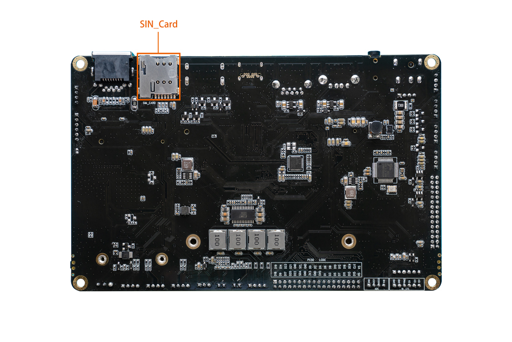

# Interface definition

The MB-JD4-RK3328&PX30 carrier board provides the following main interfaces:

* 12V power input
* 1 × USB 3.0 Device
* 5 × USB 2.0 (four external ports and one onboard header)
* HDMI display output
* 100M Ethernet
* Wi-Fi and Bluetooth antenna connectors
* Power and Recovery buttons
* 3.5mm headphone and speaker connectors
* RTC battery connector
* Infrared receiver connector
* TF card and SIM card slots
* Debug UART

## Special interface notes

The LVDS, touch-panel, backlight, panel-voltage jumper, microphone, and MIPI display interfaces on the MB-JD4-RK3328&PX30 carrier board are intended for the PX30 system-on-module and are unavailable when Core-3328-JD4 is installed.