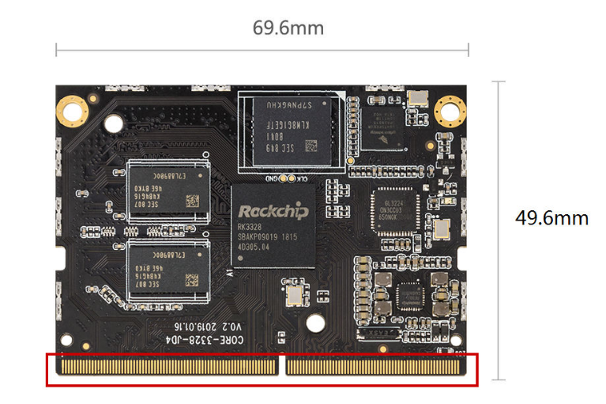
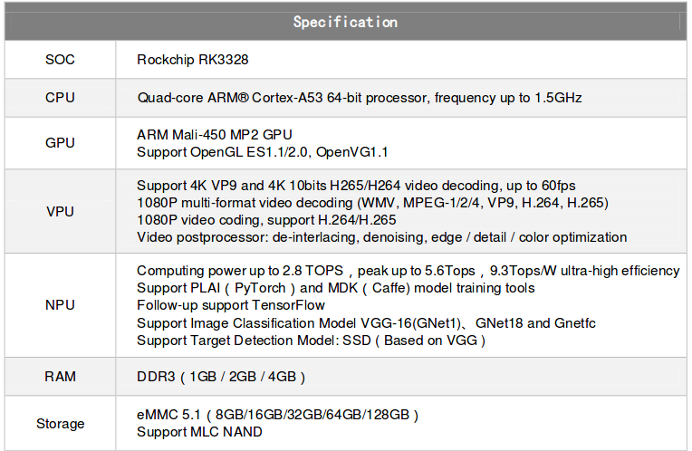
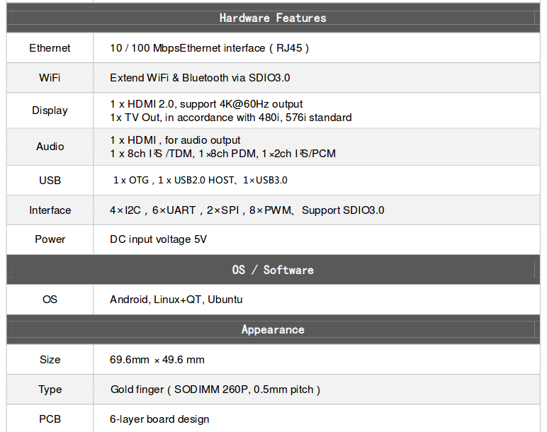

# Product introduction

## Overview

### Entry-level quad-core 64-bit system-on-module

Core-3328-JD4 is powered by the Rockchip RK3328 quad-core 64-bit Cortex-A53 processor and includes an onboard AI neural-network accelerator. It provides capable hardware video decoding and a rich set of expansion interfaces, supports multiple operating systems, and is suitable for cluster servers, high-performance computing and storage, and industrial computers.

## Specifications

## Standard kit

The Core-3328-JD4 standard kit contains:

* Core-3328-JD4 system-on-module × 1
* MB-JD4-RK3328&PX30 carrier board × 1
* Antenna × 1
* 12V/2A power adapter × 1
* Type-A to Type-C data cable × 1

You may also need:

* An HDMI display and HDMI cable
* A 100M Ethernet cable and wired router, or a Wi-Fi router
* A USB mouse, keyboard, or infrared remote control
* A USB-to-TTL serial adapter

## Power on

1. Connect an HDMI display and a USB mouse or keyboard if required.
2. Verify all connections, then connect the power adapter.
3. The blue power LED turns on. When an HDMI display is connected, the Firefly boot logo is shown.
 