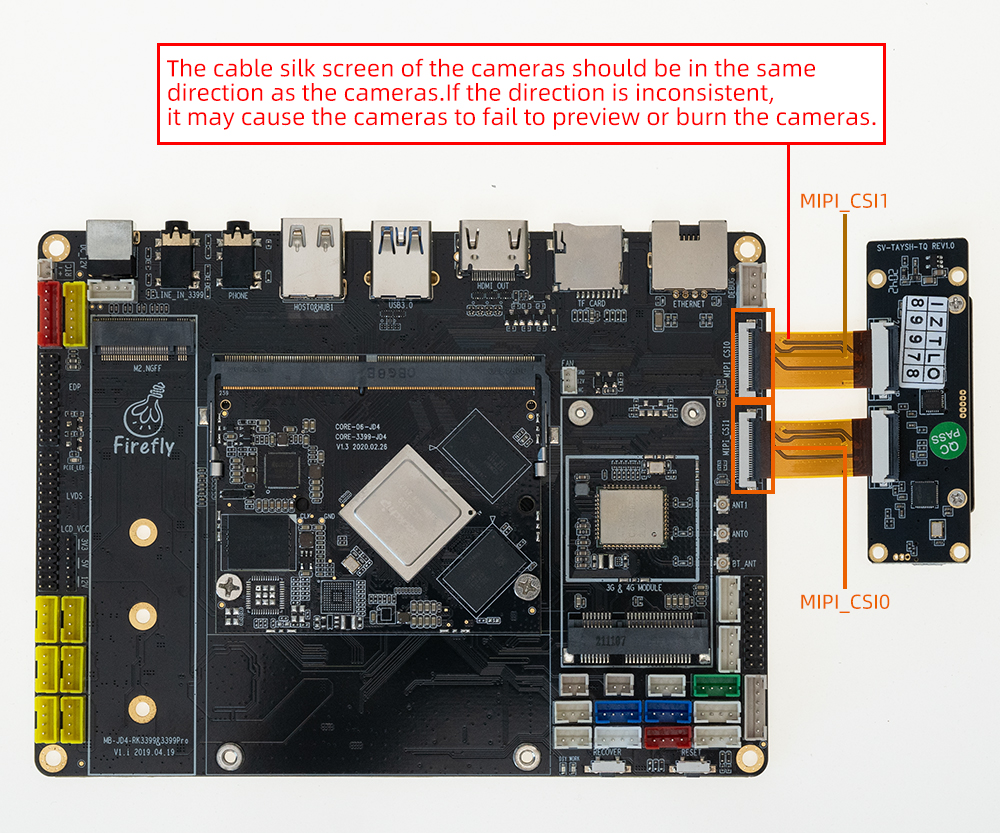

## SV-TAYSH-TQ Camera module

### Product parameters

* Model：XC7022(RGB)/XC6130(IR)

* Interface ：MIPI

* Pixel ：200W

### Patch
「 Android 7.1 」device/rockchip/rk3399/rk3399_firefly_aiojd4.mk

```
 BOARD_NFC_SUPPORT := false
 BOARD_HAS_GPS := false
+BOARD_XC7022_XC6130_SUPPORT := true

 #for 3G/4G modem dongle support
 BOARD_HAVE_DONGLE := false
```
 Modify the above patch and [complie Android](https://wiki.t-firefly.com/en/Core-3399-JD4/compile_android7.1_industry_firmware.html#manual-compilation-core-3399-jd4), then reboot after upgrading system.img.

### Physical map


### Connection method



### Real pictures


