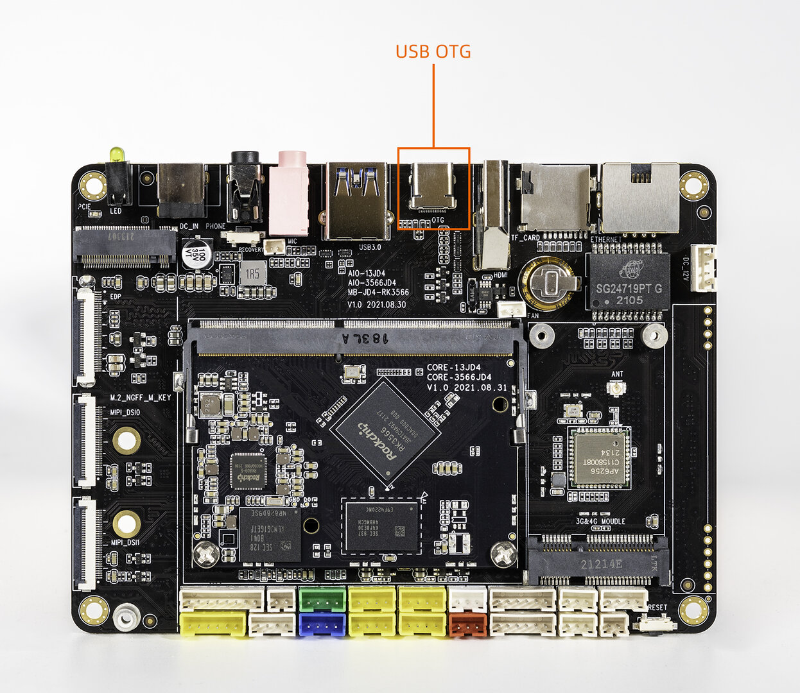

When using `adb`, you need to:
1. AIO-3566JD4 Connect the device and host with Type-C data cable;
1. Install the adb driver and commands based on your system. (introduce later)

Android needs:

1. Open the `Settings` ->`About tablet`-> click 7 times `Build number`
1. Go to `Settings`->`System`->`Advance`->`Developer options`, check the "USB debugging" option (checked by default), Root authorization check the option with ADB;


When the device status bar prompts `USB debugging connected`, you can debug:

```shell
adb devices

adb shell
```

