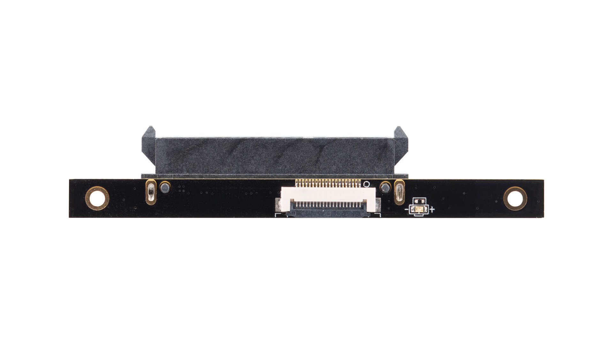
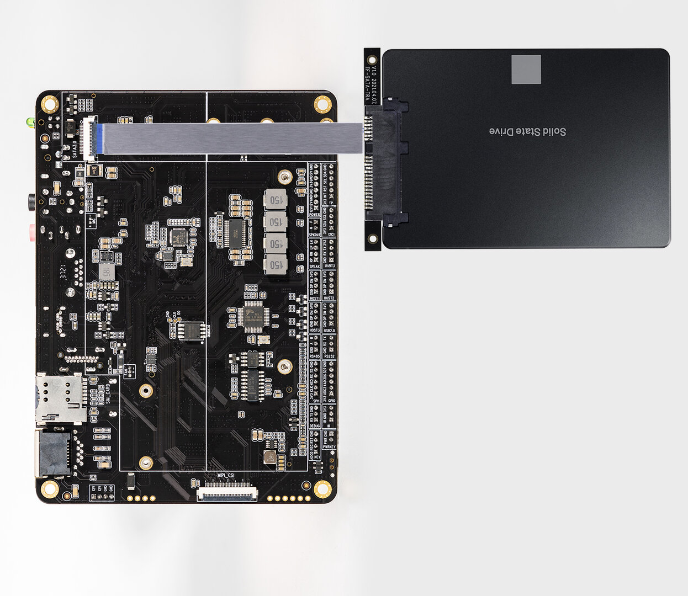

# [SATA Adapter](https://www.firefly.store/products/sata-adapter)
AIO-3566JD4 needs  SATA Adapter module when using the SATA storage device. The SATA Adapter fits all series mainboards of Firefly with FPC SATA interface, can be connected to 2.5'' or 3.5'' SSD/HDD, and it uses FPC ribbon cable, with aluminum foil shielding, minimizes signal interference


## Real figure
* SATA Adapter front


* SATA Adapter back


## AIO-3566JD4 connect to SATA storage device 


**Note:** in order to prevent the situation from burning out, please turn off the power of the AIO-3566JD4 first and then connect the SATA storage device 
(The public firmware turns off SATA by default)

## enable SATA
* Since SATA and m.2 PCIe functions on AIO-3566JD4 are multiplexed, the enabling SATA is modified as follows:
```
--- a/kernel/arch/arm64/boot/dts/rockchip/rk3566-firefly-aiojd4.dtsi
+++ b/kernel/arch/arm64/boot/dts/rockchip/rk3566-firefly-aiojd4.dtsi
@@ -173,11 +173,11 @@
     pinctrl-names = "default";
     pinctrl-0 = <&pcie_reset_gpio>;
     /delete-property/ vpcie3v3-supply;
-    status = "okay";
+    status = "disabled";
 };

 &sata2 {
-    status = "disabled";
+    status = "okay";
 };
```
