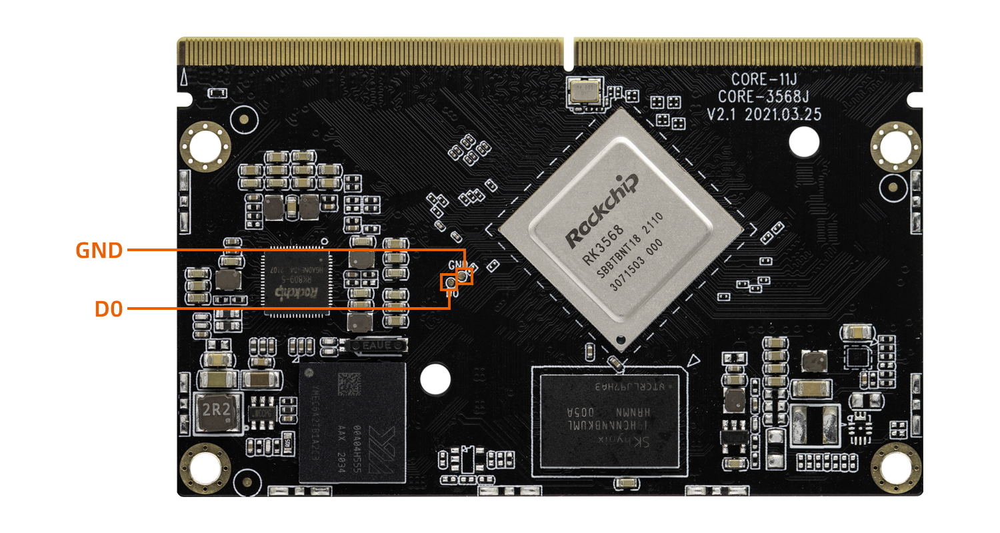

# MaskRom mode

***See startup mode for an introduction [startup mode](01-bootmode.md)***

`MasRrom` mode is the last line of defense against device being bricked. Forced entry `MaskRom` involved hardware operation, have certain risk, so only in the situation that deivce failed entering the `Loader` mode, you can try `MaskRom` mode.

**Please read carefully and operate carefully!**

The operation steps are as follows:

1. Disconnect all power supplies.
1. Connect device and host PC with Double male USB data cable.
1. Use a metal tweezer to short and hold the two test points as shown in the following figure on Core-3568J (as shown in the figure below).
1. Connect the power.
1. Wait a few seconds, stop shorting.

Short circuit the D0 and GND test points near EMMC 

At this point, the device should go into `MaskRom mode`.

