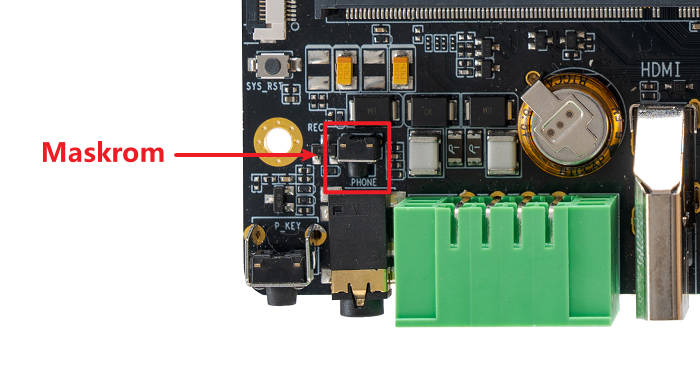

# MaskRom mode

***See startup mode for an introduction [startup mode](upgrade_bootmode.md)***

`MaskRom` pattern is the last line of defense equipment burn out. Forced entry `MaskRom` involved hardware operation, have certain risk, so only in the equipment into the `Loader` mode, can try `MaskRom` mode.

**Please read carefully and operate carefully!**

The operation steps are as follows:

1. Disconnect the device from the power supply
2. Hold the MaskRom button on AIO-3588SJD4-AI (shown in the picture below)
3. The device is plugged into the power supply and powered on

At this point, the device should go into `MaskRom mode`.

