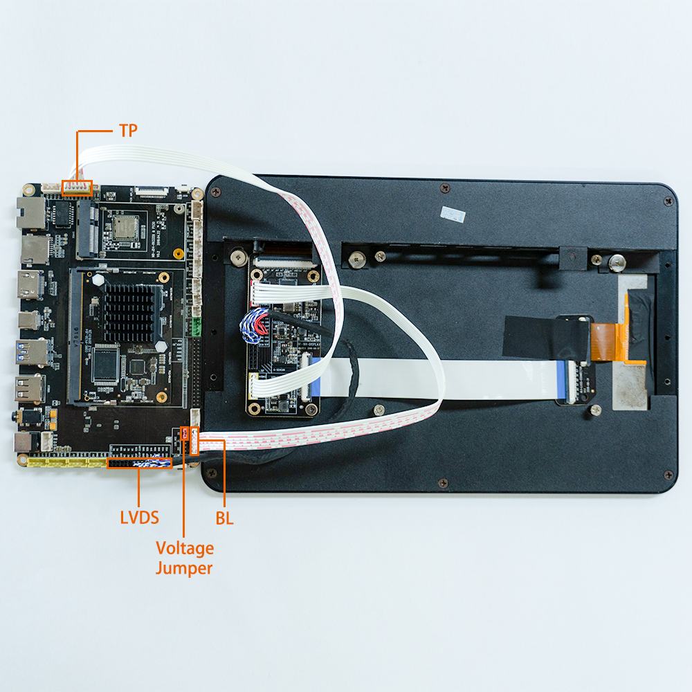

# Accessories

## [USB to UART module](https://www.firefly.store/products/usb-to-uart-module-cp2104)

Product Parameter

* Brand：Firefly
* Size：29mm * 19mm

Reference material

* [Driver link](http://www.prolific.com.tw/US/ShowProduct.aspx?pcid=41)

Picture


Connection


## [EC20 4G module](https://www.firefly.store/products/4g-module-kit-eg25-g)

Product Parameter

* Model
   - EC20-C R2.0 Mini PCIe-C
* Power supply
   - 3.3V～3.6V (Typical 3.3V)
* Band
   - TDD-LTE: B38/B39/B40/B41
   - FDD-LTE：B1/B3/B8
   - WCDMA: B1/B8
   - TD-SCDMA: B34/B39
   - GSM: 900/1800
* Data
   - TDD-LTE： Max 130Mbps (DL) Max 35Mbps (UL)
   - FDD-LTE： Max 150Mbps (DL) Max 50Mbps (UL)
   - DC-HSPA+： Max 42Mbps (DL) Max 5.76Mbps (UL)
   - UMTS： Max 384Kbps (DL) Max 384Kbps (UL)
   - CDMA： Max 3.1Mbps (DL) Max 1.8Mbps (UL)
   - TD-SCDMA： Max 4.2Mbps (DL) Max 2.2Mbps (UL)
   - EDGE： Max 236.8Kbps (DL) Max 236.8Kbps (UL)
   - GPRS： Max 85.6Kbps (DL) Max 85.6Kbps (UL)
* Connector
   - USB: USB 2.0 high-speed interface, 480Mbps
   - Digital voice: 1 digital voice interface (optional)
   - USIM: 1.8 V / 3 V
   - Network instructions: * 2, NET_STATUS, and NET_MODE
   - UART: x 1 UART
   - Reset: low level
   - PWRKEY: low level
   - Antenna interface: x 3 (main antenna, split antenna and GNSS antenna interface)
   - ADC: x 2
* Dimensions
   - 51.0mm×30.0mm×4.9mm
* Weight
   - About 10.5g
* Approvals
   - CCC/ NAL*/ TA

Reference firmware:

* The public firmware supports EC20 4G module by default

Picture


Connection

* USB connection


* MIPI connection


## [Power adapter](https://www.firefly.store/products/12v-2a-power-adapter)

Product parameter

* Product parameter：Power Adapter
* Specifications: EU Standard/US Standard
* Input：AC110-240V 50/60Hz
* Output：12V-2A

<font color=#ff0000>Note: AIO-PX30-JD4 integrated machine normal work requires power 12V/2A, it probably abnormal restart if the current is less than 2A. In order to ensure the normal operation of thethe Firefly-RK3399, please use the voltage of 12V, current is 2A ~ 3A power, and we suggest to use the official power.</font>

Picture


## [Remote control](https://www.firefly.store/products/12-key-ir-remote-control)

Product Parameter

* Product: 12-KEY Remote Control
* Version: Firefly Customized
* Power: 2xAAA Batteries
* Adapter: AIO-PX30-JD4
* Description: Support for remote boot capabilities AIO-PX30-JD4

Picture


Key code


The IR wiring position of the AIO-PX30-JD4 is shown in the red box below:


## [Aluminum heat sink](https://www.firefly.store/products)

Product parameters

* Adaptation: AIO-PX30-JD4
* size: 43mm (L)* 39.5mm(W)*11mm(H)

Picture


## [OV13850 Camera Moudle](https://www.firefly.store/products/ov13850-camera-module)

Product Parameter

* Brand：Omnivision
* Model：OV13850
* Interface：MIPI
* Pixels：1320W

Firmware follow

* cMK-OV13850 camera module is supported by default in the public firmware

Datasheet

* [DataSheet and schematic of OV13850 Camera Module](http://download.t-firefly.com/product/RK3288/Docs/Peripherals/OV13850%20datasheet/Sensor_OV13850-G04A_OmniVision_SpecificationV1.pdf)

Picture


Connection


Renderings


## [LVDS display module](https://www.firefly.store/products)

Product parameters

* Brand: Firefly
* Model: HSX101H40C
* Size: 10.1 inch
* Resolution: 1280x800
* Interface: LVDS
* Visual angle: 170°
* Touch screen: Multi-touch capacitive

Reference materials

* [Datasheet&Schematic](https://community.t-firefly.com/en/doc/download/45)

Reference firmware

**Note: The official firmware name supporting 10.1 inch screen has the word "LVDS". The following is the firmware link:**

* [Firmware link](https://community.t-firefly.com/en/doc/download/45)

Picture



### Compile command

Use the following command when compiling the supported 10.1 inch screen firmware with the official website SDK:

```
./FFTools/make.sh -j8 -d px30-firefly-aiojd4-lvds -l px30_evb-userdebug
./FFTools/mkupdate/mkupdate.sh -l px30_evb-userdebug
```