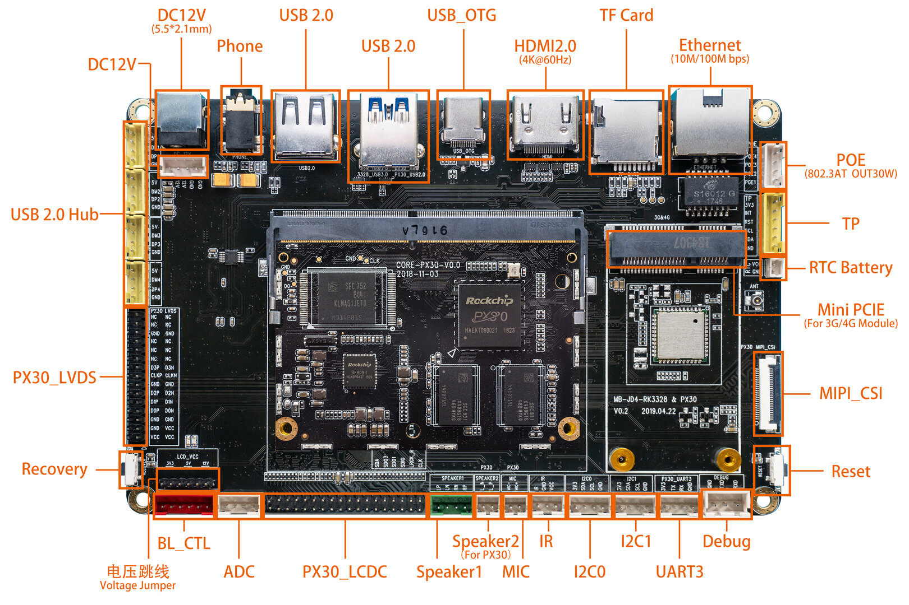
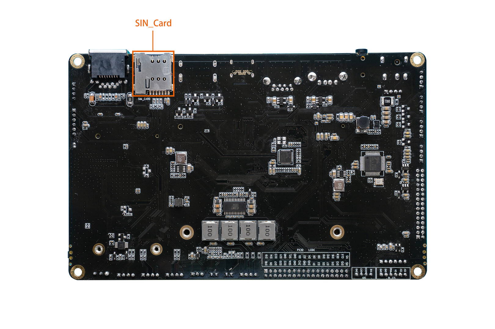

# Interface definition

## Interface definition of the whole machine

CORE-PX30-JD4 provides rich interfaces, including :

* Power interface,
* 1 x USB3.0(device), 6 x USB2.0 (interface 4, seat 2),
* Ethernet,
* LVDS interface screen,
* TP touch interface,
* Screen voltage jump line interface,
* Backlight interface,
* WIFI antenna,
* Bluetooth antenna,
* Power button,
* MIC interface,
* Audio output (lineout),
* 3.5 mm headphone jack,
* RTC power interface,
* 12V power supply interface,
* IR interface,
* TF card slot,
* SIM card slot,
* Speaker interface,
* Recovery button,
* Debugging serial port,
* Industrial serial port (TTL),
* MIPI screen interface (single LVDS multiplexing),

The details are as follows:

###  Special interface description

The HDMI interface and HUB1_USB3 in the MB-JD4-RK3328&PX30 baseboard are designed to support the rk3328 core board, so the PX30 core board cannot use these two interfaces.