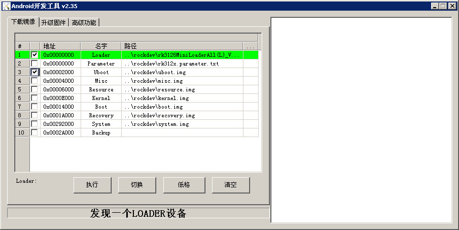

# U-Boot introduction

## Introduction

RK U-Boot based on the open source U-Boot development, work mode has a boot loading mode and download mode. Boot load mode is the normal working mode of U-Boot, embedded product release, U-Boot is working in this mode, mainly used for boot to load the memory of the kernel into memory, start the operating system; Download mode is mainly used to download the firmware to flash memory, and press the recovery button to enter the download mode after startup time. This article briefly explains the use of U-Boot. Please refer to the development document `v3.0.pdf` of the `RKDocs/common/uboot/RockChip_Uboot` directory under the SDK for more relevant documents.

## Compile

The compiling steps of U-Boot are similar to kernel compiling. Before compiling, you need to write the configuration to `.config`, run the command:

* Android:

```
make evb-px30_defconfig
```

* Linux:

```
make xxx_defconfig
```

If you need to modify the relative option, you can run:

```
make menuconfig
```

Run below command to compile:

```
make ARCH=aarch64
```

After compiling successfully, there will be a new file created at the follow path:

```
u-boot/uboot.img
u-boot/trust.img
u-boot/px30_loader_v1.10.115.bin
```

## Flash Image

Open the upgrade tool, connect the board with the USB OTG cable, press the Recovery key when the power is on, and make the development board enter the U-Boot download mode. Select the compiled Loader file in the upgrade tool and click execute, as shown below:



## Verify that the new Loader is correctly upgraded

If you flash the loader successfully, there will be some information output from the debug UART as the follow log shows:

```
#Boot ver: 2019-05-08#1.09
```

If the time shows the same as your compile time, it means you flash the loader successfully.

## Enter u-boot command line mode

Since Firefly product is mainly used for development, we set the 1 second countdown time when starting up by default. At this time, if any key is input in the serial port, it can enter the u-boot command line mode. The product released does not need to enter the U-Boot command line mode. If U-Boot is not required to enter the command line mode by default, the following modifications can be made:

In the file: `u-boot/include/configs/rk33plat.h`

```
/* mod it to enable console commands.  */
#define CONFIG_BOOTDELAY               0
```

If the macro CONFIG_BOOTDELAY is changed to 0, it will not enter command line mode by default.