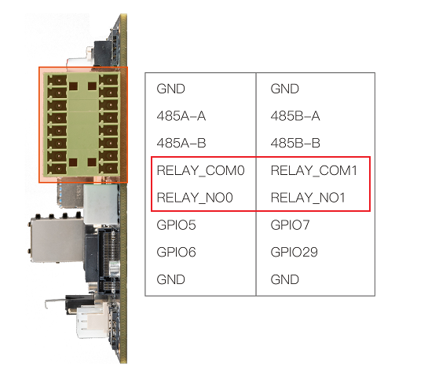
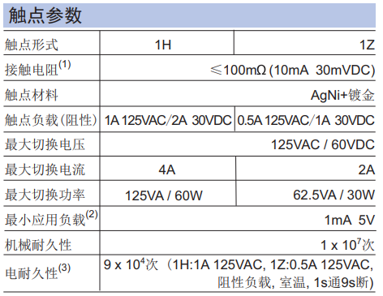

# RELAY


AIO-1684XQ has 2 RELAY control units on the development board:

<center>

    
</center>

Parameters for each RELAY unit:

<center>


</center>
```
# RELAY0 Connection State (Connecting both circuits of the relay)
echo 1 >/sys/class/leds/RELAY0/brightness
# RELAY1 Connection State (Connecting both circuits of the relay)
echo 1 >/sys/class/leds/RELAY1/brightness

# RELAY0 Disconnection State (Disconnecting both circuits of the relay)
echo 0 >/sys/class/leds/RELAY0/brightness
# RELAY1 Disconnection State (Disconnecting both circuits of the relay)
echo 0 >/sys/class/leds
```
