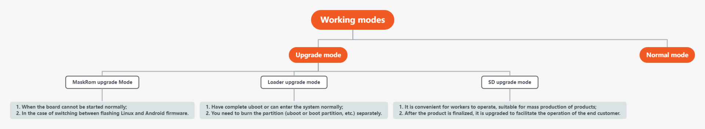

# Introduction to updating firmware

## Preface

AIO-3562JQ has 2 working modes. Under normal circumstances, boot directly into `Normal mode` to start the system normally. If you need to upgrade the board subsystem, you can choose the appropriate `Upgrade mode` to upgrade the firmware according to the situation.

## Normal mode

| Working Mode | Normal Mode | Upgrade Mode |
| :--------: | :-------: | :------- |
| Boot Media | eMMC Interface/SDMMC Interface| | √ |
| Description | Normal mode is the normal startup process,   each component is loaded in sequence and enters the system normally. | There are currently 3 upgrade modes supported, each with their own advantages and disadvantages: 1. [MaskRom Upgrade Mode](04-maskrom_mode.html) 2. [Loader upgrade mode](loader_mode.html) 3. [SD upgrade mode](05-upgrade_firmware_sd.html)|

## Upgrade mode

**Among the upgrade modes, the comparison between different upgrade modes:**

| Upgrade mode  | [MaskRom Upgrade Mode](04-maskrom_mode.html) | [Loader upgrade mode](loader_mode.html) | [SD upgrade mode](05-upgrade_firmware_sd.html) |
| :--------: | :------- | :------- | :------- |
| Quick description | 1. Use the USB cable to connect the motherboard to the computer; 2. The hardware operation makes the board enter the upgrade mode; 3. Use USB to upgrade the board firmware on the PC.  |  1. Use the USB cable to connect the motherboard to the computer; 2. Software or button operation makes the board enter the upgrade mode; 3. Use USB to upgrade the board firmware on the PC. | 1. Use the upgrade card making tool to make the MicroSD card as an upgrade card; 2. Insert the upgrade card into the motherboard, power on, and the machine will automatically perform the upgrade.|
| Connection method | USB | USB | TF card (a few are SD card slots) |
| Entry method | Requires hardware operation |  Button or software entry| Power on and enter directly|
| Conditions of Use | Hardware operation entry |  Can use uboot normally| Nothing|
| Recommended usage scenarios | 1. When the board cannot be started normally; 2. Loader mode failed to upgrade |  1. Have a complete uboot or can enter the system normally; 2. Need to burn the partition separately (uboot or boot partition, etc.).| 1. It is convenient for workers to operate, suitable for mass production of products; 2. The products can be upgraded after finalization, which is convenient for end customers to operate.|
| Advantage | 1. The most basic programming method;  2. Upgrades rarely fail; 3. No uboot support is required, rescue abnormal boards. | 1. Most commonly used method ; 2. It can write partitions separately; 3. It is convenient to enter the loader mode. | 1. Easy to operate, just plug in the card to start; 2. It combines the advantages of MaskRom Upgrade Mode. |
| Disadvantages | 1. It is difficult to enter Maskrom mode; 2. It is difficult to upgrade the partitions individually; 3. Misoperation will cause board failed to start normally. | 1. A complete loader (usually uboot) is required. | 1. Requires to synthesize full firmware. |

#### MaskRom Upgrade Mode

In general, there is no need to enter `MaskRom Upgrade Mode`. Only when the board failed to boot normally or `Loader Mode` failed to upgrade. In this mode, the BootRom code will enter this mode. At this time, the BootRom code waits for the host to transmit the bootloader code through the USB interface, load and run it. When the bootloader verification fails (the IDB block cannot be read, or the bootloader is damaged), it will enter `MaskRom Mode` automatically. You can also manually enter the `MaskRom Upgrade Mode`.

***To enter `MaskRom Upgrade Mode`, please refer to the chapter ["MaskRom Upgrade Mode"](04-maskrom_mode.md).***

#### Loader upgrade mode

It is the recommended mode. In `Loader upgrade mode`, the bootloader will enter an upgrade state, waiting for host commands for firmware upgrades, etc. To enter this mode, the bootloader must detect a `RECOVERY` key press at startup and the USB is connected.

***To enter `Loader upgrade mode`, see the chapter ["Loader upgrade mode"](loader_mode.md).***

#### SD upgrade mode

Using SD upgrade is essentially to make a bootable SD card with upgrade firmware, let the board boot from SD, erase and upgrade the firmware to EMMC.

***To enter `SD upgrade mode`, please refer to the chapter ["Upgrade Firmware Using SD Card"](05-upgrade_firmware_sd.md).***
