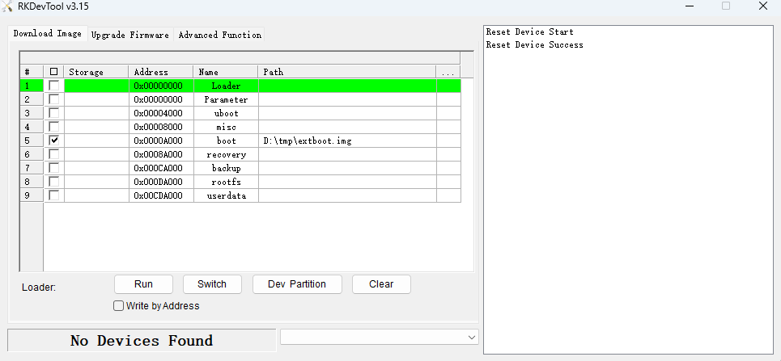
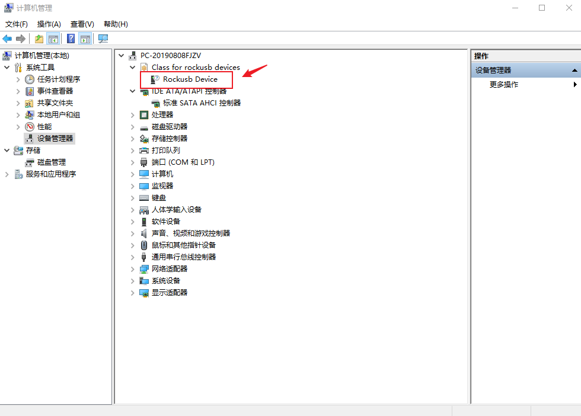
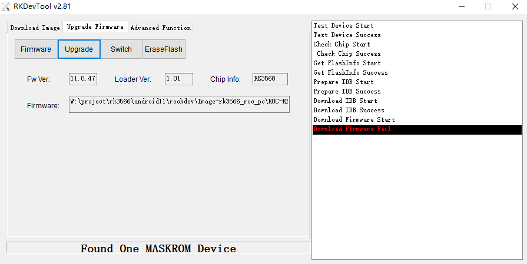

# Upgrade the firmware via USB cable

## Introduction

This article describes how to upgrade the firmware file on the host to the flash memory of the development board through the Double male USB data cable. When upgrading, you need to choose the appropriate upgrade mode according to the host operating system and firmware type.

## Preparatory Tools

* AIO-3562JQ board
* Firmware
* host computer
* Double male USB data cable

There are two types of firmware files:

* A single unified firmware

	The unified firmware is a single file packaged and merged by all files such as the partition table, bootloader, uboot, kernel, system and so on. The firmware officially released by Firefly adopts a unified firmware format. Upgrading the unified firmware will update the data and partition table of all partitions on the motherboard, and erase all data on the motherboard.

* Multiple partition images

	That is, files with independent functions, such as partition table, bootloader, and kernel, are generated during the development phase. The independent partition image can only update the specified partition, while keeping other partition data from being destroyed, it will be very convenient to debug during the development process.

> Through the unified firmware unpacking / packing tool, the unified firmware can be unpacked into multiple partition images, or multiple partition images can be merged into a unified firmware.

In order to avoid the burning problem caused by the upgrade tool version, it is recommended to use the tool packaged inside the public firmware package for burning. 

### Windows

* Install RK USB drive

Download [Release_DriverAssistant.zip](https://en.t-firefly.com/doc/download/222.html#other_672), extract, and then run the DriverInstall.exe inside .
In order for all devices to use the updated driver, first select `Driver uninstall`(`驱动卸载`) and then select `Driver install`(`驱动安装`).

<center>


</center>

* Open RKDevTool

Use tools in the firmware package or download here [RKDevTool](https://en.t-firefly.com/doc/download/222.html#other_674)

RKDevTool defaults to display in Chinese. We need to change it to English. Open `config.ini` with an text editor (like notepad). The starting lines are:

```
#Language Selection: Selected=1(Chinese); Selected=2(English)
[Language]
Kinds=2
Selected=1
LangPath=Language\
```

Change `Selected=1` to `Selected=2`, and save. From now on, RKDevTool will display in English.Now, run RKDevTool.exe: (Note: If using Windows 7/8, you’ll need to right click it, select to run it as Administrator)



### Linux

There is no need to install device driver under Linux. Please refer to the Windows section to connect the device.

* Upgrade_Tool : Use tools in the firmware package or download here [upgrade_tool_xxx (version number)](https://en.t-firefly.com/doc/download/222.html#other_673)

Install it into the system as follows for easy invocation:

```
unzip Linux_Upgrade_Tool_xxxx.zip
cd Linux_UpgradeTool_xxxx
sudo mv upgrade_tool /usr/local/bin
sudo chown root:root /usr/local/bin/upgrade_tool
sudo chmod a+x /usr/local/bin/upgrade_tool
```

## Enter Upgrade Mode

Use Double male USB data cable to connect host computer and OTG port of board.

### Loader mode

we can put the device into upgrade mode by hardware as follows:

* Disconnect all power supply
* Press and hold RECOVERY button on board
* Connect the power supply
* After few seconds, release RECOVERY button
Or put the device into upgrade mode by software as follows:

Use the command in the serial debugging terminal or adb shell

```shell
reboot loader
```
We can use tools to check if the board is in loader mode:

* Windows
Use RKDevTool we can see the notice "Found One LOADER Device" if the board is in Loader mode.


And you will see a new `Rockusb Device` in windows device manager. If not, you can try resinstall RK USB driver.



* Linux

Run upgrade_tool you can see a device with "Loader" lable:
```shell
firefly@T-chip:~/severdir/down_firmware$ sudo upgrade_tool
List of rockusb connected
DevNo=1 Vid=0x2207,Pid=0x330c,LocationID=106    Loader
Found 1 rockusb,Select input DevNo,Rescan press <R>,Quit press <Q>:q
```

## Upgrade the firmware

### Windows

#### Upgrade unified firmware - update.img

The steps to update the unified firmware `update.img` are as follows:

1. Switch to the "upgrade firmware" page.
2. Press the "firmware" button to open the firmware file to be upgraded. The upgrade tool displays detailed firmware information.
3. Press the "upgrade" button to start the upgrade.

#### Upgrade Partition image

The steps to upgrade the partition image are as follows:
1. Switch to the "download image" page.
2. Click `Dev Partition`
3. Check the partition to be burned, and select multiple.
4. Make sure the path of the image file is correct. If necessary, click the blank table cell on the right side of the path to select it again.
5. Click "Run" button to start the upgrade, and the device will restart automatically after the upgrade.


### Linux

#### Upgrade unified firmware - update.img

```
sudo upgrade_tool uf update.img
```

#### Upgrade Partition image

```
sudo upgrade_tool di -b /path/to/extboot.img
sudo upgrade_tool di -r /path/to/recovery.img
sudo upgrade_tool di -m /path/to/misc.img
sudo upgrade_tool di -u /path/to/uboot.img
sudo upgrade_tool di -p paramater   #upgrade parameter
sudo upgrade_tool ul bootloader.bin #upgrade bootloader
```

## FAQs

### 1. How to forcibly enter MaskRom mode

**A1 :** If the board does not enter Loader mode, you can try to force your way into MaskRom mode. See operation method ["How to enter MaskRom mode"](04-maskrom_mode.md).

### 2. Analysis of programming failure

If Download Boot Fail occurs during the programming process, or an error occurs during the programming process, as shown in the figure below, it is usually caused by the poor connection of the USB cable, the inferior cable, or the insufficient drive capability of the USB port of the computer. Troubleshoot the computer USB port.

