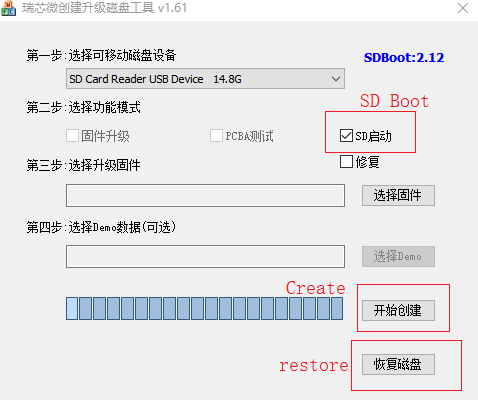

# Make an SD boot card

Following the previous step of using SD card to upgrade the firmware, this paper mainly introduces how to use a MicroSD card to make an SD boot card for starting and running the system.
You need to follow the same steps to make a bootable card, except that you need to check the *SD Boot* box when you open **SD_Firmware_Tool**, as shown below:

After selecting the correct removable disk device and firmware update, click **Create**, Note: Not every device and SDK supports SD boot 

Note: Since making an SD boot card rewrites the partitions on the card, you can click **restore** to get your SD card back to work.