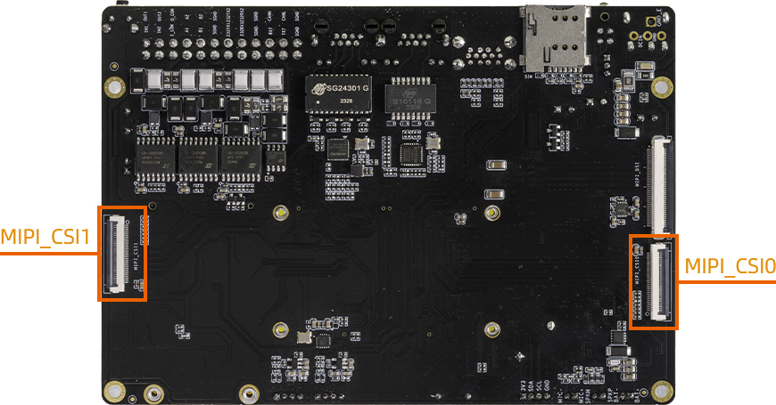
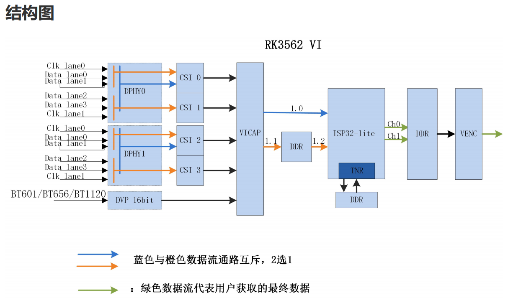

# Camera

* interface



## MIPI CSI
RK3562 platform has 2 4-lane dphy, each lane up to 2.5Gbps.

### dphy

RK3562 has 2 4-lane dphy: csi2_dphy0 and csi2_dphy3.

Use csi2_dphy0 and/or csi2_dphy3 directly is called "full mode".

You can split them for "split mode":

csi2_dphy0 can split into 2 2-lane dphy: csi2_dphy1 and csi2_dphy2;

csi2_dphy3 can split into 2 2-lane dphy: csi2_dphy4 and csi2_dphy5.

### mipi_csi

RK3562 has 4 mipi_csi:

Data comes from csi2_dphy0 (csi2_dphy1+csi2_dphy2) goes to mipi0_csi2 and mipi1_csi2;

Data comes from csi2_dphy3 (csi2_dphy4+csi2_dphy5) gose to mipi2_csi2 and mipi3_csi2.

### vicap

Similarly, vicap has 4 nodes:

Data comes from mipi0_csi2 and mipi1_csi2 gose to rkcif_mipi_lvds and rkcif_mipi_lvds1;

Data comes from mipi2_csi2 and mipi3_csi2 gose to rkcif_mipi_lvds2 and rkcif_mipi_lvds3.

### rkisp_vir

RK3562 has only one isp, which has 4 nodes: rkisp_vir0~3



## Configuration

Reference document: SDK/docs/en/Common/ISP/ISP32-lite/Rockchip_Driver_Guide_VI_EN_v1.0.7.pdf

### Dual 8MS1M Camera

800W px camera 8MS1M (XC7160_SC8238), it come with isp, so link to vicap is enough:
```
xc7160_0 -> csi2_dphy0 -> mipi0_csi2 -> rkcif_mipi_lvds
xc7160_1 -> csi2_dphy3 -> mipi2_csi2 -> rkcif_mipi_lvds2
```
For details please refer to the DTS: SDK/kernel/arch/arm64/boot/dts/rockchip/rk3562-firefly-aio-3562jq-dual-xc7160.dtsi

### Dual IMX415 Camera

IMX415 is RAW camera, so link it to rkisp:
```
imx415_0 -> csi2_dphy0 -> mipi0_csi2 -> rkcif_mipi_lvds -> rkcif_mipi_lvds_sditf -> rkisp
imx415_1 -> csi2_dphy3 -> mipi2_csi2 -> rkcif_mipi_lvds2 -> rkcif_mipi_lvds2_sditf ->rkisp
```
For details please refer to the DTS: SDK/kernel/arch/arm64/boot/dts/rockchip/rk3562-firefly-aio-3562jq-dual-imx415.dtsi

rkisp need rkaiq_3A_server in userspace to handle stream. (Work in progress)

## Select Camera Conf

SDK/kernel/arch/arm64/boot/dts/rockchip/rk3562-firefly-aio-3562jq.dts included rk3562-firefly-aio-3562jq-dual-xc7160.dtsi by default. Which means using dual 8MS1M.

You can change that inclusion if you want other cameras. Remember to re-build kernel after modification.

## Camera Debug
Use v4l2-ctl to capture camera frame data
```shell
# First use v4l2-ctl to list available devices
v4l2-ctl --list-devices

# capture frames to out.yuv
v4l2-ctl --verbose -d /dev/video0 --set-fmt-video=width=1920,height=1080,pixelformat='NV12' --stream-mmap=4 --set-selection=target=crop,flags=0,top=0,left=0,width=1920,height=1080 --stream-to=/data/out.yuv
```

Copy file out.yuv to computer and play it with ffplay:
```shell
ffplay -f rawvideo -video_size 1920x1080 -pix_fmt nv12 out.yuv
```

## Android Use Camera App
In Android, you can use "Camera" app to use camera.

## Linux Preview Camera
You can use this script to preview camera, you can change the video device:
```bash
#!/bin/bash

export DISPLAY=:0
export XAUTHORITY=/home/firefly/.Xauthority
export LD_LIBRARY_PATH=$LD_LIBRARY_PATH:/usr/lib/aarch64-linux-gnu/gstreamer-1.0
WIDTH=1920
HEIGHT=1080
SINK=xvimagesink

gst-launch-1.0 v4l2src device=/dev/video0 ! video/x-raw,format=NV12,width=${WIDTH},height=${HEIGHT}, framerate=30/1 ! videoconvert ! $SINK &

wait
```

## IQ Files
Supported raw camera iq files are under `external/camera_engine_rkaiq/rkaiq/iqfiles/isp32_lite/`. 

If you need to use raw sensor camera, please check if there is a matchable iq file under `/etc/iqfiles/` directory.

