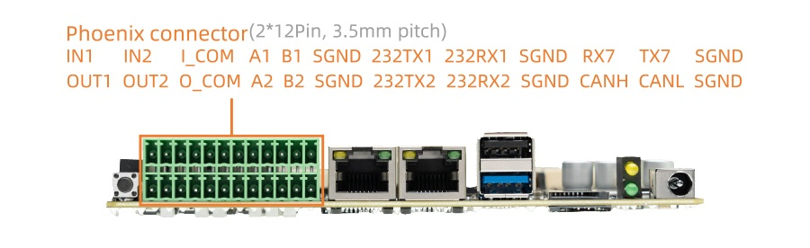

# UART

## Introduction

AIO-3562JQ supports UART, RS232 and RS485 interfaces
* UART x 1
* RS485 x 2
* RS232 x 2

The UART is uart7, RS232 is converted from RK3562 uart8 and uart9, RS485 is converted from uart5 and uart6.

The serial interface diagram of the AIO-3562JQ development board is as follows:



## DTS configuration

File `kernel/arch/arm64/boot/dts/rockchip/rk3562-firefly-aio-3562jq.dtsi` has the definition of uart related nodes:

```
/* RS485 */
&uart5 {
    status = "okay";
    pinctrl-names = "default";
    pinctrl-0 = <&uart5m1_xfer>;
};

&uart6 {
    status = "okay";
    pinctrl-names = "default";
    pinctrl-0 = <&uart6m0_xfer>;
};

&uart7 {
    status = "okay";
    pinctrl-names = "default";
    pinctrl-0 = <&uart7m0_xfer>;
};

/* RS232 */
&uart8 {
    status = "okay";
    pinctrl-names = "default";
    pinctrl-0 = <&uart8m0_xfer>;
};

&uart9 {
    status = "okay";
    pinctrl-names = "default";
    pinctrl-0 = <&uart9m1_xfer>;
};
```

The nodes on the hardware interface corresponding to the software are:

```
485A1/B1：   /dev/ttyS5
485A2/B2：   /dev/ttyS6
TX7/RX7：    /dev/ttyS7
232TX1/RX1:  /dev/ttyS8
232TX2/RX2:  /dev/ttyS9
```

## Direction Control

RS485 needs additional GPIOs to control its direction(Send or Receive). The last pin of GPIO extension chip PCA9555 controls 485A1/B1 direction, the penultimate pin controls 485A2/B2 direction.

First we need to check the PCA9555 GPIO pin index, run this command and find out the index range is 496-511. This range may change because of the modified kernel, please refer to the actual situation.
```
root@firefly#: cat /sys/kernel/debug/gpio | grep 2-0021
gpiochip5: GPIOs 496-511, parent: i2c/2-0021, 2-0021, can sleep:
```

So the last pin index is 511 and the penultimate pin index is 510.

Use /sys/class/gpio sub-system to operate GPIO:
```
# export GPIO 511
echo 511 > /sys/class/gpio/export

# set the direction as output
echo out > /sys/class/gpio/gpio511/direction

# echo 1 means GPIO output logic 1 voltage, RS485 goes into send mode
echo 1 > /sys/class/gpio/gpio511/value

# echo 0 means GPIO output logic 0 voltage, RS485 gose into receive mode
echo 0 > /sys/class/gpio/gpio511/value

# operate another GPIO with the same way, just change the index.
```

You can also read/write files in codes to achieve the same purpose instead of using shell.
