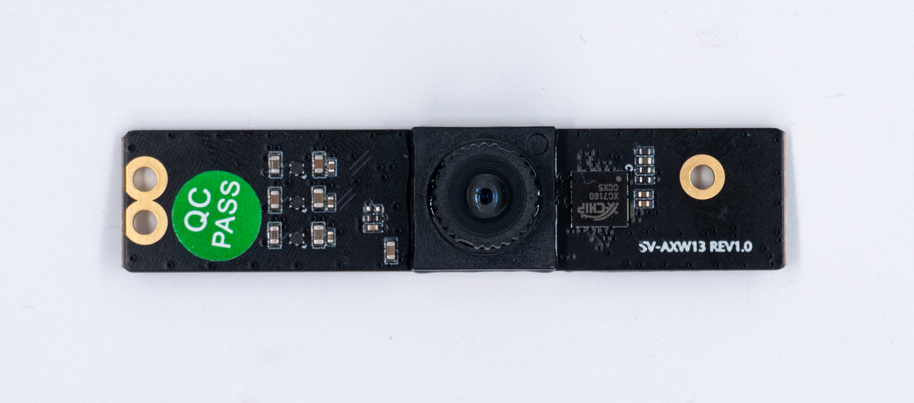
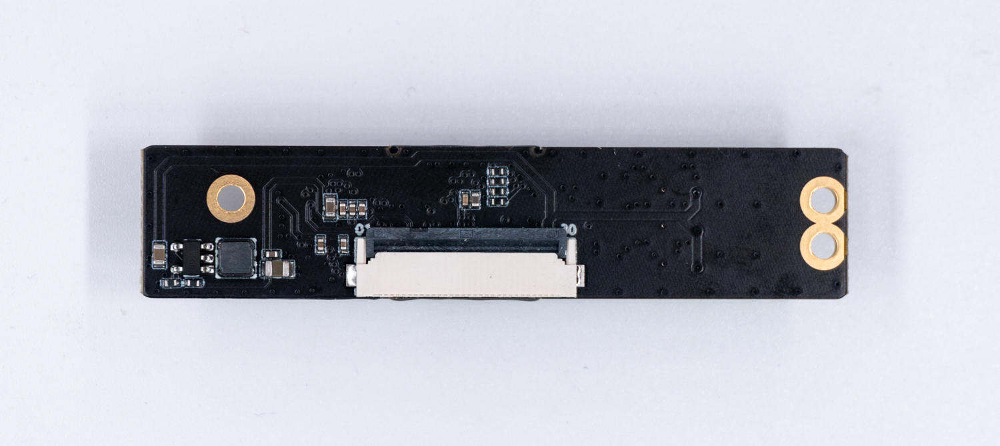
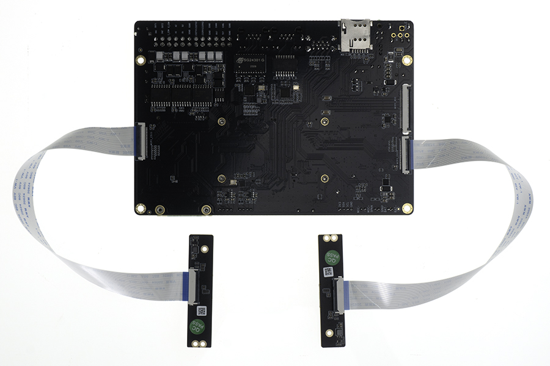

# Camera Module

## [CAM-8MS1M Monocular camera](https://www.firefly.store/products/cam-8ms1m-camera-module)

### Product Specification
* **Brand**：SV
* **ISP**：xc7160
* **Sensor**: sc8238
* **Interface**: MIPI
* **Pixels**: 800W(Currently only supports up to 1080P, 4K work in progress)

### Reference firmware
Public Fimware support CAM-8MS1M camera module by default. If it doesn't work, please update the latest firmware.
[Firmware Download: CAM-8MS1M](https://en.t-firefly.com/doc/download/222.html#other_670)

### Product Images

### Connection method

### Photo by CAM-8MS1M

