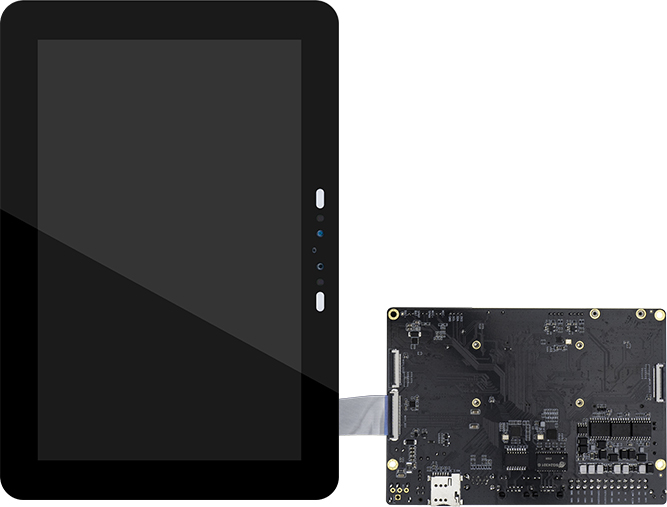
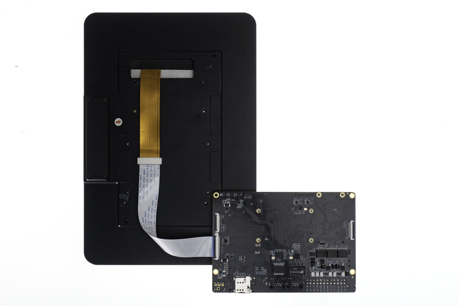

# Screen module

## [DM-M10R800 V2 MIPI module](https://www.firefly.store/products/dm-m10r800-v2)

### Product parameters

* **model:** M101014_BE45_A1
* **size:** 10.1 inch
* **resolution:** 800x1280
* **display interface:** MIPI
* **visual Angle:** 160°
* **touch screen:** multi-point capacitive touch

### Firmware

The official firmware default support MIPI_DSI display. Here is the firmware download link: [Firmware link](https://en.t-firefly.com/doc/download/222.html#other_670)

### Reference

[Screen module Datasheet](http://en.t-firefly.com/doc/download/109.html#other_417)

### Product images

#### MIPI_DSI FRONT

#### MIPI_DSI BACK

