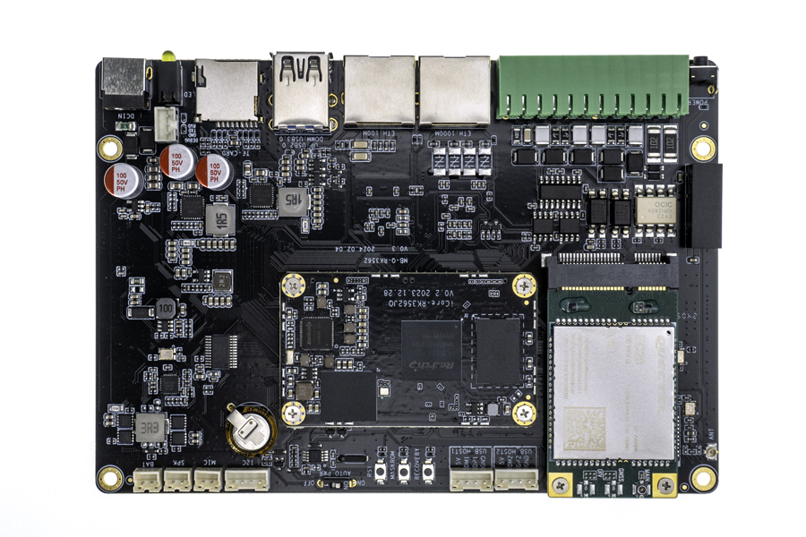
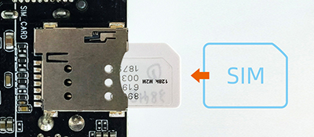
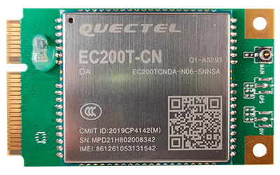

**Note:** 4G module and 5G module use different interface seats. 4G module uses Mini PCIe interface, 5G module uses M.2 (NGFF) interface, please select the correct interface seat according to the required module when the  AIO-3562JQ is in use

# Wireless module
## [EC20 4G Module suite](https://www.firefly.store/products/4g-module-kit-eg25-g)
### Product parameters
* **Model**
  * EC20-C R2.0 Mini PCIe-C
* **Supply voltage**
  * 3.3V~ 3.6V, Typical values: 3.3V
* **Working frequency band**
  * TDD-LTE: B38/B39/B40/B41
  * FDD-LTE: B1/B3/B8
  * WCDMA: B1/B8
  * TD-SCDMA: B34/B39
  * GSM: 900/1800
* **Data transmission**
  * TDD-LTE： Max 130Mbps (DL) Max 35Mbps (UL)
  * FDD-LTE： Max 150Mbps (DL) Max 50Mbps (UL)
  * DC-HSPA+： Max 42Mbps (DL) Max 5.76Mbps (UL)
  * UMTS： Max 384Kbps (DL) Max 384Kbps (UL)
  * TD-SCDMA： Max 4.2Mbps (DL) Max 2.2Mbps (UL)
  * CDMA： Max 3.1Mbps (DL) Max 1.8Mbps (UL)
  * EDGE： Max 236.8Kbps (DL) Max 236.8Kbps (UL)
  * GPRS： Max 85.6Kbps (DL) Max 85.6Kbps (UL)
* **Interface connector**
  * USB: USB 2.0 high-speed interface, 480Mbps
  * digital voice: 1 digital voice interface (optional)
  * USIM：1.8V/3V
  * network indicator: ×2, NET_STATUS 和 NET_MODE
  * UART：×1 UART
  * reset: low level
  * PWRKEY: low level
  * antenna interface: 3 (main antenna, diversity antenna and GNSS antenna interface)
  * ADC：×2
* **Structure size**
  * 51.0mm × 30.0mm × 4.9mm
* **Weight**
  * about 10.5g
* **Certification**
  * CCC/ NAL*/ TA

### GNSS function

There are two types of EC20 modules, one is has GNSS and another is no GNSS. EC20 4G modules sold on firefly's official website do not support GNSS, and the suffix is `SNNS`. EC20 modules that support GNSS generally have the suffix `SGNS`.The public firmware supports GNSS function, but it is turned off by default. For the use method, please refer to the chapter [EC20 GNSS function](#ec20-gnss-function).

### Real figure

### Connection

* USB connection

* Mini PCIe connection

* SIM card Connection

## EC200T 4G Module suite

### Product parameters
* **Model**
  * EC200T-CN Mini PCIe-D
* **Supply voltage**
  * 3.4V~ 4.3V, Typical values: 3.8V
* **Working frequency band**
  * TDD-LTE: B34/B38/B39/B40/B41
  * FDD-LTE: B1/B3/B5/B8
  * WCDMA: B1/B5/B8
  * GSM: 900/1800 MHz
* **Data transmission**
  * TDD-LTE： Max 120Mbps (DL) Max 3Mbps (UL)
  * FDD-LTE： Max 150Mbps (DL) Max 50Mbps (UL)
  * DC-HSDPA： Max 21Mbps (DL)
  * HSDPA: Max 5.76 Mbps (UL)
  * WCDMA: Max 384Kbps (DL) Max 384Kbps (UL)
  * EDGE: Max 236.8Kbps (DL) Max 236.8Kbps (UL)
  * GPRS： Max 85.6Kbps (DL) Max 85.6Kbps (UL)
* **Interface connector**
  * USB: USB 2.0 high-speed interface, 480Mbps
  * digital voice: 1 digital voice interface (optional)
  * USIM：1.8V/3V
  * network indicator: ×2, NET_STATUS 和 NET_MODE
  * UART：×1 UART
  * W_DISABLE# for Airplane Mode Control
  * LED_WWAN# for Network Status Indication
  * PERST# for Module Resetting
  * RI for Host Wake-up
  * WAKEUP_IN for Sleeping Control, Low Level Active
  * WAKEUP_OUT for Sleeping Status Indication
  * antenna interface: 2 (main antenna, diversity antenna)
* **Structure size**
  * 51.0mm × 30.0mm × 4.9mm
* **Weight**
  * about 10.2g
* **Certification**
  * CCC/SRRC/NAL

### Real figure

### Connection

Please refer to [EC20 4G module suite](#ec20-4g-module-suite). 

## Reference firmware

The official website of the public version of the default firmware support EC20 4G dongle module, EC200T 4G module 
[Firmware Download](https://en.t-firefly.com/doc/download/222.html#other_670)
