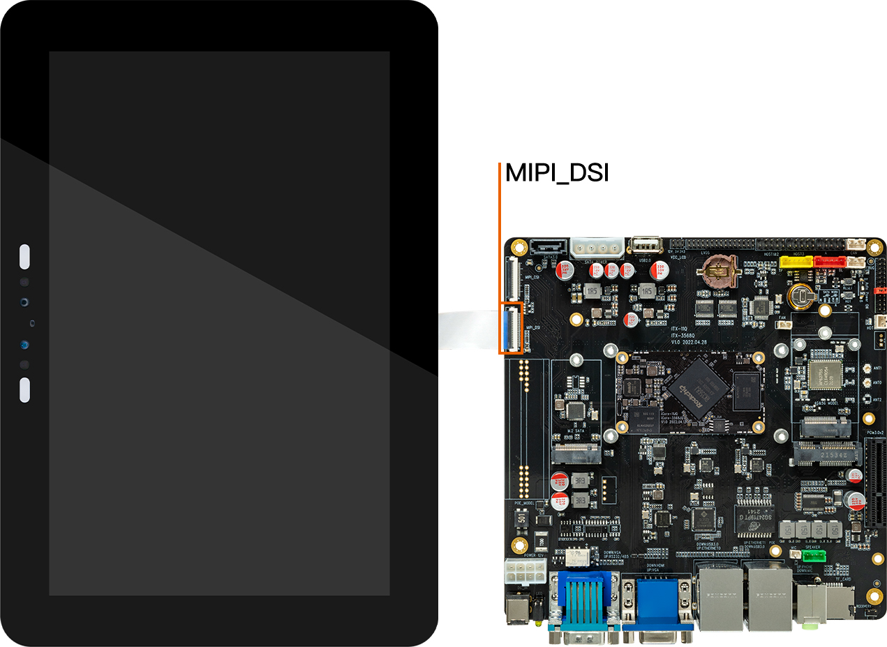

# Screen module

## [DM-M10R800 V2 MIPI module](https://www.firefly.store/products/dm-m10r800-v2)

### Product parameters

* **model:** M101014_BE45_A1
* **size:** 10.1 inch
* **resolution:** 800x1280
* **display interface:** MIPI
* **visual Angle:** 160°
* **touch screen:** multi-point capacitive touch

### Refer to the firmware

The official MIPI firmware default support MIPI_DSI1 + HDMI display, MIPI screen connected to ITX-3568Q MIPI_DSI1 interface. Below is the link to the firmware: [Firmware link](https://en.t-firefly.com/doc/download/109.html#other_531)

**NOTE:** When using HDMI display, there may be black edges on both sides of HDMI. The reason is HDMI as a secondary screen, will be scaled according to the aspect ratio of the main screen MIPI. If the aspect ratio of the two is inconsistent, it will lead to black edges.

### Compile command

Using official SDK to compile firmware that support 10.1 inches screen firmware need the following command, the default compiled firmware is MIPI_DSI0+HDMI display:

* Linux just select mk file
```
./build.sh itx-3568q-mipi-ubuntu.mk
./build.sh
```
* Android
```
./FFTools/make.sh -d rk3568-firefly-itx-3568q-mipi101_M101014_BE45_A1 -j8 -l rk3568_firefly_itx_3568q-userdebug
./FFTools/mkupdate/mkupdate.sh -l rk3568_firefly_itx_3568q-userdebug
```

**<font color=red>Note：If need to use CAM-8MS1M camera，first to add patch。** </font>

```
diff --git a/kernel/arch/arm64/boot/dts/rockchip/rk3568-firefly-itx-3568q.dts b/kernel/arch/arm64/boot/dts/rockchip/rk3568-firefly-itx-3568q.dts
index d784287..fbe7b6b 100755
--- a/kernel/arch/arm64/boot/dts/rockchip/rk3568-firefly-itx-3568q.dts
+++ b/kernel/arch/arm64/boot/dts/rockchip/rk3568-firefly-itx-3568q.dts
  @@ -21,8 +21,8 @@
  * using dual camera gc2053/gc2093   ----> rk3568-firefly-itx-3568q-cam-2ms2m.dtsi
   * using hdmi-in module rk628d   ----> rk3568-firefly-itx-3568q-tf-hdmi-mipi-rk628.dtsi
   */
-//#include "rk3568-firefly-itx-3568q-cam-8ms1m.dtsi"
-#include "rk3568-firefly-itx-3568q-cam-2ms2m.dtsi"
+#include "rk3568-firefly-itx-3568q-cam-8ms1m.dtsi"
+//#include "rk3568-firefly-itx-3568q-cam-2ms2m.dtsi"
 //#include "rk3568-firefly-itx-3568q-tf-hdmi-mipi-rk628.dtsi"
```

### Reference data

[[schematic of screen module Datasheet& adapter board]](http://en.t-firefly.com/doc/download/109.html#other_417)

### Connection methods




