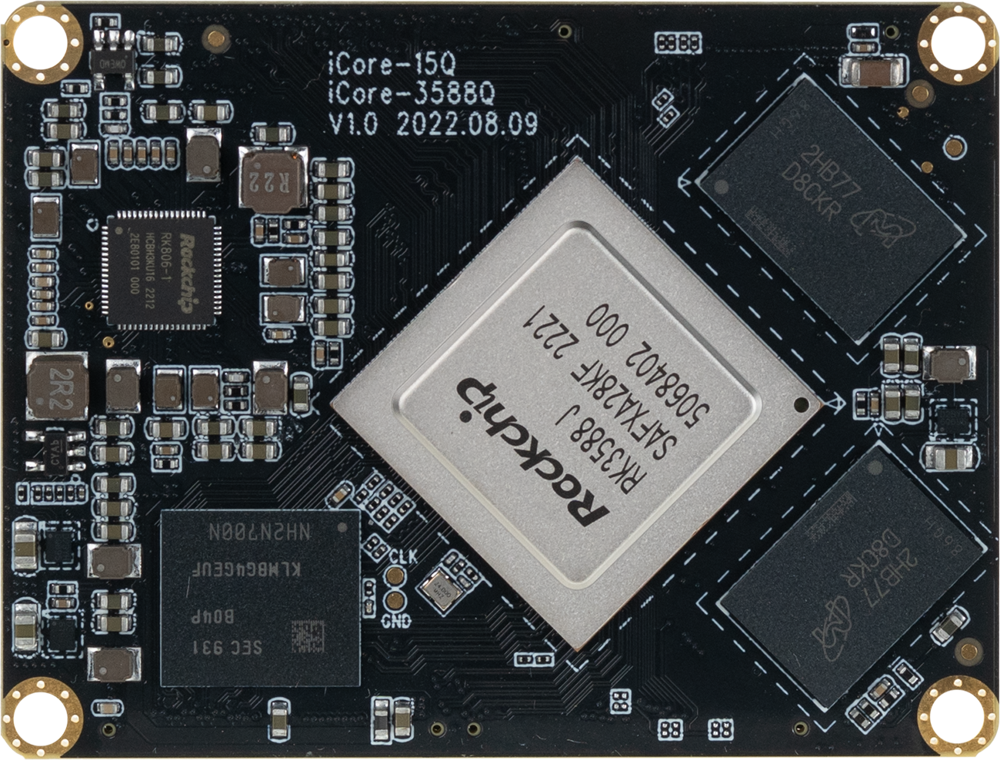
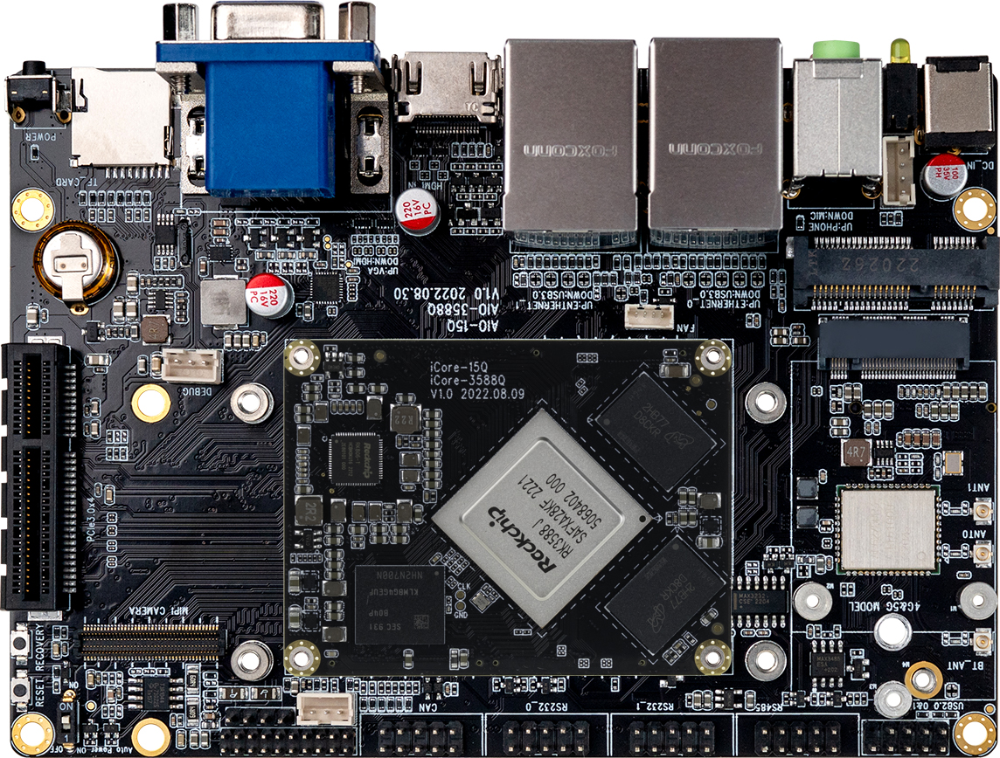

## Introduction

The core boards of the **3588Q** include **iCore-3588Q**, **iCore-3588MQ** and **iCore-3588JQ**. The **MB-Q-RK3588** can support these three different core boards.

Based on Rockchip new generation of flagship AIOT chip -- RK3588, the
[iCore-3588JQ](https://www.firefly.store/products/icore-3588jq-8k-industrial-ai-core-board) features an 8nm LP process and an 8-core (Cortex-A76x4+
Cortex-A55x4) 64-bit CPU.

Integrated ARM Mali-G610 MP4 quad-core GPU, built-in AI accelerator NPU,
can provide 6Tops computing power, support the mains, support up to 32 GB of memory, support WiFi 6,5G/4G and other
high-speed wireless network communication, support 8K video codec and
multiple formats of video input and output, support multiple operating
systems can be applied to ARM PC, edge computing, cloud server,
intelligent NVR and other fields.

  

 

The [AIO-3588JQ](https://www.firefly.store/products/aio-3588jq-8k-ai-industrial-mainboard-delivery-within-15-days) development board consists of the core board **iCore-3588JQ** + **MB-Q-RK3588**. AIO-3588JQ
has rich interfaces such as RGMII, SATA3.0, CAN, PCIE3.0, USB3.0, I2C,
SPI, UART, GPIO, MIPI-DSI, and MIPI-CSI, provide multiple power supply
modes. It can be directly applied to various intelligent products to
accelerate product implementation. For details, refer to ["interface
definition"](interface_definition.md).

### The AIO-3588JQ standard kit contains the following accessories (for reference only): 

-   iCore-3588JQ Core Board x 1
-   MB-Q-RK3588  x 1
-   Copper tube antenna x 3
-   Type-C data cable x 1

Optional accessories include:

-   Serial port module of Firefly

In addition, you may need the following accessories during use:

-   Display device
    -   Monitor or TV with HDMI connector and HDMI cable
-   Network
    -   100M/1000M Ethernet cable and wired router
    -   WiFi router
-   Input device
    -   USB wireless/wired mouse/keyboard
-   Upgrade firmware, debug
    -   Type-C data cable
    -   Serial to USB adapter 
 