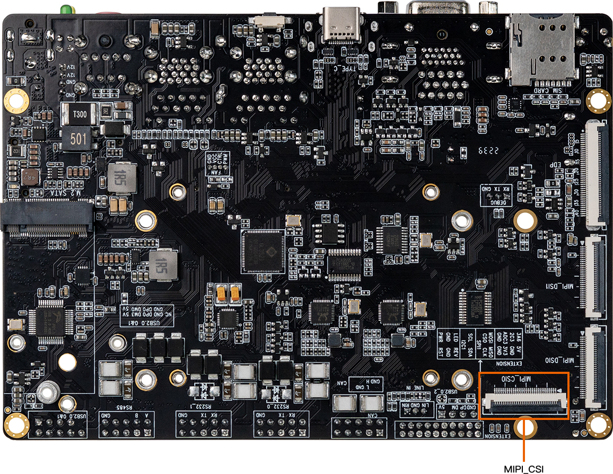
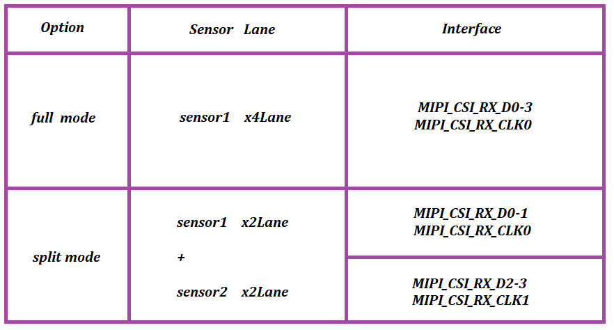

# Camera
* Hardware interface




## MIPI CSI
RK3588/RK3588S platform has two physical mipi dphy, include dphy0_hw/dphy1_hw .It can work in two modes: full mode and split mode;
and split into three logical dphy: csi2_dphy0, csi2_dphy1, csi2_dphy2 (See detail in rk3588.dtsi)


### Full Mode
* Only use csi2_dphy0 (csi2_dphy0 and csi2_dphy1/csi2_dphy2 cannot be used at the same time);
* Maximum 4 data lanes;
* Maximum speed 2.5Gbps/lane;

### Split Mode
* Use csi2_dphy1 and/or csi2_dphy2, cannot use csi2_dphy0 at this mode;
* csi2_dphy1 and csi2_dphy2 can be used at the same time;
* csi2_dphy1 and csi2_dphy2 both have maximum 2 data lanes;
* csi2_dphy1 maps to physical dphy lane0/lane1;
* csi2_dphy2 maps to physical dphy lane2/lane3;
* Maximum speed 2.5Gbps/lane



In short, if we use single-camera, we can set dphy to full mode, if we use dual-camera, we can set dphy to split mode.

## Full Mode Configuration
**Link path**: sensor->csi2_dphy0->mipi2_csi2->rkcif_mipi_lvds2 - - -> rkcif_mipi_lvds2_sditf->rkisp0_vir0

### Full Mode DTS Configuration Key Points

### Configure Sensor
We need to check the MIPI CSI interface in schematic to find out which I2C bus is used for camera sensor. And configure the camera under that I2C node, correctly set the properties like I2C device address, pins, etc. For example, there's a configuration for xc7160 in iCore-3588JQ:
kernel-5.10/arch/arm64/boot/dts/rockchip/rk3588-firefly-aio-cam-8ms1m.dtsi
```
&i2c3 {
	status = "okay";

        XC7160: XC7160b@1b{
               compatible = "firefly,xc7160";
               reg = <0x1b>;
               clocks = <&cru CLK_MIPI_CAMARAOUT_M3>;
               clock-names = "xvclk";
               pinctrl-names = "default";
               pinctrl-0 = <&mipim0_camera3_clk>;
               power-domains = <&power RK3588_PD_VI>;

               power-gpios = <&gpio1 RK_PB1 GPIO_ACTIVE_LOW>;
               reset-gpios = <&gpio1 RK_PB0 GPIO_ACTIVE_HIGH>;
               pwdn-gpios = <&gpio1 RK_PA6 GPIO_ACTIVE_HIGH>;

               //avdd-supply = <&vcc_mipidcphy0>;
               firefly,clkout-enabled-index = <0>;
               rockchip,camera-module-index = <0>;
               rockchip,camera-module-facing = "back";
               rockchip,camera-module-name = "NC";
               rockchip,camera-module-lens-name = "NC";
               port {
                        xc7160_out0: endpoint {
                               remote-endpoint = <&mipidphy0_in_ucam0>;
                               data-lanes = <1 2 3 4>;
                       };
               };
       };

};
```

### Configure Logical Dphy
csi2_dphy0 and csi2_dphy1/csi2_dphy2 cannot be used at the same time. In addition, we need to enable csi2_dphy0_hw node.
```shell
&csi2_dphy0 {
        status = "okay";

        ports {
                #address-cells = <1>;
                #size-cells = <0>;
                port@0 {
                        reg = <0>;
                        #address-cells = <1>;
                        #size-cells = <0>;

                        mipidphy0_in_ucam0: endpoint@1 {
                                reg = <1>;
                                remote-endpoint = <&xc7160_out0>;
                                data-lanes = <1 2 3 4>;
                        };
                };
                port@1 {
                        reg = <1>;
                        #address-cells = <1>;
                        #size-cells = <0>;

                        csidphy0_out: endpoint@0 {
                                reg = <0>;
                                remote-endpoint = <&mipi2_csi2_input>;
                        };
                };
        };
};

&csi2_dphy0_hw {
   status = "okay";
};

&mipi2_csi2 {
        status = "okay";

        ports {
                #address-cells = <1>;
                #size-cells = <0>;

                port@0 {
                        reg = <0>;
                        #address-cells = <1>;
                        #size-cells = <0>;

                        mipi2_csi2_input: endpoint@1 {
                                reg = <1>;
                                remote-endpoint = <&csidphy0_out>;
                        };
                };

                port@1 {
                        reg = <1>;
                        #address-cells = <1>;
                        #size-cells = <0>;

                        mipi2_csi2_output: endpoint@0 {
                                reg = <0>;
                                remote-endpoint = <&cif_mipi2_in0>;
                        };
                };
        };
};

&rkcif {
        status = "okay";
};

&rkcif_mmu {
        status = "okay";
};

&rkcif_mipi_lvds2 {
        status = "okay";

        port {
                cif_mipi2_in0: endpoint {
                        remote-endpoint = <&mipi2_csi2_output>;
                };
        };
};
```

### Configure Isp
The `remote-endpoint` in rkisp_vir0 node should point to `mipi_lvds2_sditf`

**sensor xc7160 have its own ISP, so rkisp is not required.In other cases, the sensor defaults to the following configuration**
```shell
&rkcif_mipi_lvds2_sditf {
        status = "disabled";

        port {
                mipi_lvds2_sditf: endpoint {
                        remote-endpoint = <&isp0_vir0>;
                };
        };
};

&rkisp0 {
        status = "disabled";
};

&isp0_mmu {
        status = "disabled";
};

&rkisp0_vir0 {
        status = "disabled";

        port {
                #address-cells = <1>;
                #size-cells = <0>;

                isp0_vir0: endpoint@0 {
                        reg = <0>;
                        remote-endpoint = <&mipi_lvds2_sditf>;
                };
        };
};
```


## Split Mode Configuration
**Link path**: 

sensor1->csi2_dphy1->mipi2_csi2->rkcif_mipi_lvds2 - - -> rkcif_mipi_lvds2_sditf->rkisp0_vir2

sensor2->csi2_dphy2->mipi3_csi2->rkcif_mipi_lvds3 - - -> rkcif_mipi_lvds3_sditf->rkisp1_vir0

### Split Mode DTS Configuration Key Points

### Configure Sensor
We need to check the MIPI CSI interface in schematic to find out which I2C bus is used for camera sensor. And configure the camera under that I2C node, correctly set the properties like I2C device address, pins, etc. For example, there's a configuration for gc2053/gc2093 in iCore-3588JQ:

### Configure csi2_dphy1/csi2_dphy2
csi2_dphy0 and csi2_dphy1/csi2_dphy2 cannot be used at the same time.
```shell
&csi2_dphy0_hw {
        status = "okay";
};

&csi2_dphy1 {
        status = "okay";

        ports {
                #address-cells = <1>;
                #size-cells = <0>;
                port@0 {
                        reg = <0>;
                        #address-cells = <1>;
                        #size-cells = <0>;

                        mipi_in_ucam2: endpoint@1 {
                                reg = <1>;
                                remote-endpoint = <&gc2053_out2>;
                                data-lanes = <1 2>;
                        };
                };
                port@1 {
                        reg = <1>;
                        #address-cells = <1>;
                        #size-cells = <0>;

                        csidphy1_out: endpoint@0 {
                                reg = <0>;
                                remote-endpoint = <&mipi2_csi2_input>;
                        };
                };
        };
};
&csi2_dphy2 {
        status = "okay";

        ports {
                #address-cells = <1>;
                #size-cells = <0>;
                port@0 {
                        reg = <0>;
                        #address-cells = <1>;
                        #size-cells = <0>;

                        mipi_in_ucam3: endpoint@1 {
                                reg = <1>;
                                remote-endpoint = <&gc2093_out3>;
                                data-lanes = <1 2>;
                        };
                };
                port@1 {
                        reg = <1>;
                        #address-cells = <1>;
                        #size-cells = <0>;

                        csidphy2_out: endpoint@0 {
                                reg = <0>;
                                remote-endpoint = <&mipi3_csi2_input>;
                        };
                };
        };
};
&mipi2_csi2 {
        status = "okay";


        ports {
                #address-cells = <1>;
                #size-cells = <0>;

                port@0 {
                        reg = <0>;
                        #address-cells = <1>;
                        #size-cells = <0>;

                        mipi2_csi2_input: endpoint@1 {
                                reg = <1>;
                                remote-endpoint = <&csidphy1_out>;
                        };
                };

                port@1 {
                        reg = <1>;
                        #address-cells = <1>;
                        #size-cells = <0>;

                        mipi2_csi2_output: endpoint@0 {
                                reg = <0>;
                                remote-endpoint = <&cif_mipi_in2>;
                        };
                };
        };
};
&mipi3_csi2 {
        status = "okay";

        ports {
                #address-cells = <1>;
                #size-cells = <0>;

                port@0 {
                        reg = <0>;
                        #address-cells = <1>;
                        #size-cells = <0>;

                        mipi3_csi2_input: endpoint@1 {
                                reg = <1>;
                                remote-endpoint = <&csidphy2_out>;
                        };
                };

                port@1 {
                        reg = <1>;
                        #address-cells = <1>;
                        #size-cells = <0>;

                        mipi3_csi2_output: endpoint@0 {
                                reg = <0>;
                                remote-endpoint = <&cif_mipi_in3>;
                        };
                };
        };
};

&rkcif {
        status = "okay";
};

&rkcif_mipi_lvds2 {
        status = "okay";
        port {
                cif_mipi_in2: endpoint {
                        remote-endpoint = <&mipi2_csi2_output>;
                };
        };
};

&rkcif_mipi_lvds2_sditf {
        status = "okay";
        port {
                mipi2_lvds_sditf: endpoint {
                        remote-endpoint = <&isp0_vir2>;
                };
        };
};

&rkcif_mipi_lvds3 {
        status = "okay";
        port {
                cif_mipi_in3: endpoint {
                        remote-endpoint = <&mipi3_csi2_output>;
                };
        };
};


&rkcif_mipi_lvds3_sditf {
        status = "okay";
        port {
                mipi3_lvds_sditf: endpoint {
                        remote-endpoint = <&isp1_vir0>;
                };
        };
};

&rkcif_mmu {
        status = "okay";
};

```

### Configure Isp
The `remote-endpoint` in rkisp_vir2 node should point to `mipi2_lvds_sditf`.The `remote-endpoint` in rkisp1_vir0 node should point to `mipi3_lvds_sditf`
```shell
&rkisp0 {
        status = "okay";
};

&isp0_mmu {
        status = "okay";
};

&rkisp1 {
        status = "okay";
};

&isp1_mmu {
        status = "okay";
};

&rkisp0_vir2 {
        status = "okay";
        port {
                #address-cells = <1>;
                #size-cells = <0>;
                isp0_vir2: endpoint@0 {
                        reg = <0>;
                        remote-endpoint = <&mipi2_lvds_sditf>;
                };
        };
};

&rkisp1_vir0 {
        status = "okay";
        port {
                #address-cells = <1>;
                #size-cells = <0>;
                isp1_vir0: endpoint@0 {
                        reg = <0>;
                        remote-endpoint = <&mipi3_lvds_sditf>;
                };
        };
};
```

## Related Directory
```shell
Linux Kernel-5.10
|-- arch/arm/boot/dts #DTS configuration file
|-- drivers/phy/rockchip
|-- phy-rockchip-mipi-rx.c #mipi dphy driver
|-- phy-rockchip-csi2-dphy-common.h
|-- phy-rockchip-csi2-dphy-hw.c
|-- phy-rockchip-csi2-dphy.c
|-- drivers/media
|-- platform/rockchip/cif #RKCIF driver
|-- platform/rockchip/isp #RKISP driver
|-- dev #includes probe, asynchronous register clock, pipeline, iommu and media/v4l2 framework
|-- capture #includes mp/sp/rawwr configuration and vb2, frame interrupt handle
|-- dmarx #includes rawrd configuration and vb2, frame interrupt handle
|-- isp_params #3A-related parameters
|-- isp_stats #3A-related statistics
|-- isp_mipi_luma #mipi luminance data statistics
|-- regs #register-related read/write operation
|-- rkisp #isp subdev and entity register
|-- csi #csi subdev and mipi configuration
|-- bridge #bridge subdev,isp and ispp interaction bridge
|-- platform/rockchip/ispp #rkispp driver
|-- dev #includes probe, asynchronous register, clock, pipeline, iommu and media/v4l2 framework
|-- stream #includes 4-channel video output configuration and  vb2, frame interrupt handle
|-- rkispp #ispp subdev and entity register
|-- params #TNR/NR/SHP/FEC/ORB parameters
|-- stats #ORB statistics
|-- i2c
  |-- ov13850.c #CIS(cmos image sensor)
```
## Single Camera CAM-8MS1M/Dual Camera CAM-2MS2MF
Firefly has already configured these cameras in dts, CAM-8MS1M and CAM-2MS2MF cannot be used at the same time. Only need to include specific dtsi file to use CAM-8MS1M or CAM-2MS2M.


### Use Single Camera CAM-8MS1M
dts configured single camera as default.
```shell
diff --git a/kernel/arch/arm64/boot/dts/rockchip/rk3588-firefly-aio-3588q.dts b/kernel/arch/arm64/boot/dts/rockchip/rk3588-firefly-aio-3588q.dts
index 7e2a8b2..14fa027 100755
--- a/kernel/arch/arm64/boot/dts/rockchip/rk3588-firefly-aio-3588q.dts
+++ b/kernel/arch/arm64/boot/dts/rockchip/rk3588-firefly-aio-3588q.dts
@@ -7,6 +7,15 @@
+#include "rk3588-firefly-aio-3588q-cam-8ms1m.dtsi"
```
### Use Dual Camera CAM-2MS2MF
```shell
diff --git a/kernel/arch/arm64/boot/dts/rockchip/rk3588-firefly-aio-3588q.dts b/kernel/arch/arm64/boot/dts/rockchip/rk3588-firefly-aio-3588q.dts
index 7e2a8b2..14fa027 100755
--- a/kernel/arch/arm64/boot/dts/rockchip/rk3588-firefly-aio-3588q.dts
+++ b/kernel/arch/arm64/boot/dts/rockchip/rk3588-firefly-aio-3588q.dts
@@ -7,6 +7,15 @@
-#include "rk3588-firefly-aio-3588q-cam-8ms1m.dtsi"
-//#include "rk3588-firefly-aio-3588q-cam-2ms2mf.dtsi"
+//#include "rk3588-firefly-aio-3588q-cam-8ms1m.dtsi"
+#include "rk3588-firefly-aio-3588q-cam-2ms2mf.dtsi"
```

## Camera Debug
Find the camera node
```shell
# Since a board may have multiple cameras, for cameras using RKISP such as 8Mega Pixel HD Camera(IMX415), 
# it is necessary to use the video node named rkisp_mainpath.
# For cameras with their own ISP, such as 8Mega Pixel HD Camera, 
# it is necessary to use the video node named stream_cif_mipi_id0.
root@firefly:~# grep '' /sys/class/video4linux/video*/name
/sys/class/video4linux/video0/name:stream_cif_mipi_id0
/sys/class/video4linux/video1/name:stream_cif_mipi_id1
/sys/class/video4linux/video10/name:rkcif_tools_id2
/sys/class/video4linux/video11/name:stream_cif_mipi_id0
/sys/class/video4linux/video12/name:stream_cif_mipi_id1
/sys/class/video4linux/video13/name:stream_cif_mipi_id2
/sys/class/video4linux/video14/name:stream_cif_mipi_id3
/sys/class/video4linux/video15/name:rkcif_scale_ch0
/sys/class/video4linux/video16/name:rkcif_scale_ch1
/sys/class/video4linux/video17/name:rkcif_scale_ch2
/sys/class/video4linux/video18/name:rkcif_scale_ch3
/sys/class/video4linux/video19/name:rkcif_tools_id0
/sys/class/video4linux/video2/name:stream_cif_mipi_id2
/sys/class/video4linux/video20/name:rkcif_tools_id1
/sys/class/video4linux/video21/name:rkcif_tools_id2
/sys/class/video4linux/video22/name:rkisp_mainpath
/sys/class/video4linux/video23/name:rkisp_selfpath
/sys/class/video4linux/video24/name:rkisp_fbcpath
/sys/class/video4linux/video25/name:rkisp_iqtool
/sys/class/video4linux/video26/name:rkisp_rawrd0_m
/sys/class/video4linux/video27/name:rkisp_rawrd2_s
/sys/class/video4linux/video28/name:rkisp_rawrd1_l
/sys/class/video4linux/video29/name:rkisp-statistics
/sys/class/video4linux/video3/name:stream_cif_mipi_id3
/sys/class/video4linux/video30/name:rkisp-input-params
/sys/class/video4linux/video31/name:stream_hdmirx
/sys/class/video4linux/video4/name:rkcif_scale_ch0
/sys/class/video4linux/video5/name:rkcif_scale_ch1
/sys/class/video4linux/video6/name:rkcif_scale_ch2
/sys/class/video4linux/video7/name:rkcif_scale_ch3
/sys/class/video4linux/video8/name:rkcif_tools_id0
/sys/class/video4linux/video9/name:rkcif_tools_id1
```

Use v4l2-ctl to capture camera frame data
```shell
v4l2-ctl --verbose -d /dev/video0 --set-fmt-video=width=1920,height=1080,pixelformat='NV12' --stream-mmap=4 --set-selection=target=crop,flags=0,top=0,left=0,width=1920,height=1080 --stream-to=/data/out.yuv
```

Copy file out.yuv to ubuntu to play
```shell
ffplay -f rawvideo -video_size 1920x1080 -pix_fmt nv12 out.yuv
```

## Android Use Camera App
In addition to the official default supported cameras, To open camera with camera app in Android needs configuring in camera3_profiles*.xml. For details please refer to files in Android SDK under `hardware/rockchip/camera/etc/camera`.

## Linux Preview Camera
Ubuntu firmware integrates `test_camera-cifisp.sh` test script. Script path `/usr/local/bin/test_camera-cifisp.sh`
```shell
#!/bin/sh

export DISPLAY=:0.0
#export GST_DEBUG=*:5
#export GST_DEBUG_FILE=/tmp/2.txt

echo "Start MIPI CSI Camera Preview!"


export XDG_RUNTIME_DIR=/run/user/1000

if cat /proc/device-tree/model | grep -q "3588" ;then
        gst-launch-1.0 v4l2src device=/dev/video0 io-mode=4 ! queue ! video/x-raw,format=NV12,width=1920,height=1080,framerate=30/1  ! glimagesink
else
        gst-launch-1.0 v4l2src device=/dev/video0 io-mode=4 ! videoconvert ! video/x-raw,format=NV12,width=640,height=480  ! rkximagesink
fi

```

## IQ Files
Supported raw camera iq files are under `external/camera_engine_rkaiq/iqfiles/isp3x`. What's different from before is that iq files will no longer use `.xml` files but `.json` files. Although there is a xml to json transfer tool, isp20 xml configuration are not suitable for isp3x even after transfer.
Similarly, the JSON of isp21 is not applicable to isp3x.

If you need to use raw sensor camera, please be careful about is there a matchable iq file under isp3x directory.

