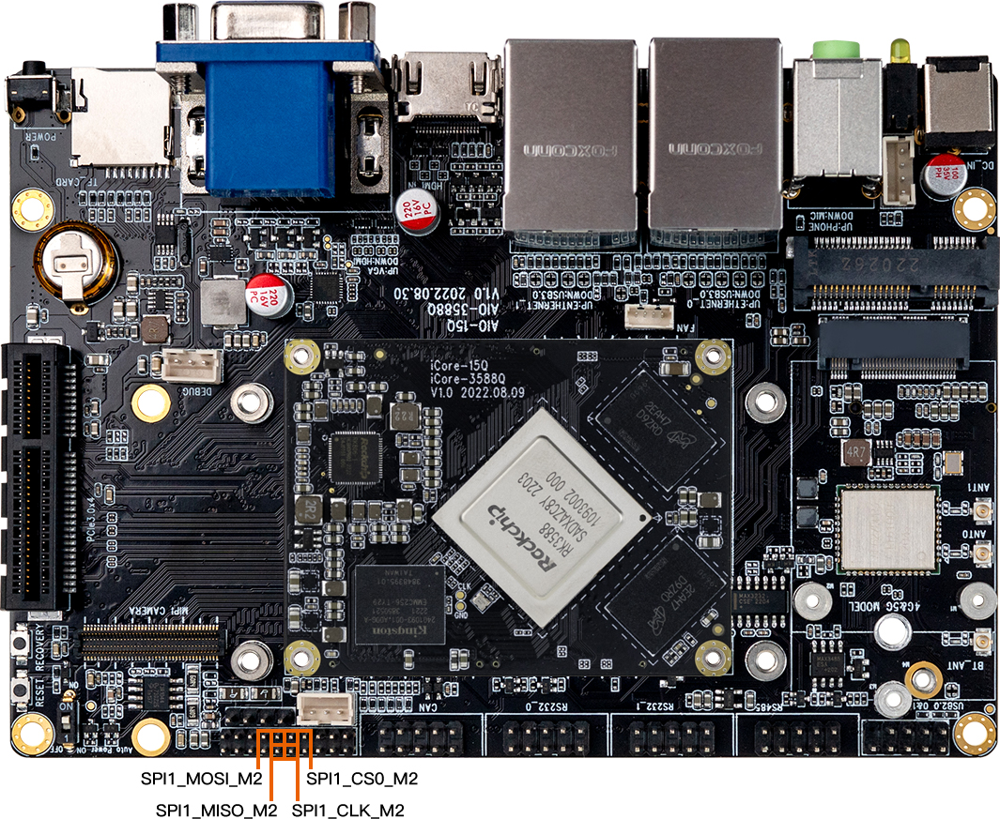
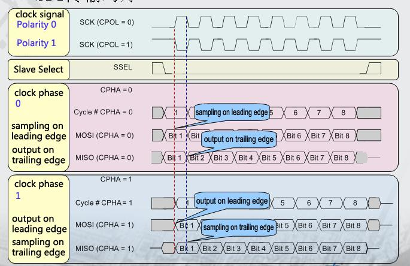

# SPI

## Introduction

SPI is a high-speed, full-duplex, synchronous serial communication interface for connecting microcontrollers, sensors, storage devices, etc. The AIO-3588Q  development board provides the SPI1 (single chip optional) interface, and the specific position is as follows:


## How SPI works

SPI works in a master-slave mode, which typically has one master device and one or more slave devices, requiring at least four wires, respectively:

```
CS		    slice selection signal
SCLK		clock letter
MOSI		master device data output and slave device data input
MISO		master device data input and slave device data output
```

The Linux kernel uses a combination of CPOL and CPHA to represent the four working modes of the current SPI:

```
CPOL＝0，CPHA＝0		SPI_MODE_0
CPOL＝0，CPHA＝1		SPI_MODE_1
CPOL＝1，CPHA＝0		SPI_MODE_2
CPOL＝1，CPHA＝1		SPI_MODE_3
```

* **CPOL :** Represents the state of the initial level of the clock signal, 0 is the low level and 1 is the high level.
* **CPHA :** Is sampling along which clock, 0 is sampling along the first clock and 1 is sampling along the second clock.

The waveforms of SPI's four working modes are as follows:



## Drive coding

The following XM25QU128C Flash module as an example of a simple introduction to the preparation of SPI driver.

### Hardware connection

The hardware connection between AIO-3588Q  and XM25QU128C is shown in the following table:

| XM25QU128C | AIO-3588Q   | 
| ----       | ----        |
| /CS        | SPI1_M2_CS0 |
| D0         | SPI1_M2_RX  |
| GND        | GND         |
| VCC        | 1.8V        |
| CLK        | SPI1_M2_CLK  |
| D1         | SPI1_M2_TX   |

### Makefile/Kconfig

Add the corresponding driver file configuration in `kernel-5.10/drivers/spi/Kconfig`:

```
config SPI_FIREFLY
       tristate "Firefly SPI demo support "
       default y
        help
          Select this option if your Firefly board needs to run SPI demo.
```

Add the corresponding driver file name in `kernel-5.10/drivers/spi/Makefile`:

```
obj-$(CONFIG_SPI_FIREFLY)              += spi-firefly-demo.o
```


### Configure the DTS nodes

Add SPI driver node description in `kernel-5.10/arch/arm64/boot/dts/rockchip/rk3588-firefly-demo.dtsi`, as shown below:

```
/* Firefly SPI demo */
&spi1{
    spi_demo: spi_demo@00{
        compatible = "firefly,rk3588-spi";
        status = "okay";
        reg = <0x00>;
        spi-max-frequency = <50000000>;
        //spi-cpha;   /* SPI mode: CPHA=1 */
        //spi-cpol; 	/* SPI mode: CPOL=1 */
        //spi-cs-high;
    };
};

&spidev1 {
    status = "disabled";
};
```

* **status :** set `okay` if you want to enable SPI, or `disable` if not.
* **spi-demo@00 :** since `CS0` is used in this example, it is set to `00`; if `CS1` is used, it is set to `01`.
* **compatible :** the attribute here must be `compatible` with the member of the structure in the driver: `of_device_id`.
* **reg :** this is consistent with `spi-demo@00`, set to: `0x00` in this example.
* **spi-max-frequency :** set the highest frequency used by spi here. AIO-3588Q  supports up to 48000000.
* **spi-cpha，spi-cpol :** the working mode of spi is set here. The working mode of the module spi used in this example is SPI_MODE_0 or SPI_MODE_3. Here we choose SPI_MODE_0. If SPI_MODE_3 is used, open spi-cpha and spi-cpol in spi_demo.

### Define SPI drivers

Create a new driver file in `kernel-5.10/drivers/spi/`, such as: `spi-firefly-demo.c`.

Before defining the SPI driver, the user first defines the variable `of_device_id`. `Of_device_id` is used to call the device information defined in the DTS file in the driver. The definition is as follows:

```
static struct of_device_id firefly_match_table[] = { {.compatible = "firefly,rk3588-spi",},{},};
```

The `compatible` values here are consistent with those in the DTS file.

Spi_driver is defined as follows:

```
static struct spi_driver firefly_spi_driver = {
    .driver = {
        .name = "firefly-spi",
        .owner = THIS_MODULE,
        .of_match_table = firefly_match_table,},
    .probe = firefly_spi_probe,};
};
```

### Registration of SPI equipment

`Static int __init firefly_spi_init(void)` registers SPI driver with kernel: `spi_register_driver(&firefly_spi_driver);`

If the kernel is successfully matched on startup, the SPI core will configure SPI's parameters (mode, speed, etc.) and call `firefly_spi_probe`.

### Read-write SPI data

* `Firefly_spi_probe` USES two interface operations to read the ID of `XM25QU128C`:
* The `firefly_spi_read_xm25x_id_0` interface directly USES `spi_transfer` and `spi_message` to transmit data.
* The `firefly_spi_read_xm25x_id_1` interface USES the SPI interface `spi_write_then_read` to read and write data.

After success, it will print:

```
console:/ $  dmesg | grep spi
[    1.791786] [    T1] firefly-spi spi1.0: Firefly SPI demo program
[    1.791788] [    T1] firefly spi demo
[    1.791795] [    T1] firefly-spi spi1.0: firefly_spi_probe: setup mode 0, 8 bits/w, 50000000 Hz max 
[    1.791797] [    T1] spi demo mode ; 0     
[    1.791838] [    T1] firefly_spi_read_xm25x_id_0 ID = 20 41 18
[    1.791875] [    T1] firefly_spi_read_xm25x_id_1 ID = 20 41 18
```

### Open SPI demo

`spi-firefly-demo` is not opened by default. If necessary, the *demo* driver can be opened with the following patch:

```
--- a/kernel-5.10/arch/arm64/boot/dts/rockchip/rk3588-firefly-demo.dtsi
+++ b/kernel-5.10/arch/arm64/boot/dts/rockchip/rk3588-firefly-demo.dtsi
@@ -64,7 +64,7 @@ /* Firefly SPI demo */
 &spi1 {spi_demo: spi-demo@00{
 -                status = "disabled";
 +                status = "okay";
                  compatible = "firefly,rk3588-spi";
                  reg = <0x00>;
                  spi-max-frequency = <50000000>;
```

### Common SPI interface

Here are the common SPI API definitions:

```
void spi_message_init(struct spi_message *m);
void spi_message_add_tail(struct spi_transfer *t, struct spi_message *m);
int spi_sync(struct spi_device *spi, struct spi_message *message) ;
int spi_write(struct spi_device *spi, const void *buf, size_t len);
int spi_read(struct spi_device *spi, void *buf, size_t len);
ssize_t spi_w8r8(struct spi_device *spi, u8 cmd);
ssize_t spi_w8r16(struct spi_device *spi, u8 cmd);
ssize_t spi_w8r16be(struct spi_device *spi, u8 cmd);
int spi_write_then_read(struct spi_device *spi, const void *txbuf, unsigned n_tx, void *rxbuf, unsigned n_rx);
```

## Interface usage

Linux provides a SPI user interface with limited functionality. If IRQ or other kernel driver interfaces are not required, consider using `spidev` interface to write user-level programs to control SPI devices. The corresponding path in the AIO-3588Q  development board is `/dev/spidev1.0`.

`spidev` corresponding driver code is `kernel-5.10/drivers/spi/spidev.c`.

The config in the kernel needs to select `SPI_SPIDEV`:

```
 │ Symbol: SPI_SPIDEV [=y]
 │ Type  : tristate
 │ Prompt: User mode SPI device driver support
 │   Location:
 │     -> Device Drivers
 │       -> SPI support (SPI [=y])
 │   Defined at drivers/spi/Kconfig:684
 │   Depends on: SPI [=y] && SPI_MASTER [=y]
```

DTS configuration is as follows:
```
&spi1{
    status = "okay";
    pinctrl-0 = <&spi1m2_cs0 &spi1m2_pins>;
    max-freq = <50000000>;
    spidev1: spidev@00{
        compatible = "rockchip,spidev";
        status = "okay";
        reg = <0x0>;
        spi-max-frequency = <50000000>;
    };
};
```
Please refer to `kernel-5.10/Documentation/spi/spidev.rst` for detailed instructions.

## FAQs

### Q1: SPI data transfer exception?

**A1 :** Make sure the `IOMUX` configuration of SPI 4 pins is correct. Confirm that when TX sends data, TX pins have normal waveform, CLK frequency is correct, CS signal is pulled down, and mode matches the device.
