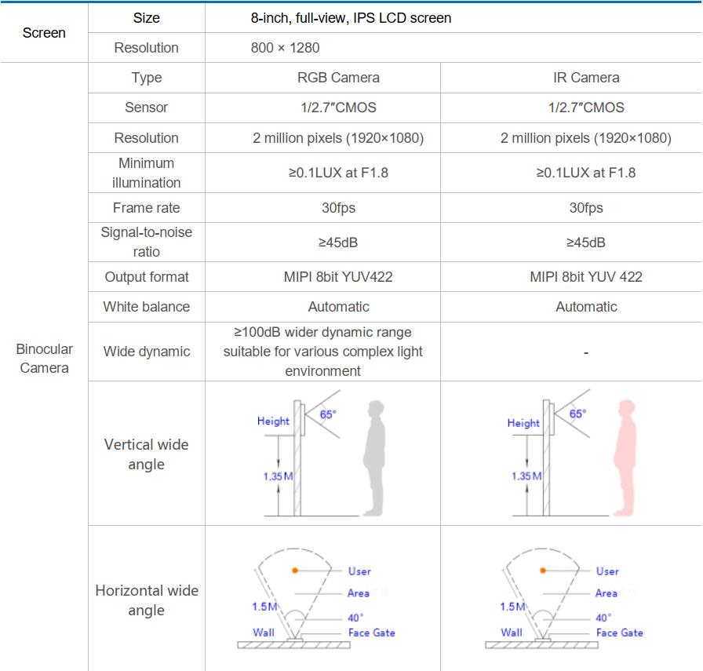
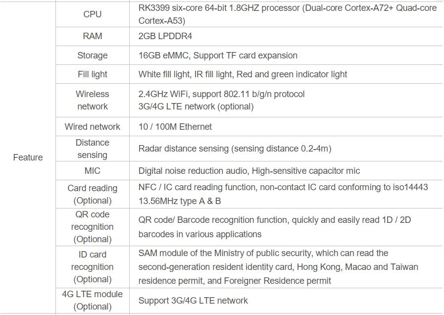
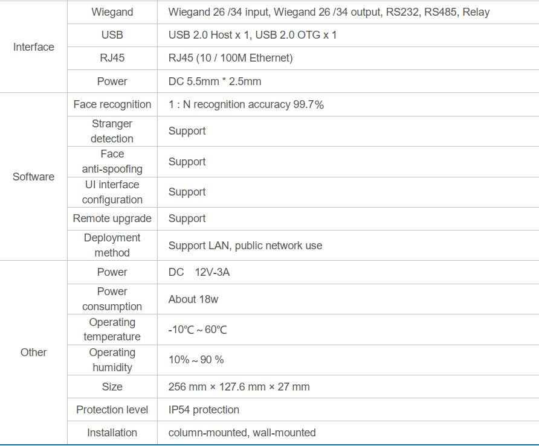
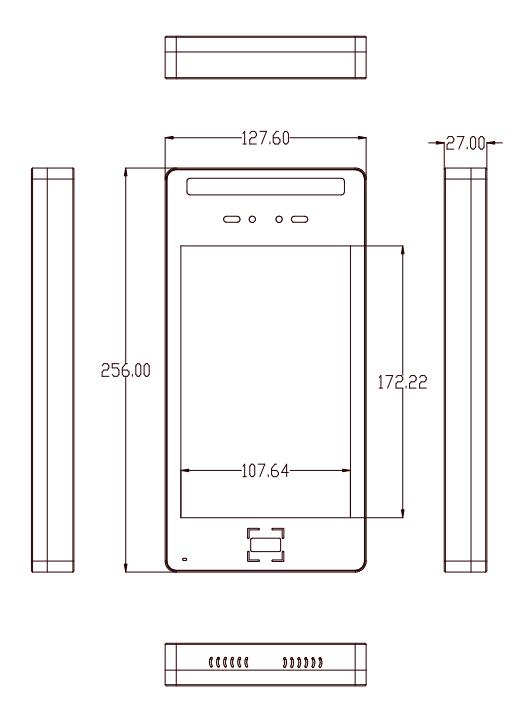
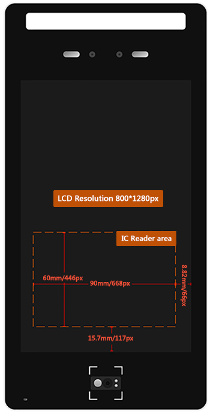
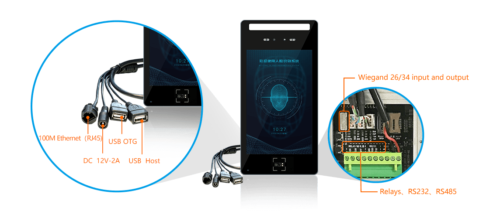
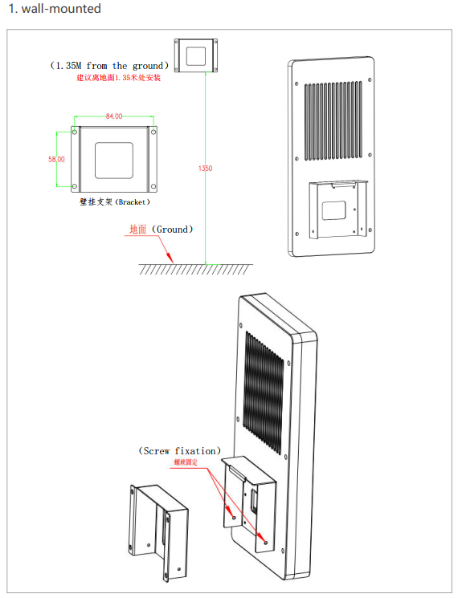
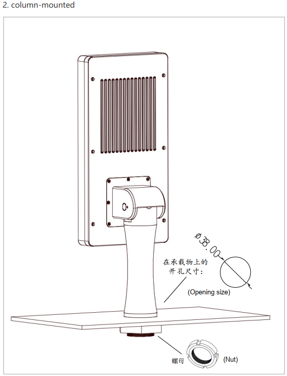

## Product introduction

Face X2 is an intelligent access control terminal based on face recognition independently developed by Firefly. It provides advanced face recognition algorithms, mobile phone management software, and background management system.Compared with the traditional password control "password opening", "swipe card opening", "fingerprint recognition" and other methods, this product breaks the limitation of personnel authorization verification, through the face recognition SDK, can easily carry out intelligent transformation of the access control system, Only "swipe the face" can quickly and accurately carry out personnel identification and access control.From collecting face photos, face comparison, and obtaining results, the whole process is automated, without manual intervention. 

## Product parameters

## Structure appearance

## Introduction of tailline

## Installation

## Product resources

* [[Wiki]](../../Mainboards/Face-RK3399/started.md)
Includes information on Android & Ubuntu driver development (see Face-RK3399 Wiki)
 

* [[Technical forum]](http://bbs.t-firefly.com/forum.php?mod=forumdisplay&fid=100)
More than 100,000 corporate customers and users communication platform

## Facial recognition apk source code supply
Basic demo is supplyed on resource download page.To send purchase information and order number{sales@t-firefly.com},Firefly will email you with the newest source code.

### Technical support
This product is suitable for: face recognition scenarios such as company attendance, examination room sign-in, base access control, station security, site gates, elevator access control, hotel apartments, bank entrances, government agencies, etc.

### Contact information
* Email: sales@t-firefly.com
* Mobile: (+86) 186 8811 7175
* Landline: 0760-89881218
* National Service Hotline: 4001-511-533
* Address: Room 2101, Hongyu Building, No. 57 Zhongshan 4th Road, East District, Zhongshan City, Guangdong Province
 