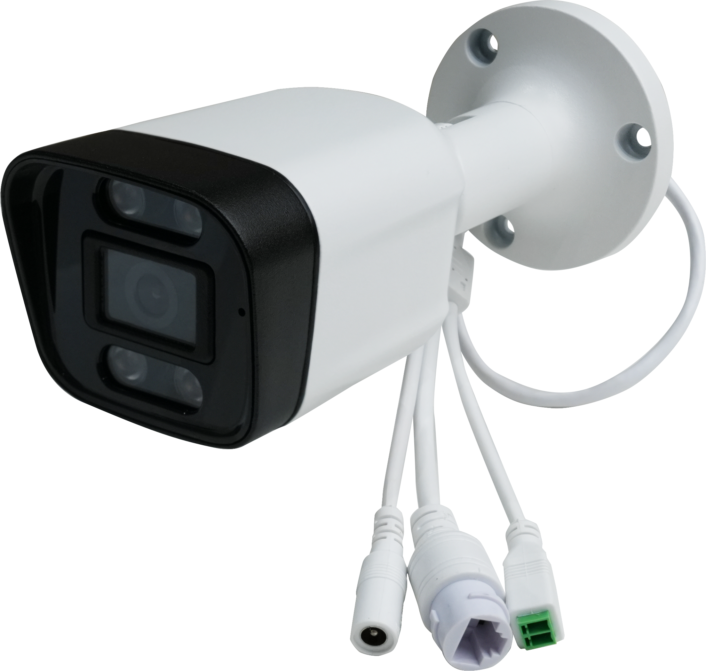
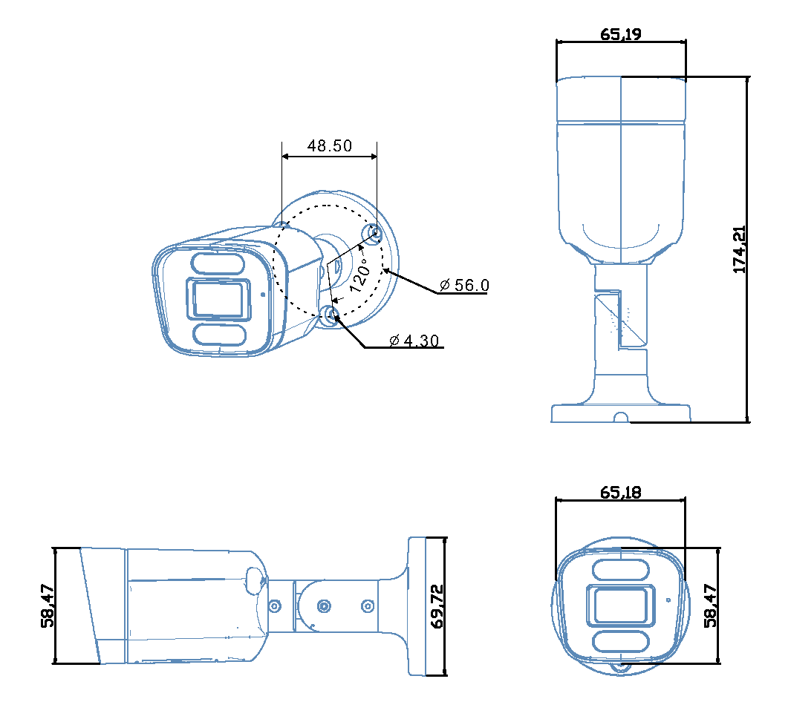

# 介绍

**CQ38W-1126B** 采用 Rockchip 四核 AI 视觉处理器 RV1126B，集成 3 TOPS NPU，可高效支撑人脸识别、手势识别等智能应用。影像方面，内置1600万像素ISP，支持4K@120fps解码与4K@60fps编码，配合500万/300万像素高清摄像头，在低光环境下也能精准捕捉细节。设备采用IP67级防水铝合金外壳，支持PoE供电，一根网线即可完成供电与数据传输，部署便捷，适用于闸机门禁、智能安防等多种场景。

## 产品尺寸

 