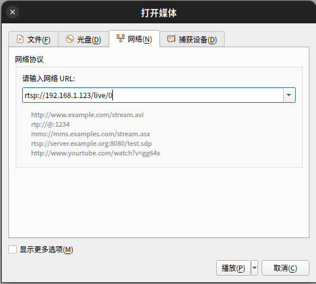
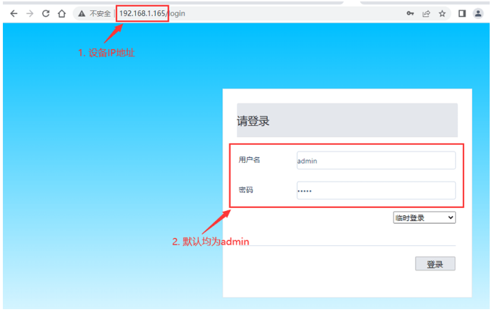
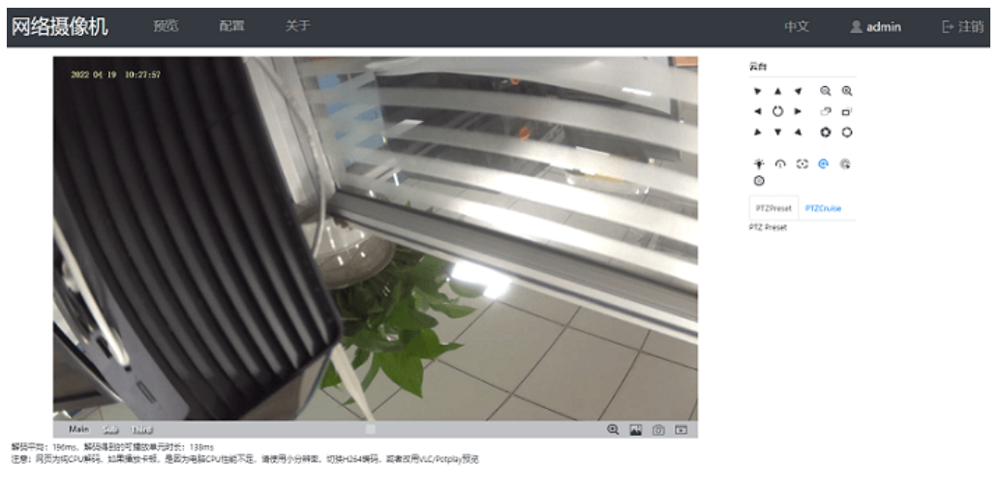

# 快速使用

## IP 地址获取

IP 地址的获取有三种方法，建议使用第一种方法进行设备访问:

* **第一种方法：机器设置了主网卡 IP 地址和子网卡 IP 地址。主网卡 `eth0` 使用的是 dhcp 动态获取 IP 地址的方式来进行 IP 地址的设置。子网卡 `eth0:1` 默认设置了静态 IP 地址方便用户访问。子网卡的静态 IP 地址：`192.168.1.10` 。在同一网段下的 PC 电脑能够直接访问到设备。**

例如主网卡的 IP 地址和子网卡的 IP 地址配置如下：
```bash
# ifconfig 
eth0      Link encap:Ethernet  HWaddr 7A:97:2D:EE:4F:8F  
          inet addr:168.168.18.16  Bcast:168.168.255.255  Mask:255.255.0.0
          UP BROADCAST RUNNING MULTICAST  MTU:1500  Metric:1
          RX packets:69277 errors:0 dropped:2135 overruns:0 frame:0
          TX packets:11945 errors:0 dropped:0 overruns:0 carrier:0
          collisions:0 txqueuelen:1000 
          RX bytes:5251929 (5.0 MiB)  TX bytes:10589068 (10.0 MiB)
          Interrupt:46 

eth0:1    Link encap:Ethernet  HWaddr 7A:97:2D:EE:4F:8F  
          inet addr:192.168.1.10  Bcast:192.168.1.255  Mask:255.255.255.0
          UP BROADCAST RUNNING MULTICAST  MTU:1500  Metric:1
          Interrupt:46 
```
* 第二种方法：接入串口进入终端使用 ifconfig eth0 命令获取 IP 地址
* 第三种方法：拆开外壳接入 USB 线缆， adb shell 进入板子终端使用 ifconfig eth0 命令获取 IP 地址


## 局域网预览（RTSP）

* 默认出厂固件为 IPC 固件。默认开机运行 rkipc 应用。在局域网内 PC 端可以直接预览摄像头 rtsp 视频流。

## 视频预览

设备支持在同一个局域网中预览，在设备联网后，使用PC端的 RTSP 软件（如 VLC ）打开网络串流。执行上角的按钮：
媒体(M) --> 打开网络串流(N) --> 网络(N) --> 请输入网络 URL

输入以下地址：
```
rtsp://（你的设备的IP地址）/live/0
```



## 网页预览

获取到 IP 地址后，在 PC 的浏览器中输入设备的 IP 地址即可进入网页登陆页面。帐号和密码均是：admin 。

**注：如果网页预览摄像头画面一直黑屏，请使用[视频预览]章节所描述的 VLC 软件进行摄像头预览。**



预览效果如下：
