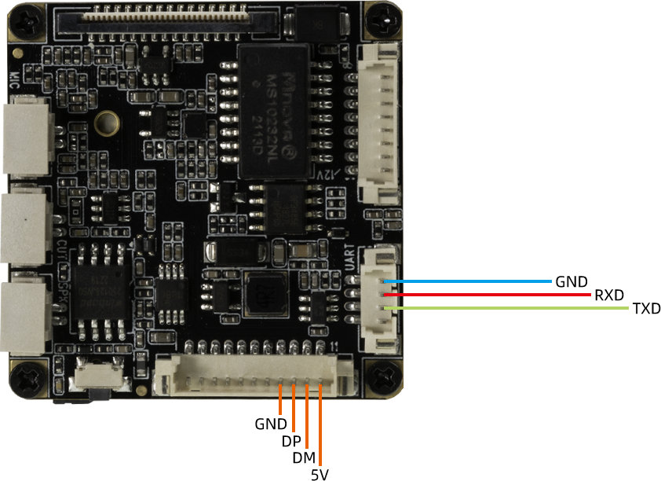
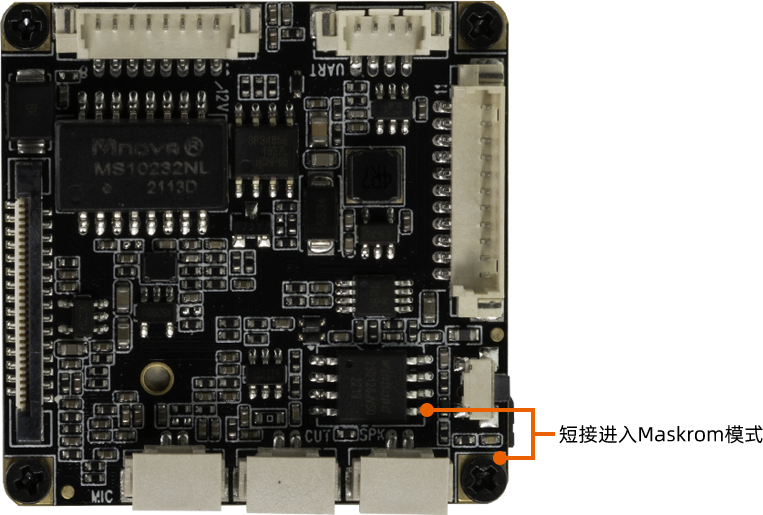
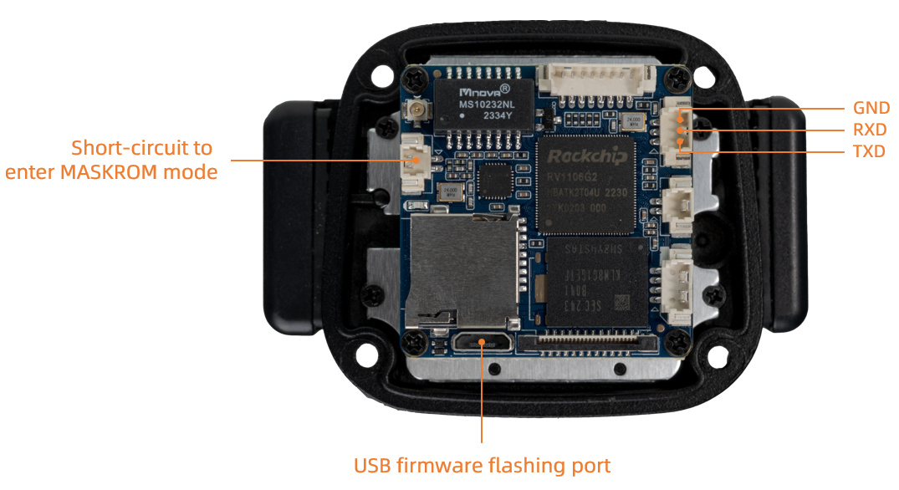

# MaskRom模式

***有关启动模式的介绍，请参阅[《升级固件介绍》](upgrade_bootmode.md)一章***

## 简介

`MaskRom` 模式是设备变砖的最后一条防线。强行进入 `MaskRom` 涉及硬件操作，有一定风险，因此仅在设备进入不了 `Loader` 模式的情况下，方可尝试 `MaskRom` 模式。

* CT36L 简介

进入 `MaskRom` 的原理是人为的把 SPI FLASH 的数据脚与地线短接，系统会认为 SPI FLASH 数据出错，从而清除 SPI FLASH 数据。

* CT36B 简介

进入`MaskRom`  的原理是人为的把 EMMC 的数据脚与地线短接，系统会认为 EMMC 数据出错，从而清除 EMMC 数据。

**请小心阅读，并谨慎操作！**

### 软件进入 MaskRom 模式

设备系统可以启动并且正常运行的情况下

操作步骤如下：
1. 设备断开电源

2. 设备接入串口。串口默认波特率为 `115200` 

3. 接入 USB 数据线到设备，并且接入电脑的 USB 接口。

* CT36L 硬件接线图如下：

  

* CT36B 硬件接线图如下：

  

4. 在串口终端输入命令进入 MaskRom 模式
```shell
reboot loader
```

### 硬件进入 MaskRom 模式

设备系统损坏无法正常运行的情况下，需要对硬件操作强制进行设备进入 Maskrom 模式

1. 设备断开电源

2. 用镊子短接 SPI FLASH 芯片的第 5 个管脚和 GND ，保持不动直到接入电源。

* CT36L 硬件接线图如下：

  
  
* CT36B 硬件接线图如下：

  
  

3. USB 数据线接入电脑 USB 接口。这时设备自动进入 MaskRom 模式。


此时设备就会进入 MaskRom 模式。