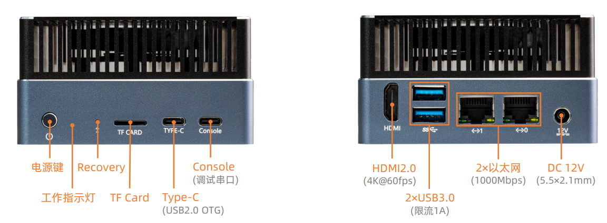
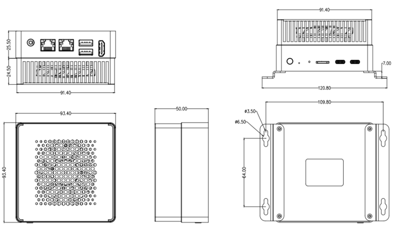

# 简介

[规格书](https://download.t-firefly.com/Spec/Computers/AIBOX-1688_AIBOX-186_Specification_CN.pdf) | [购买链接](https://item.taobao.com/item.htm?id=852613533931) | [下载资料](https://community.t-firefly.com/doc/download/278)

**AIBOX-186** 搭载算能智算芯片 CV186AH，是面向 AI 推理、计算机视觉等应用的高集成视觉算力芯片。可高效适配市场上各类 AI 算法，实现图片分类、目标检测、实例分割、语义分割、文字识别、语音识别等应用，并支持大语言模型的本地私有化部署，可满足边缘智算、AI 推理盒子等应用场景需求。

## 接口描述

**AIBOX-186** 提供了丰富的接口，主要包括：

**正面接口**：
- 电源键
- 工作指示灯 (三色灯，进入系统默认为绿色)
- Recovery 按键 (需要用小针捅进去，功能暂未定义)
- TF 卡座 (支持高速卡)
- TYPE-C USB 2.0 OTG
- TYPE-C 调试串口

**背面接口**：
- HDMI 2.0 (最高支持 4K@60fps)
- 2*USB 3.0 (上面接口默认只支持 USB 3.0，不支持 USB 2.0)
- 2*千兆以太网 (网口0: DHCP, 网口 1: 静态 IP 地址 192.168.150.1/24)
- 12V 电源接口（5.5*2.5mm）
## 结构尺寸

## 资源与技术支持

* [核心板 Core-186JD4 开发文档](https://wiki.t-firefly.com/Core-186JD4/)：包含 SDK 编译教程、各功能开发等资料
* [技术交流论坛](https://forum.t-firefly.com/)：超过10万企业客户和用户沟通交流平台

### 联系方式

* 邮箱：sales@t-firefly.com
* 手机：(+86) 186 8811 7175
* 座机：0760-89881218
* 全国服务热线：4001-511-533
* 地址：广东省中山市东区中山四路 57 号宏宇大厦 2101 室