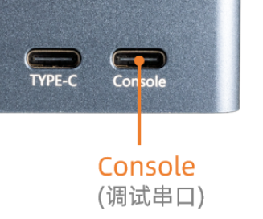

# 硬件功能使用

## 登录

AIBOX-3576 登录方式有两种，一种是通过 Console（调试串口）进行终端登录，一种是通过 HDMI 登录。

### Console 登录（调试串口）
Type-C 线接入 Console 口，登录账号为`root`，默认没有设置`root`密码。<br>
使用以下串口参数：
* 波特率：115200
* 数据位：8
* 停止位：1
* 奇偶校验：无
* 流控：无

<center>


</center>

#### Windows 下使用串口调试

用 Type-C 数据线将板卡与电脑连接后，系统会提示发现新硬件并完成初始化，之后可以在设备管理器中找到对应的 COM 口：

<center>


</center>

Windows 上一般用 putty 或 SecureCRT。这里推荐使用 MobaXterm 免费版本，这是一款功能强大的终端软件，其它串口软件的使用方法与之类似。

1. 选择 `session` 为 `Serial`。
2. 将 `Serial port` 修改为在设备管理器中找到的 COM 端口。
3. 设置 `Speed (bsp)` 为 `115200`。
4. 点击 `OK` 按钮。

<center>


</center>


<center>


</center>

#### Ubuntu 下使用串口调试

安装 minicom：

```
sudo apt-get install minicom
```

使用 `minicom -s` 打开配置界面，进入 `Serial port setup`，将串口参数设置为 `115200 8N1`：

* `E - Bps/Par/Bits`：`115200 8N1`
* `F - Hardware Flow Control`：`No`
* `G - Software Flow Control`：`No`

**注意：** `Hardware Flow Control` 和 `Software Flow Control` 都要设成 No，否则可能导致无法输入。

设置完成后选择 `Save setup as dfl` 保存为默认配置，退出后 minicom 即以 115200-8-N-1 连接调试串口，使用 `root` 账号登录（默认没有设置密码）。

### HDMI 登录
在界面登录的时候，自动登录`firefly`用户，`firefly` 用户密码也为`firefly`。

## 看门狗

AIBOX-3576的外部看门狗的设备名称是`/dev/wdt_core`，使用方法如下:
```shell
# 写入不同字段来开启看门狗并设置时间
# 数字 0，1，2，3 分别表示 0.64s，2.56s，10.24s，40.96s
# 字母 e 表示开启看门狗，字母 d 表示关闭看门狗

# 开启并定时 10.24 秒，每 10.24 秒之内要写入一次，也可随时写入不同数字更改时间
echo e >/dev/wdt_core #开启
echo 2 >/dev/wdt_core #设置超时时间为10秒
```

## RTC

### 简介

AIBOX-3576 有一路外部的 RTC，由外部的底板电容进行供电，掉电后短时间内保证RTC运行。在 kernel 中表示为 `rtc0`。

### 接口使用

Linux 提供了三种用户空间调用接口。路径为：

*    SYSFS接口：/sys/class/rtc/rtc0/
*    PROCFS接口： /proc/driver/rtc
*    IOCTL接口： /dev/rtc0

同步最新的系统时间到 RTC 内：
```
hwclock -w
```

#### SYSFS接口

可以直接使用 `cat` 和 `echo` 操作 `/sys/class/rtc/rtc0/` 下面的接口。

比如查看当前 RTC 的日期和时间：

```
# cat /sys/class/rtc/rtc0/date
2024-07-10
# cat /sys/class/rtc/rtc0/time
02:36:30

```

#### PROCFS 接口

打印 RTC 相关的信息：

```
# cat /proc/driver/rtc
rtc_time        : 02:37:00
rtc_date        : 2024-07-10
alrm_time       : 00:00:00
alrm_date       : 1970-01-01
alarm_IRQ       : no
alrm_pending    : no
update IRQ enabled      : no
periodic IRQ enabled    : no
periodic IRQ frequency  : 1
max user IRQ frequency  : 64
24hr            : yes
```

#### IOCTL接口

可以使用 `ioctl` 控制 `/dev/rtc0`。

详细使用说明请参考文档 `kernel-jammy-src/Documentation/admin-guide/rtc.rst` 。