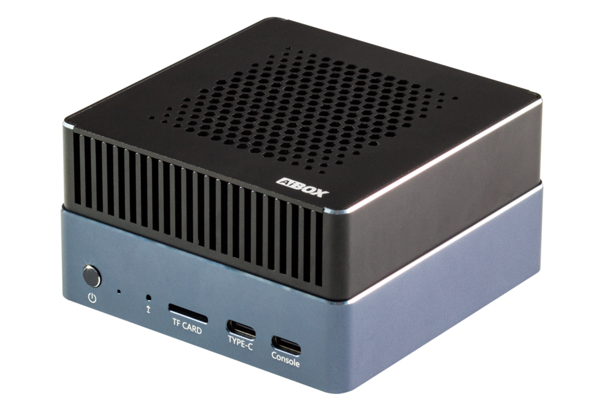
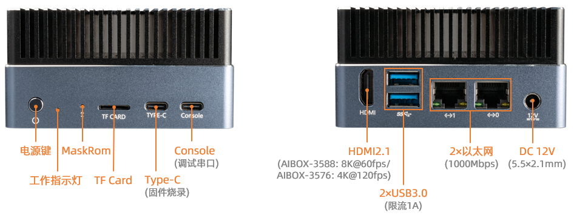

# 简介

[规格书](https://download.t-firefly.com/Spec/Computers/AIBOX-3576_AIBOX-3588_AIBOX-3588S_Specification_CN.pdf) | [购买链接](https://item.taobao.com/item.htm?id=829594561878) | [下载资料](https://community.t-firefly.com/doc/download/268)

**AIBOX-3576**  配置 Rockchip 八核64位AIOT处理器 RK3576，采用先进工艺制程，高性能低功耗，内置ARM Mali G52 MC3 GPU，集成6 TOPS算力NPU，支持Transformer架构下超大规模参数模型的私有化部署，支持CNN、RNN、LSTM等传统网络架构，支持多种深度学习框架，并支持自定义算子开发，支持Docker容器化管理技术。一个盒子就能满足个性化的AI部署。

## 接口描述

**AIBOX-3576** 提供了丰富的接口，主要包括：
- 12V 电源接口（5.5*2.5mm）
- Power 按键
- MaskRom 按键
- 千兆以太网 x 2
- USB 3.0 x 2
- HDMI
- TF卡槽
- Console (调试串口)
- Type-C（烧录）
- 电源指示灯

## 结构尺寸

## 资源与技术支持

* [技术交流论坛](https://forum.t-firefly.com/)：超过10万企业客户和用户沟通交流平台

### 联系方式

* 邮箱：sales@t-firefly.com
* 手机：(+86) 186 8811 7175
* 座机：0760-89881218
* 全国服务热线：4001-511-533
* 地址：广东省中山市东区中山四路 57 号宏宇大厦 2101 室