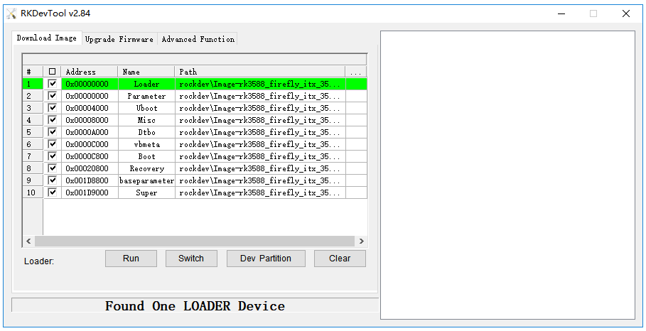
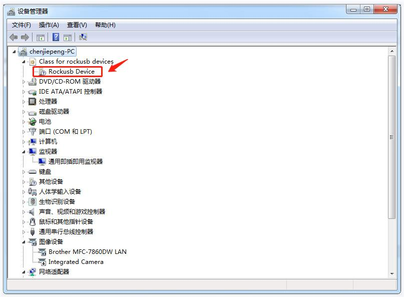

# FAQ

## Q：设备有哪些启动模式？

**A：** AIBOX-3588S有三种启动模式：

* Normal 模式
* Loader 模式
* MaskRom 模式

### Normal 模式

Normal 模式就是正常的启动过程，各个组件依次加载，正常进入系统。


### Loader 模式

在 Loader 模式下，bootloader 会进入升级状态，等待主机命令，用于固件升级等。

### MaskRom 模式

MaskRom 模式用于 bootloader 损坏时的系统修复。

一般情况下是不用进入 `MaskRom 模式`的，只有在 bootloader 校验失败（读取不了 IDB 块，或 bootloader 损坏） 的情况下，BootRom 代码 就会进入 `MaskRom 模式`。此时 BootRom 代码等待主机通过 USB 接口传送 bootloader 代码，加载并运行之。

***要强行进入 `MaskRom 模式`，请参阅[《升级固件》](upgrade_firmware.md)一章。***

## Q：如何判断当前处于哪种升级模式？

**A：** 烧写固件前，需要让板子进入可升级模式（Loader 模式或 MaskRom 模式），具体请参阅[进入升级模式的操作](upgrade_firmware.md)。进入相应模式后，可以通过以下工具确认：

**Windows操作系统**

通过AndroidTool工具可以看到下方提示`Found One LOADER Device`
<center>


</center>

如果仍旧没有看到烧写工具提示LOADER，此时可以看一下Windows主机是否有提示发现新硬件并配置驱动。打开设备管理器，会见到新设备 `Rockusb Device` 出现，如下图。

<center>


</center>

**Linux操作系统**

运行upgrade_tool后可以看到连接设备中有个`Loader`的提示

```shell
firefly@T-chip:~/severdir/down_firmware$ sudo upgrade_tool
List of rockusb connected
DevNo=1 Vid=0x2207,Pid=0x330c,LocationID=106    Loader
Found 1 rockusb,Select input DevNo,Rescan press <R>,Quit press <Q>:q
```

## Q：如何进行分区刷写？

**A：** 以下内容面向需要单独烧写分区（boot/kernel/rootfs 等）的进阶用户；仅需完整固件升级请参阅[《使用USB线缆升级固件》](upgrade_firmware.md)。

### Windows 操作系统

#### 烧写分区映像

烧写分区映像的步骤如下：

1. 切换至`Upgrade Firmware`页。
2. 勾选需要烧录的分区，可以多选。
3. 确保映像文件的路径正确，需要的话，点路径右边的空白表格单元格来重新选择。
4. 点击`Run`按钮开始升级，升级结束后设备会自动重启。

<center>


</center>

### Linux 操作系统

#### 烧写分区镜像

```shell
sudo upgrade_tool di -b /path/to/boot.img
sudo upgrade_tool di -r /path/to/recovery.img
sudo upgrade_tool di -m /path/to/misc.img
sudo upgrade_tool di -u /path/to/uboot.img
sudo upgrade_tool di -dtbo /path/to/dtbo.img
sudo upgrade_tool di -p paramater   # 烧写 parameter
sudo upgrade_tool ul bootloader.bin # 烧写 bootloader
```

如果因 flash 问题导致升级时出错，可以尝试低级格式化、擦除 emmc：

```shell
sudo upgrade_tool lf update.img	# 低级格式化
sudo upgrade_tool ef update.img	# 擦除
```

fastboot 烧写动态分区：

```shell
adb reboot fastboot # 进入bootloader
sudo fastboot flash vendor vendor.img
sudo fastboot flash system system.img
sudo fastboot reboot # 烧写成功后,重启
```

## Q：烧写时出现异常怎么办？

**A：**

### 烧写失败分析

如果烧写过程中出现 Download Boot Fail，或者烧写过程中出错，如下图所示，通常是由于使用的 USB 线连接不良、劣质线材，或者电脑 USB 口驱动能力不足导致的，请更换 USB 线或者电脑 USB 端口排查。

<center>


</center>

### 无法识别设备 / 驱动异常

进入 Loader 模式后，如果烧写工具一直没有提示 `LOADER`，一般是设备未被识别或驱动异常：请检查 Windows 主机是否提示发现新硬件并配置驱动，打开设备管理器确认是否出现 `Rockusb Device`；如果没有，请返回重新安装 RK USB 驱动后再试。对应的截图与详细说明见上文「如何判断当前处于哪种升级模式」一节。

### 如何强行进入 MaskRom 模式

如果板子进入不了 Loader 模式，此时可以尝试强行进入 MaskRom 模式，操作方法见[《升级固件》](upgrade_firmware.md)，亦可参阅下文「如何进入 MaskRom 模式？」一节。

## Q：如何进入 MaskRom 模式？

**A：** `MaskRom` 模式是设备变砖的最后一条防线。强行进入 `MaskRom` 涉及硬件操作，有一定风险，因此仅在设备进入不了 `Loader` 模式的情况下，方可尝试 `MaskRom` 模式。进入 `MaskRom` 的原理是人为的把 EMMC 的数据脚与地线短接，系统会认为 EMMC 数据出错，从而清除 EMMC 数据。

**请小心阅读，并谨慎操作！**

### 进入 MaskRom 模式

如果设备进入不了 Loader 模式，可以强行进入 MaskRom 模式：先按住 MaskRom 按键，然后给设备上电，此时设备就会进入 MaskRom 模式。

**请小心阅读，并谨慎操作！**

<center>


</center>

