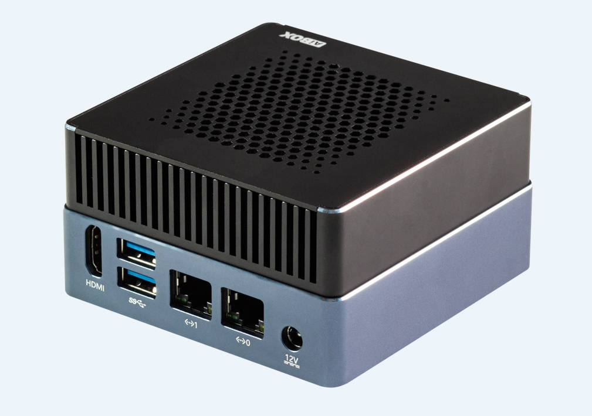
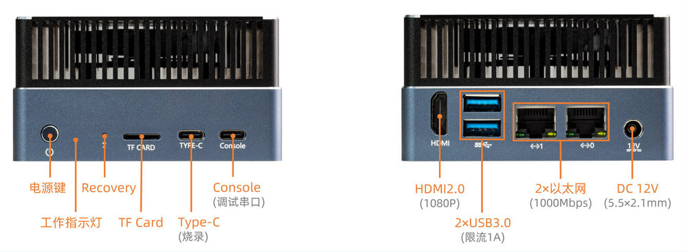

# 简介

[规格书](https://download.t-firefly.com/Spec/Computers/AIBOX-8550_Specification_CN.pdf) | [购买链接](https://item.taobao.com/item.htm?id=997165259189) | [下载资料](https://community.t-firefly.com/doc/download/356)

AIBOX-8550 采用高通六核(1+2+3)高性能 AI 处理器 QCS8550，集成 48 TOPS NPU，支持多种主流 AI 大模型和深度学习框架。内置 Adreno 740 GPU，支持光线追踪技术、8K 视频编解码。采用工业级全金属外壳，高效散热，支持 7×24 小时稳定运行，满足工业级的应用需求。广泛适用于智能监控、AI 教学、算力服务、边缘计算、大模型私有化部署、数据安全和隐私保护等行业领域。

## 接口描述

**AIBOX-8550** 提供了丰富的接口，主要包括：

* 电源接口
* 2 x USB3.0
* 1 x Type-C（烧录）
* 1 x Console（调试串口）
* 2 x 1000M 以太网口
* 1 x HDMI 2.0
* TF 卡槽
* Power 按键

具体如下图：

## 结构尺寸

## 资源与技术支持

* [[技术交流论坛]](https://forum.t-firefly.com/)：超过10万企业客户和用户沟通交流平台

### 联系方式

* 邮箱：sales@t-firefly.com
* 手机：(+86) 186 8811 7175
* 座机：0760-89881218
* 全国服务热线：4001-511-533
* 地址：广东省中山市东区中山四路 57 号宏宇大厦 2101 室