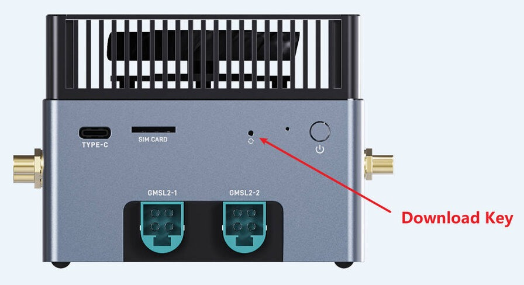
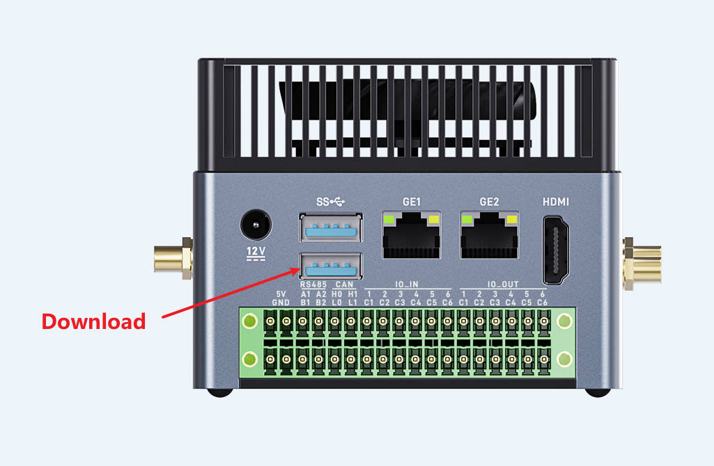

# 升级完整固件

## 升级前准备

### 前言

本文介绍了如何将固件，通过 Type-A USB 数据线 烧录到 AIBOX-9075 开发板的存储器中。

### 准备工具
* AIBOX-9075 开发板
* 处理器架构为 X86_64 的 windows 电脑
* 良好的 Type-A USB 数据线

### 准备固件
固件可以通过编译SDK获得，也可以通过[资源下载](https://community.t-firefly.com/doc/download/407)处下载公版固件（完整固件）。

* 完整固件

    完整固件是由 parameter、bootloader、kernel、system 等所有文件打包合并成的单个文件。完整固件会是一个压缩包，里面包含很多文件。Firefly 正式发布的固件都是采用统一固件格式，升级统一固件将会更新主板上所有分区的数据和分区表，并且擦除主板上所有数据。

* 分区镜像
    
    分区镜像只包含单个系统分区的内容，分区镜像是单个文件。最常见的就是 boot.img 和 dtbo.img，开发过程中可以只单独烧录某个分区镜像来验证修改、部分更新、对比测试等。烧录分区镜像的前提是，设备本身需要正常运行。若设备无法开机，则只能烧录完整固件。

### 安装烧写工具
* 安装 USB 驱动

前往 [USB 驱动](https://community.t-firefly.com/doc/download/407) 下载驱动。

有两份驱动，先安装高通 usb 驱动： Qualcomm USB Driver，双击 exe 文件运行，接受用户协议一直点 next 即可，最后点 finish 安装完成。

再安装 Google USB 驱动，解压 usb_driver_r13-windows，右键里面的 android_winusb.inf，点击安装，一直点确认即可。

* 安装 QTSP

前往 [QTSP 工具](https://community.t-firefly.com/doc/download/407) 下载工具。

解压后，双击 QPST.2.7.496.1.exe 开始安装。接受用户协议一直点 next 即可，最后点 install 安装，点 finish 安装完成。

安装完成后，我们要用到的工具位于 C:\Program Files (x86)\Qualcomm\QPST\bin\QFIL.exe

双击 QFIL.exe 打开工具。

* 安装 Android SDK Platform-Tools

前往 [Platform Tools](https://community.t-firefly.com/doc/download/407) 下载工具。

下载后解压即可，内含 adb.exe 和 fastboot.exe


## 进入 EDL 升级模式

### 硬件方式

1. 首先确认设备完全断开电源。

2. 使用 Type-A USB 数据线 连接设备的 Download 口和电脑。

3. 使用针或其他细小物品伸入恢复孔，按住里面的下载按钮，保持住。

4. 接入电源。

5. 2 秒后松开恢复按钮。

<center>


</center>
### 软件方式

在设备正常运行的情况下，使用 Type-A USB 数据线 连接好设备的烧录口和电脑，然后在设备终端或调试串口上运行：

```shell
sudo systemctl reboot edl
```

<center>


</center>

### 确认是否成功

如果设备成功进入 EDL 模式，QFIL 工具上一般会显示 Qualcomm HS-USB QDLoader 9008。

<center>


</center>

也有可能显示 Please Select an Existing Port，此时点击右侧 SelectPort，也可以看到 Qualcomm HS-USB QDLoader 9008，选中并点击 OK 即可。

<center>


</center>

## 烧写固件

1 点击上方 Configuration，再点击 FireHose Configuration，在弹出的窗口中，按照下图设置。完成后点击 OK

<center>

</center>

2 在主界面选择 Flat Build，点击 Browse

<center>


</center>

3 在弹出的窗口中前往你解压好的固件位置，文件类型选择 All Files，然后找到 xbl_s_devprg_ns.melf (也可能是 prog_firehose_ddr.elf，不同芯片不一样)并点击打开。

<center>


</center>

4 主界面点击 Load XML，在弹出的串口中，全选所有 xml 文件并点击打开。此时又会弹出相同的窗口，继续选择全部 xml 文件点击打开。

<center>


</center>

<center>


</center>

5 最后点击 Download 开始烧录，等待它完成，需要几分钟。完成后如图

<center>


</center>

6 完成后等待一会，设备应该会自动重启到正常模式。