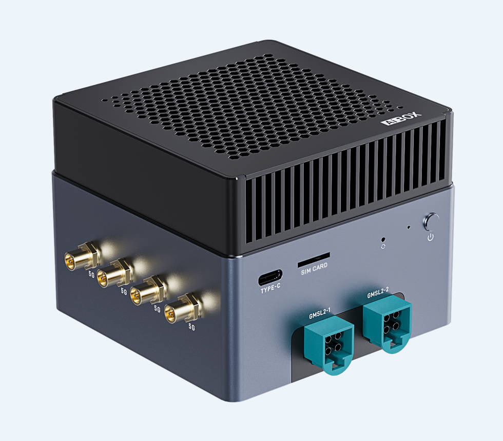
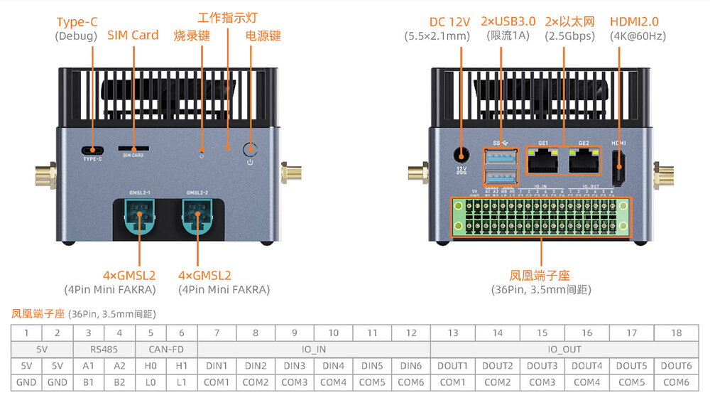

# 简介

[规格书](https://download.t-firefly.com/Spec/Computers/AIBOX-9075_Specification_CN.pdf) | [购买链接](https://item.taobao.com/item.htm?id=1053086279091) | [下载资料](https://community.t-firefly.com/doc/download/407)

AIBOX-9075 搭载高通 IQ-9075 处理器，峰值算力 200 TOPS，13B 大模型推理达 12TPS，支持端侧大模型私有化部署。八核 CPU 主频高达 2.36GHz，适配高负载边缘 AI 与多任务并发。内置安全子系统及四颗实时内核。依托 Qualcomm Linux 软件栈，支持 Ubuntu/Yocto 系统与主流 AI 推理框架，工业宽温设计，标配 GMSL2、CAN-FD、RS485 及光耦隔离 IO，适用于边缘计算、工控、智能监控与机器人场景。

## 接口描述

**AIBOX-9075** 提供了丰富的接口，主要包括：

* 电源接口
* 2 x USB3.0
* 1 x Type-C（调试串口）
* 2 x 2.5G 以太网口
* 1 x HDMI 2.0
* 1 x SIM 卡槽
* 2 x GMSL2 4Pin Mini FAKRA
* 2 x RS485
* 2 x CAN-FD
* 6 x IO in
* 6 x IO out
* Download 按键
* Power 按键

具体如下图：

## 结构尺寸

## 资源与技术支持

* [[技术交流论坛]](https://forum.t-firefly.com/)：超过10万企业客户和用户沟通交流平台

### 联系方式

* 邮箱：sales@t-firefly.com
* 手机：(+86) 186 8811 7175
* 座机：0760-89881218
* 全国服务热线：4001-511-533
* 地址：广东省中山市东区中山四路 57 号宏宇大厦 2101 室