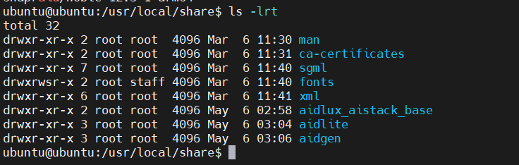
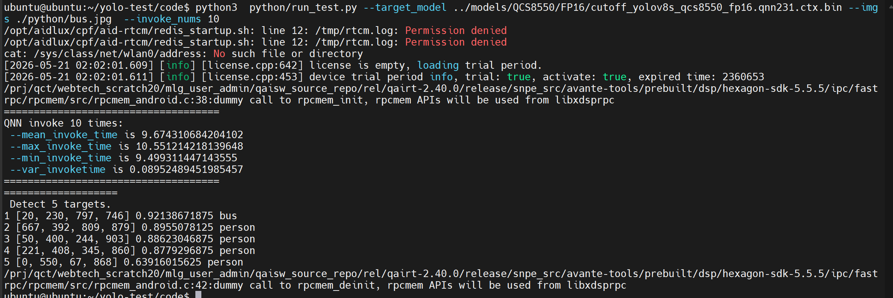
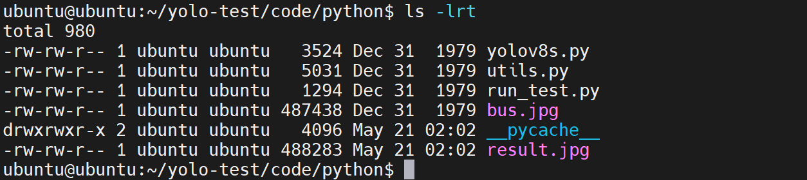
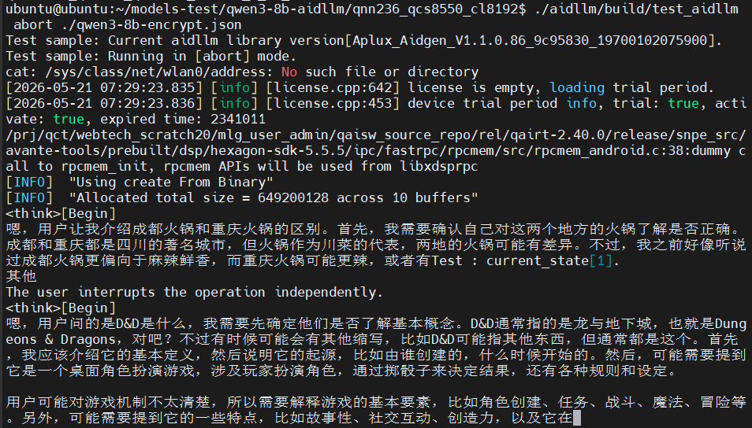
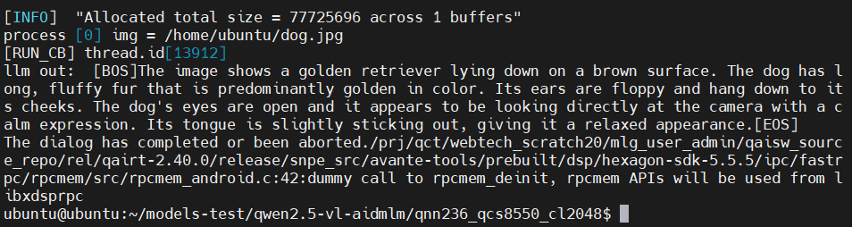
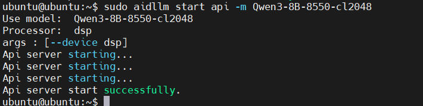
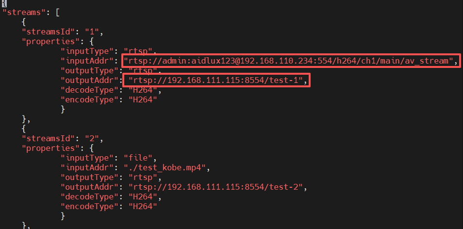

# AI 教程

## AidLux 介绍

AidLux 是一套完备的边缘端 AI 开发工具套件，能简化高通平台的环境部署，帮助开发者加速 AI 应用落地。

我们推荐使用 AidLux 来进行 AI 应用的开发。AidLux 包含 AidLite、AidGen、AidGenSE、AidStream 等组件。

## 系统依赖配置

* 配置 AidLux 源

```bash
# 下载正确的公钥
sudo wget -O- https://archive.aidlux.com/ubuntu24/public.key | gpg --dearmor | sudo tee /etc/apt/trusted.gpg.d/private-aidlux.gpg > /dev/null

# 编辑源文件
sudo vim /etc/apt/sources.list.d/private-aidlux.list

# 在源文件中填入AidLux 提供的私钥
deb [arch=arm64 signed-by=/etc/apt/trusted.gpg.d/private-aidlux.gpg] https://archive.aidlux.com/ubuntu24 noble main

# 更新缓存
sudo apt update
```

* 安装 AidLux 依赖
```bash
# 必须先安装的，系统不自带
sudo apt install python3 python3-pip libopencv-dev python3-opencv  net-tools

# 安装依赖
sudo apt install aidlux-aistack-base aidrtcm
sudo apt install aid-lms aidlms-sdk cmake aid-mms

# DSP 支持
sudo apt-get install qcom-fastrpc1
sudo apt-get install qcom-fastrpc-dev

# GPU 支持
sudo apt-add-repository -s ppa:ubuntu-qcom-iot/qcom-ppa
sudo apt install qcom-adreno-cl1
sudo ln -s /usr/lib/aarch64-linux-gnu/libOpenCL.so.1 /usr/lib/aarch64-linux-gnu/libOpenCL.so

# 支持 aidlite-sdk 和 aidgen-sdk
sudo apt install aidlite-sdk aidlite-*
sudo apt install aidgen-qnn240-sdk
sudo apt-get install libfmt-dev nlohmann-json3-dev
```

安装完成后，检查系统 /usr/local/share/ 新增 aidlite 和 aidgen 目录。



## 模型广场

模型广场聚集了大量的经过优化适配在高通 NPU 上的前沿 AI 模型，结合 AidLux 工具链，可以帮助开发者在高通芯片上更快的构建自己的 AI 应用。

地址：https://aiot.aidlux.com/zh/models

请前往注册账号，后续的例子会用到。

## AidLite

AidLite 是 AI 执行框架，旨在充分调度端侧芯片的各计算单元 (CPU、GPU、NPU) 实现AI模型的加速推理。

下面以 yolov8s 模型为例子展示 AidLite 的用法：

* 通过 mms 命令下载对应的 yolov8s 模型，需要提前注册模型广场的账号。
```bash
# 登录，根据提示输入模型广场的账户和密码
mms login

# 列举并下载模型
mms list | grep YOLOv8s | grep FP16 | grep 8550
mms get -m YOLOv8s -p fp16 -c qcs8550 -b qnn2.31 -d ./

# 解压
unzip YOLOv8s_qcs8550_fp16.zip
```

* 移动到模型目录，阅读 README 文档中操作执行模型调用
```bash
cd ./code
python3  python/run_test.py --target_model ../models/QCS8550/FP16/cutoff_yolov8s_qcs8550_fp16.qnn231.ctx.bin --imgs ./python/bus.jpg  --invoke_nums 10
```



* 检查生成的结果 python/result.jpg



## AidGen

AidGen 是基于 AidLite 构建的专门针对生成式 Transformer 模型的推理框架，旨在充分调用硬件的各计算单元（CPU、GPU、NPU）实现大模型在端侧的推理加速。

AidGen 提供原子级别的大模型推理接口，适用于开发者将大模型推理集成到自己的应用中。

AidGen 支持多种类型的生成式 AI 模型:

语言类大模型 -> AidLLM 推理

多模态大模型 -> AidMLM 推理

下面以 Qwen3-8B-CL8192 模型展示 AidGen 部署 LLM 的方法：

* 通过 mms 命令下载对应的 Qwen3 模型，需要提前注册模型广场的账号。
```bash
# 登录，根据提示输入模型广场的账户和密码
mms login

# 列举并下载模型
mms list | grep Qwen3
mms get -m Qwen3-8B-CL8192 -p W4A16 -c qcs8550 -b qnn2.36 -d ./
```

* 解压模型
```bash
mkdir qwen3-8b-aidllm
unzip qnn236_qcs8550_cl8192.zip -d qwen3-8b-aidllm/
```

* 新增模型配置文件 qwen3-8b-encrypt.json
```bash
cd  ./qwen3-8b-aidllm/qnn236_qcs8550_cl8192
vim qwen3-8b-encrypt.json
```

配置文件内容：
```json
{
    "backend_type" : "genie",
    "prefix_path":"kv-cache.primary.qnn-htp",
    "model":{
        "path" : [
        "qwen3-8b_qnn236_qcs8550_cl8192_1_of_5.serialized.bin.aidem",
        "qwen3-8b_qnn236_qcs8550_cl8192_2_of_5.serialized.bin.aidem",
        "qwen3-8b_qnn236_qcs8550_cl8192_3_of_5.serialized.bin.aidem",
        "qwen3-8b_qnn236_qcs8550_cl8192_4_of_5.serialized.bin.aidem",
        "qwen3-8b_qnn236_qcs8550_cl8192_5_of_5.serialized.bin.aidem"
        ]
    }
}
```

* 拷贝示例工程目录到模型目录并编译
```bash
# 拷贝工程目录到模型目录：
cp -r /usr/local/share/aidgen/examples/aidgen_qnn240/cpp/aidllm/ ./

# 编译
cd ./aidllm
mkdir build && cd build
cmake ..
make
```

* 调用执行
```bash
cd ../../
./aidllm/build/test_aidllm  abort ./qwen3-8b-encrypt.json
```



下面以 Qwen2.5-VL-3B-Instruct (392x392) 模型展示 AidGen 部署 MLM 的方法：

* 通过 mms 命令下载对应的 Qwen3 模型，需要提前注册模型广场的账号。
```bash
# 登录，根据提示输入模型广场的账户和密码
mms login

# 列举并下载模型
mms list | grep Qwen2 | grep VL
mms get -m 'Qwen2.5-VL-3B-Instruct (392x392)' -p w4a16 -c qcs8550 -b qnn2.36 -d ./
```

* 解压模型
```bash
mkdir qwen2.5-7b-aidmlm
unzip qnn236_qcs8550_cl2048.zip -d ./qwen2.5-vl-aidmlm/
```

* 新增配置文件 Qwen2.5-VL-3B-392x392-8550.json
```bash
cd ./qwen2.5-vl-aidmlm/qnn236_qcs8550_cl2048/
vim Qwen2.5-VL-3B-392x392-8550.json
```

配置文件内容：
```json
{
    "vision_model_path": "./veg.serialized.bin.aidem",
    "pos_embed_cos_path": "./position_ids_cos.raw",
    "pos_embed_sin_path": "./position_ids_sin.raw",
    "vocab_embed_path": "./embedding_weights_151936x2048.raw",
    "window_attention_mask_path": "./window_attention_mask.raw",
    "full_attention_mask_path": "./full_attention_mask.raw",
    "llm_path_list": [
        "./qwen2p5-vl-3b_qnn236_qcs8550_cl2048_1_of_1.serialized.bin.aidem"
    ]
}
```

* 拷贝示例工程目录到模型目录并编译
```bash
# 拷贝工程目录到模型目录下
cp -r /usr/local/share/aidgen/examples/aidgen_qnn240/cpp/aidmlm/* ./

# 编译可执行程序
mkdir build && cd build
cmake ..
make
```

* 运行
```bash
cd ..
./build/test_aidmlm single qwen25vl3b392 Qwen2.5-VL-3B-392x392-8550.json /home/ubuntu/dog.jpg "请描述一下图中场景"
```



## AidGenSE

AidGenSE 是基于 AidGen 封装的适配了 OpenAI HTTP 协议的生成式 AI HTTP 服务。开发者可以通过 HTTP 方式调用生成式 AI 并快速集成到自己的应用中。

下面介绍 AidGenSE 的用法：

* 环境准备
```bash
# 配置虚拟运行环境
sudo apt install -y python3-pip python3-venv > /dev/null 2>&1
sudo python3 -m venv /opt/aidlux/aid-python3

# 创建 aid-python3 命令
echo '#!/bin/bash
exec /opt/aidlux/aid-python3/bin/python3 "$@"' | sudo tee /usr/bin/aid-python3 > /dev/null
sudo chmod +x /usr/bin/aid-python3

# 创建 aid-pip3 命令
echo '#!/bin/bash
exec /opt/aidlux/aid-python3/bin/python3 -m pip "$@"' | sudo tee /usr/bin/aid-pip3 > /dev/null
sudo chmod +x /usr/bin/aid-pip3

# 安装 AidGenSE deb
sudo apt install aidgense
sudo aidllm system --sys linux --soc 8550
sudo apt install aid-pkg
```

* 常用指令
```bash
# 查询服务器可供下载的模型
sudo aidllm remote-list api
# 拉取模型
sudo aidllm pull api aplux/Qwen3-8B-8550-cl2048
# 枚举本地已下载的模型
sudo aidllm list api 
# 启动运行本地模型
sudo aidllm start api
# 停止运行本地模型
sudo aidllm stop api 
```

* start api 之后，即可通过 <设备ip>:8888 使用 OpenAI HTTP 请求进行交互



## AidStream

AidStream 是一个基于 GStreamer 的多媒体数据实时处理工具包，适用于构建基于 AI 的视频、图像分析应用和服务。

Demo 演示：

* 安装依赖
```bash
sudo apt-add-repository -s ppa:ubuntu-qcom-iot/qcom-ppa
sudo apt update
sudo apt install weston-autostart

sudo apt install gstreamer1.0-qcom-sample-apps
sudo reboot # 需要重启一次

sudo apt-get install libgstreamer1.0-dev gstreamer1.0-plugins-ugly gstreamer1.0-libav gstreamer1.0-alsa gstreamer1.0-gtk3

sudo apt-get install -y libjsoncpp-dev

sudo ln -s /usr/lib/aarch64-linux-gnu/libjsoncpp.so /usr/lib/aarch64-linux-gnu/libjsoncpp.so.1

sudo apt install gstreamer1.0-rtsp

sudo apt install aidstream-gst
```

* 配置视频输入、输出地址
```bash
cd /usr/local/share/aidstream-gst/conf
# 修改输入和输出地址为当前设备可访问的视频流服务器IP
vim aidstream-gst.conf
```



* 演示
```bash
mkdir aid-streamer-gst
cd aid-streamer-gst
cp -r /usr/local/share/aidstream-gst/example/ ./
cd example/python
sudo python3 example.py
```

然后通过视频输出地址查看处理结果。