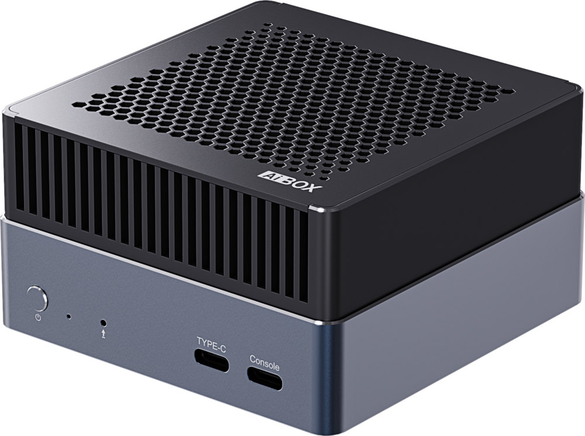
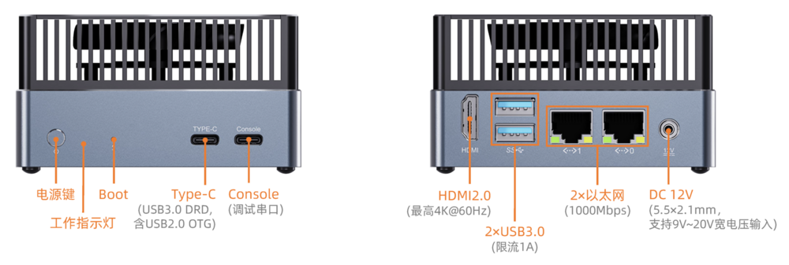
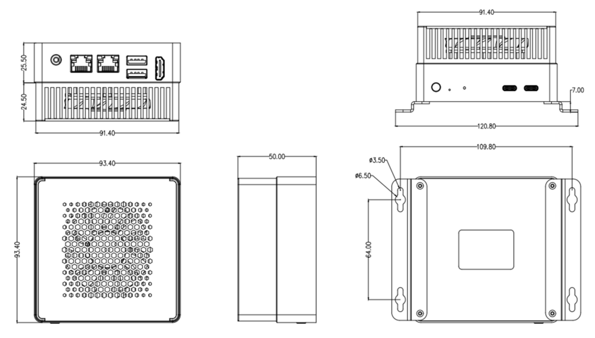

# 简介

[规格书](https://download.t-firefly.com/Spec/Computers/AIBOX-K3_Specification_CN.pdf) | [购买链接](https://item.taobao.com/item.htm?id=1043452574021) | [下载资料](https://community.t-firefly.com/doc/download/376)

**AIBOX-K3** 搭载进迭时空 SpacemiT Key Stone K3 主控芯片，采用 RISC-V 同构融合计算架构；芯片集成自研 8 核高性能通用大核 X100 与 8 核超宽并行 AI 核 A100，可提供 130K DMIPS 通用算力与 60 TOPS 通用 AI 算力，支持运行 30B 参数级大模型，并兼容全品类 AI 算法与模型快速部署。芯片原生支持 Linux 7.0 内核主线、 RISC‑V 硬件虚拟化，具备 CPU、内存、中断与 I/O 完整虚拟化能力；支持 M/S/U 三级处理器权限架构，可在硬件层面抵御 Spectre、Meltdown 等侧信道攻击，并内置国密级 SM2/SM3/SM4 加密算法。

## 接口描述

**AIBOX-K3** 提供了丰富的接口，主要包括：
- 12V 电源接口（5.5*2.5mm）
- Power 按键
- Boot 按键
- 千兆以太网 x 2
- USB 3.0 x 2
- PCIE SSD 硬盘卡槽（机器底部） x 1
- HDMI2.0
- Console (调试串口)
- Type-C USB3.0
- 电源指示灯

## 结构尺寸

## 资源与技术支持

* [芯片产品文档](https://spacemit.com/community/document/info?lang=zh&nodepath=hardware/key_stone/k3/k3_docs)：包含《产品介绍》、《数据手册》和《用户手册》
* [技术交流论坛](https://forum.t-firefly.com/)：超过10万企业客户和用户沟通交流平台

### 联系方式

* 邮箱：sales@t-firefly.com
* 手机：(+86) 186 8811 7175
* 座机：0760-89881218
* 全国服务热线：4001-511-533
* 地址：广东省中山市东区中山四路 57 号宏宇大厦 2101 室