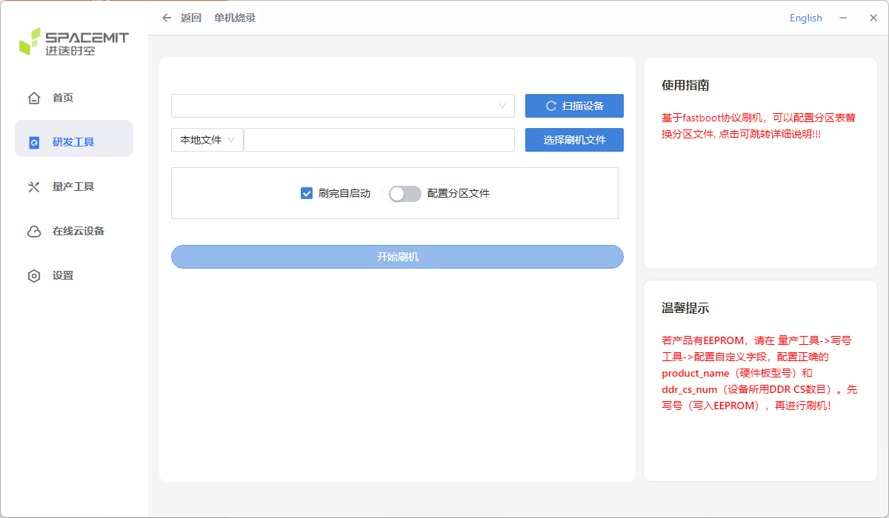
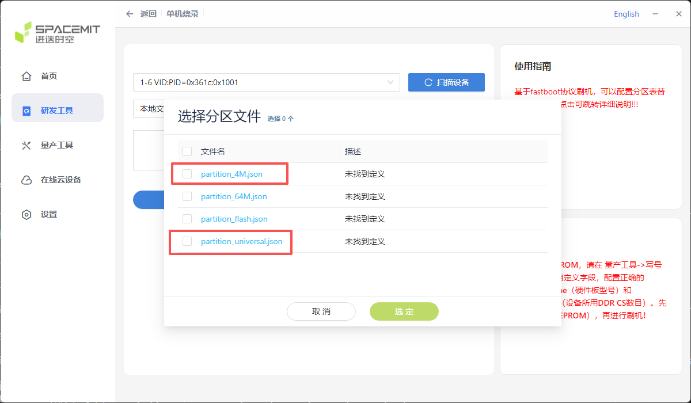
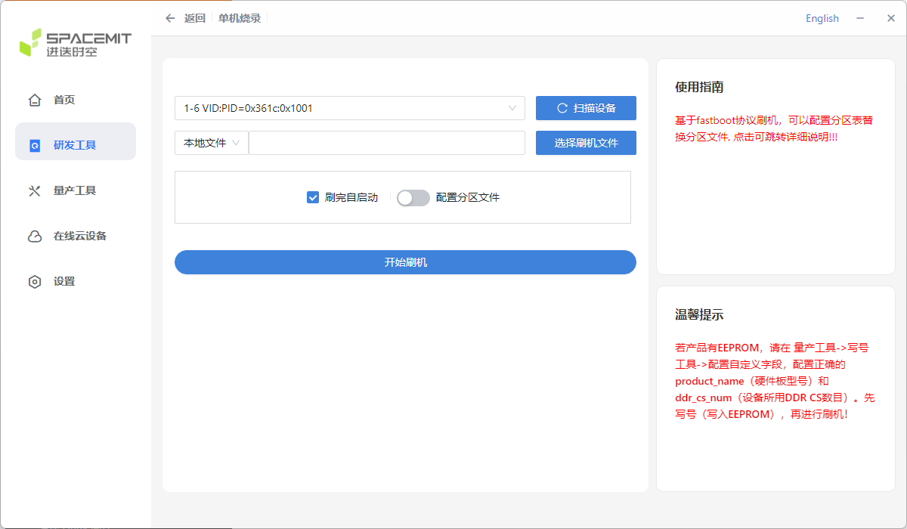

# FAQ

## Q：K3 支持哪些烧录方式？

**A：** AIBOX-K3 支持两种烧录方式：

* **USB 线缆烧录**：通过 Type-C 线缆将主机上的固件烧录到板子的存储器中，支持烧录统一固件与分区映像，需先让板子进入烧录模式，再使用 titanflasher 烧录工具完成刷机，详见[《使用USB线缆升级固件》](upgrade_firmware.md)。
* **MaskRom（硬件烧录模式）烧录**：当板子无法进入 Loader 模式时的最后防线，通过 boot 按键配合上电进入，详见[《硬件烧录模式》](upgrade_boot_mode_spacemit.md)。

刷机前请详细阅读[《刷机工具使用手册》](https://spacemit.com/community/document/info?lang=zh&nodepath=tools/user_guide/flasher_user_guide.md)。

titanflasher 烧录工具界面如下：

## Q：如何进入烧录模式（Loader）？

**A：** 软件方式进入 Loader 模式需要操作 uboot 终端（不能使用 adb 工具），步骤如下：

1. 用 Type-C 线缆连接板子与主机，并接好串口调试终端。
2. 在串口调试终端执行 `reboot`，重启板子。
3. 板子重启到 uboot 阶段时按住 `s` 键进入 uboot 调试终端，然后删除多余的 `s` 字符输入信息。
4. 在 uboot 调试终端执行 `fastboot 0` 进入烧写模式。
5. 在 PC 端 titanflasher 上点击：研发工具 --> 单机烧录 --> 扫描设备 --> 选择刷机文件 --> 开始刷机。

> 注意：此时 titanflasher 工具会烧写一部分必要的固件进板子，但不会烧入全部固件，还需在板子的 uboot 终端再次按下 Enter 按键进行后续的固件烧录。

如果板子进入不了 Loader 模式，可以强行进入硬件烧录模式，方法见下文「常见错误有哪些？」。

## Q：是否支持分区烧写？

**A：** 支持。在 titanflasher 上除了烧录统一固件，还可以通过配置分区文件烧写分区映像，步骤如下：

研发工具 --> 单机烧录 --> 扫描设备 --> 本地文件 --> 选择刷机文件 --> 刷完自启动 --> 配置分区文件 --> 开始刷机。

配置分区文件时需要选择分区文件：

1. `partition_4M.json`：更新核心板上的 Nor Flash。
2. `partition_universal.json`：更新核心板上的 UFS 分区映像。

## Q：烧写失败怎么办？

**A：** 如果烧写过程中出错，通常是由于使用的 USB 线连接不良、劣质线材，或者电脑 USB 口驱动能力不足导致的，可按以下步骤排查：

1. 更换一条状态良好的 Type-C 线缆。
2. 更换电脑的 USB 端口，重新扫描设备后再试。
3. 仍失败时，可尝试强行进入硬件烧录模式后再烧写（见下文「常见错误有哪些？」）。

## Q：常见错误有哪些？

**A：**

* **无法进入 Loader 模式**：可以强行进入硬件烧录模式：PC 通过 Type-C 线接到板子的 Type-C USB 3.0 口（注意不要接错到 USB 串口上），按住 boot 按键后上电，设备即进入硬件烧录模式，再点击烧写工具的《扫描设备》识别设备。详见[《硬件烧录模式》](upgrade_boot_mode_spacemit.md)。

* **烧写工具识别不到设备**：确认 Type-C 线缆连接良好且没有接错端口（应接 Type-C USB 3.0 口），必要时更换 USB 线或电脑 USB 端口，重新点击《扫描设备》。
* **Nor Flash 相关**：`partition_4M.json` 用于更新核心板上的 Nor Flash，烧写前请先确认核心板上是否贴有 Nor Flash 存储器，避免选错分区文件。

