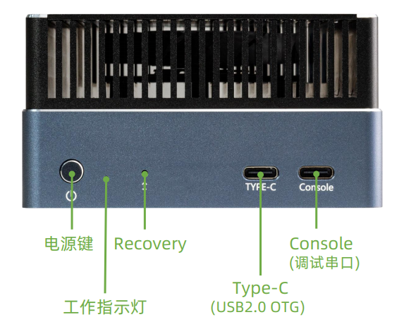
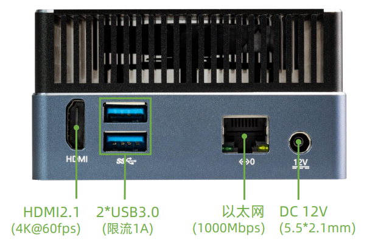

# 接口介绍

AIBOX-Orin NX 接口丰富，主要包括：
- 12V 电源接口（5.5*2.5mm）
- Power 按键
- Recovery 按键 (让设备进入Recovery 模式，便于烧录固件)
- 千兆以太网 x 1
- USB 3.0 x 2
- HDMI
- NVME 接口(PCIE3.0 x 1)
- Console (调试串口)
- Type-C（USB2.0 OTG）
- 电源指示灯

